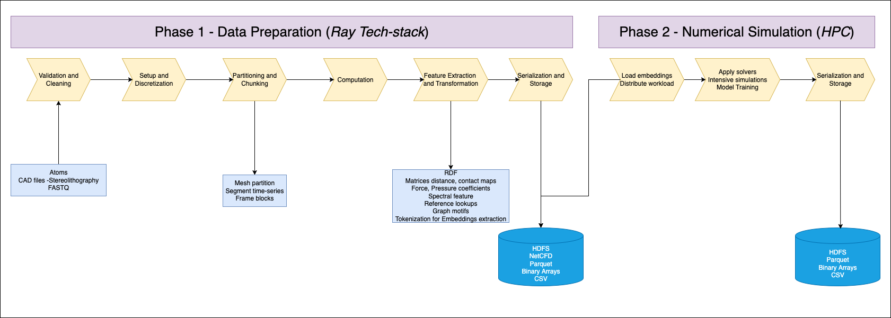

# Chapter 2 - State of the art

The following sections survey how leading‐edge practices in both data
preprocessing and large‐scale simulation converge into a coherent, two‐phase
pipeline that meets current industry standards. First, we examine the Two-Phase
Data-to-HPC Pipeline Framework, highlighting shared preprocessing steps across
domains and the rationale for separating high-throughput ETL (Phase 1) from
MPI/Slurm-driven numeric simulations (Phase 2). Next, we review Cloud-Native
Design Patterns and Tools — from Data Lakes and Ray’s distributed compute
abstractions to AWS ParallelCluster and serverless hybrids — that enable fully
automated, scalable deployments in line with best practices for IaC, CI-CD, and
resilient looped model refinement.

## 2.1. Two-Phase Data-to-HPC Pipeline Framework

Modern scientific and engineering workloads — from molecular dynamics to
genomics — rely on a two-phase data pipeline that first transforms raw,
heterogeneous inputs into clean, structured embeddings (Phase 1) and then drives
compute-intensive simulations or analyses (Phase 2). Table 1 outlines the shared
preprocessing steps — validation, discretization, partitioning, computation, feature
extraction, and serialization — across MD, CFD, FFT, and Genomics.

**Figure 1**: Processes and Storage schema for the most common steps in a
two-phased data pipeline pattern

In the genomics domain, for example, terabytes of FASTQ reads undergo quality
control and adapter trimming, error correction [5], format conversion to SAM/BAM
[11], and sequence alignment, before k-mer feature extraction [16] and
Transformer-based embedding generation with DNABERT [6]. These
high-dimensional vectors are enriched from public repositories such as GenBank
and Ensembl [9][20], then sharded into Parquet files optimized for S3 or FSx. By
cleanly separating data prep — handled by Ray tasks and actors on
GPU-accelerated EC2/EKS clusters — from numerical simulation on Slurm/MPI
clusters, this pattern addresses the volume, variety, and velocity challenges endemic
to large-scale data pipelines.

 | Step                                    | MD (Molecular Dynamics)                                                                                    | CFD (Computational Fluid Dynamics)                                                                                            | FFT (Spectral Analysis)                                        | Genomics / Protein Sequencing                                                                     |
| --------------------------------------- | ---------------------------------------------------------------------------------------------------------- | ----------------------------------------------------------------------------------------------------------------------------- | -------------------------------------------------------------- | ------------------------------------------------------------------------------------------------- |
| **Validation & Cleaning**               | • Fix missing atoms/residues • I/O: small text files, many parses • CPU‐bound serial cleanup         | • Geometry repair, ensure watertight meshes • I/O: CAD formats heavy parsing • Memory: storing geometry                 | • Window selection, denoising • CPU‐light, GPU‐trivial      | • Sequence QC, adapter trimming • I/O: FASTQ large files • Irregular string parses          |
| **Setup & Discretization**              | • Box definitions, coordinate conversion • Memory: atom arrays • GPU: cell lists for neighbor search | • Mesh generation (unstructured/tet/hexa) • Compute: meshing algorithms (serial/p threaded) • Memory: large mesh in RAM | • Signal framing, padding • Low compute; trivial memory     | • k-mer indexing, suffix arrays • Memory: huge hash tables • Parallel: distributed indexing |
| **Partitioning & Chunking**             | • Split trajectory into frame blocks • I/O throughput: binary streams • Memory: chunk fits node      | • Domain decomposition subdomains • I/O: writing mesh partitions • Compute: balance & load distribution                 | • Segmenting time series • Minimal I/O; in‐memory slicing   | • Batch reads for alignment • I/O: S3/FSx streaming needed                                     |
| **Computation**                         | • Integration kernels (Verlet) • GPU: OpenMM, CUDA acceleration • Compute‐bound with data locality   | • Solver loops (Navier–Stokes) • Memory‐bandwidth bound • GPU: CuPHY or OpenCL solvers                                  | • FFT kernels (cuFFT / FFTW) • Highly optimized GPU libs    | • Alignment (BWA, Bowtie) or assembly • Irregular memory access; vectorization possible        |
| **Feature Extraction & Transformation** | • Compute distances, RDFs, contact maps • CPU/GPU transforms • Memory: distance matrices             | • Extract forces, pressure coefficients • CPU heavy reductions • Memory: scalar fields                                  | • Spectral feature extraction • GPU trivial with transforms | • Variant calling, motif detection • Compute: HMMs; I/O: reference lookups                     |
| **Serialization & Storage**             | • HDF5 or NetCDF writes • I/O bound, parallel HDF5 recommended                                          | • VTK, CGNS, NetCDF outputs • Storage: large binary dumps                                                                  | • Binary arrays, Parquet • Minimal size                     | • Parquet/CSV for variants • Metadata catalogs, many small files                               |

**Table 1**: Phase 1 regular steps for some scientific modeling & simulation context
domain.

## 2.2. Cloud-Native Design Patterns and Tools

Implementing a robust two-phase pipeline in the cloud demands established design
patterns and managed services. The Data-Centric Pipeline and Last-Mile ETL
patterns use an S3-backed Data Lake with Lake Formation for governance, while
Ray Data and Ray AIR provide scalable, in-memory pipelines and UDF-based
featurization [14]. Distributed Batch Compute is realized via AWS ParallelCluster
— provisioned through CloudFormation or Cloud Development Kit (CDK) — for
MPI/Slurm workloads on P4d/C5n instances with EFA networking and FSx for Lustre
storage [7]. Hybrid data flows leverage AWS Glue and DataSync to bridge on-prem
archives and cloud storage. Automation via CodePipeline and CodeBuild ensures
Docker-based Ray autoscaler and ParallelCluster stacks are deployed as IaC.
Finally, the Model Improvement Loop pattern — driven by EventBridge and
Lambda — automatically retrains AI models on new simulation outputs, while
services like SageMaker HyperPod offer resilient, scalable Ray job submission [18].
Emerging trends in Data Mesh, serverless HPC bursts (Mashup) [8], and unified
AI+HPC frameworks further reinforce this architecture as state of the art for
next-generation data-intensive applications.

**Figure 2**: Trend in the cloud industry to ties easily integration between different
processing engines and capabilities to simplify specially data exchange for one to
feed another: Data Processing <–> Gen/AI <–> HPC <–> Data Processing.