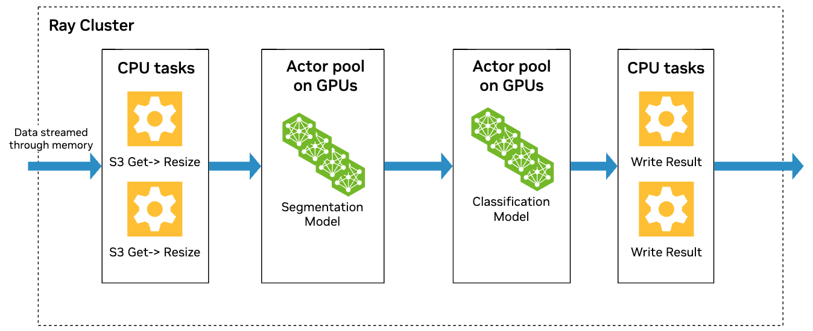
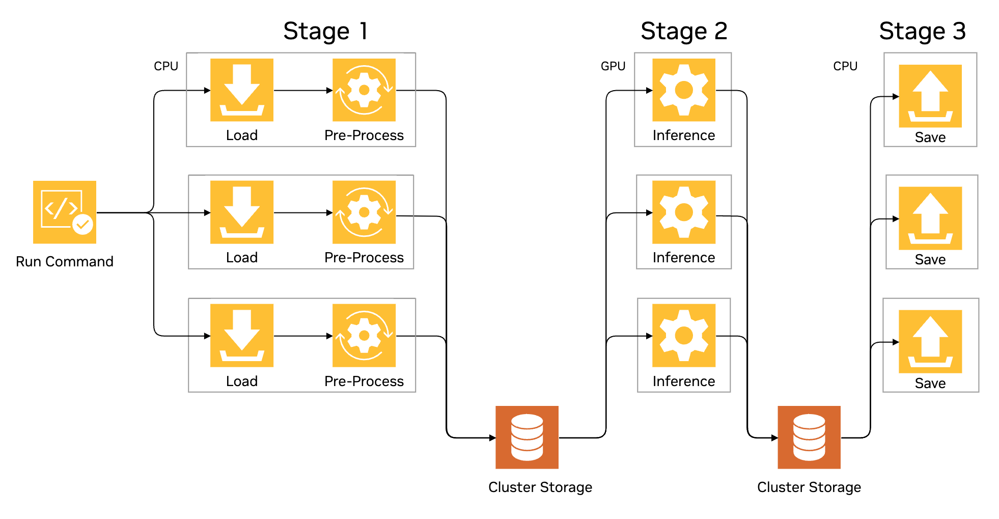

# Ray to feed High Performance Computing application - DNA Sequencing context

Data Processing and Feature Engineering form the foundation of any large scale AI workflow. In particular, tokenization and embedding creation turn raw inputs — whether words, images, or biological sequences — into dense numerical vectors that downstream models can consume. Ray Data, for example, excels at this “last mile” of preprocessing: it can load terabytes of raw files from S3 or FSx, apply parallel data cleaning and normalization, and then execute feature extraction leveraging  UDFs (User Defined Functions) for language tokenizers or sequence encoders, for instance, at scale [@spuler2024tokenizer]. By encapsulating each step as Ray tasks or actors, teams gain modularity, fault tolerance, and elastic autoscaling without bespoke orchestration code.

These embeddings occupy a pivotal role in the AI data pipeline. In Transformer models, the token-to-embedding mapping is not hard-coded feature engineering but a learned weight matrix that captures semantic or structural patterns in context. Whereas classical ML relies on manually crafted features, modern LLMs and sequence models ingest embeddings that have been optimized during pretraining—providing a richer, more flexible representation for tasks from translation to protein folding. The embedding lookup and the addition of positional encodings then feed directly into the model’s core attention layers.

When we apply the same paradigm to DNA and protein sequencing — treating nucleotides or amino acids as “tokens” — the scale of computation and data movement grows dramatically. As surveys of bioinformatic processing show [@park2024survey], the main challenges include:

1. **Vocabulary Size and Embedding Matrix Size:** The combinatorial space of k-mers or protein motifs can balloon the embedding table to millions of rows, stressing both GPU memory and network bandwidth.
2. **Token Sequence Length and Transformer Complexity:** Genomic reads often span thousands of bases, requiring attention mechanisms whose cost scales quadratically with sequence length.
3. **Data Volume and Parallel Processing:** A single human-genome experiment can generate over a terabyte of reads — necessitating highly parallel I/O and compute to complete preprocessing within clinical timeframes.
4. **Hardware Acceleration and Data Movement:** Efficiently moving precomputed embeddings from Ray’s preprocessing cluster into GPU or FPGA driven simulation environments demands careful coordination of S3/FSx endpoints, VPC peering, and instance placement.
5. **Memory Optimization Techniques:** Techniques like mixed precision embeddings, block sparse tables, or on-the-fly caching become essential to fit large models into limited device memory.
6. **Cloud Computing as a Solution:** Elastic scaling across CPU, GPU, and FPGA nodes — with spot fleets and autoscaling policies — helps balance throughput and cost when processing petabyte scale genomic datasets.

**Architectural Design Perspective**

Together, these factors motivate a two stage architecture: Ray handles the high-throughput, distributed featurization and embedding generation, and then passes compact numeric representations to an HPC cluster (MPI/Slurm, GPU-accelerated) for the heavy lifting of downstream simulations or inference. This separation of concerns leverages Ray’s lightweight orchestration for data prep and the raw computational power of specialized hardware for complex, numeric-intensive tasks.

###TODO
Add conceptual pipeline diagram
    ref https://developer.nvidia.com/blog/petabyte-scale-video-processing-with-nvidia-nemo-curator-on-nvidia-dgx-cloud/

## Tokenization, Embeddings for DNA Sequencing challenges
In Transformer inference, input text is first broken into discrete numerical tokens, but these tokens aren’t used directly; they’re immediately transformed into learned “embeddings”, which are dense vectors capturing each token’s semantic and contextual information. During training, the model learns an embedding weight matrix that maps each token to its high-dimensional representation via a simple matrix multiplication. To incorporate word order, fixed positional embeddings—vectors encoding each token’s position are added to the resulting token embeddings. This two-step process of multiplying the token-to-embedding matrix and then summing positional embeddings yields the final input vectors the Transformer uses for all downstream attention and feed-forward computations [@spuler2024tokenizer].

A large vocabulary directly impacts the size of the embeddings matrix, which is a set of weights. For example, the number of distinct k-mers in DNA sequences can be 40 times greater than the number of distinct words in English Wikipedia, leading to huge lookup tables and significant memory/disk requirements to persist them on a computing node [@zhang2021lshve]

As a consequence, DNA sequencing has exposed severe scalability gaps in current tools and pipelines: processing terabytes of error‐prone short reads requires at least 15–20 sequential stages — from alignment through cleaning to variant calling — yet most popular tools (BWA, Bowtie, Wham, Picard‐Tools, NovoSort, GATK) run on a single machine and are often single‐threaded. With that, real‐world pipelines at centers like NYGC take 3–23 days per human sample, with specialized cancer analyses (Mutect, Theta) alone demanding days or weeks — far beyond the 1–2-day turnaround needed for clinical applications [@roy2017massively].

## Modular Architecture for Cloud HPC

Modularity is a cornerstone of efficient HPC on AWS. By decomposing pipelines into small, independently testable components—defined as code, container, or microservice—you minimize manual intervention and accelerate CI/CD. Infrastructure-as-code (CloudFormation, ParallelCluster) and automated testing ensure that each change is validated in isolation, preventing system-wide downtime.

### Ray Core & Ray AIR: Building Blocks

    Ray Core offers two primitives:

        Tasks (stateless functions), ideal for parallel data transforms

        Actors (stateful services), for pooling resources (e.g., caches, GPUs)

    Ray AIR unifies Ray Datasets (distributed I/O), Ray Train (distributed training), Ray Tune (HPO) and Ray Serve (model deployment) under a consistent API. Each library is “distributed by design,” so you can mix-and-match—for example, map a preprocessing task over S3 files, train embeddings in parallel, then serve feature transformers as microservices.

### Ray-Powered ETL for Feature Embeddings

In a typical ETL before HPC compute:

    Ingestion & Cleaning: Ray Datasets shards S3/FSx reads across workers, applies tokenization or format fixes.

    Feature Extraction: Stateless Ray tasks invoke pretrained AI models (e.g. protein‐language models, ResNet) to compute embeddings. GPU actors batch inferences for high throughput.

    Embedding Serialization: Results are written back to Parquet or HDF5 via parallel Ray Dataset writes, producing chunked numeric arrays ready for HPC solvers.

### Integrating Embeddings into HPC Compute

    Numeric Solvers (e.g. spectral solvers, graph algorithms) consume embeddings as input vectors or masks.

    Ray → Slurm Bridge: Lightweight Ray tasks submit jobs via SSH/Sbatch to a ParallelCluster, passing S3 paths to embedding files.

    This pattern lets Ray handle data-prep and model inference, while specialized MPI/GPU kernels run on HPC nodes.

By leveraging Ray Core and AIR, there is the strategical benefit of a cloud-agnostic, fully modular ETL stack that bridges AI-driven feature engineering and HPC numerical simulation—boosting developer productivity, resource utilization, and end-to-end pipeline agility.