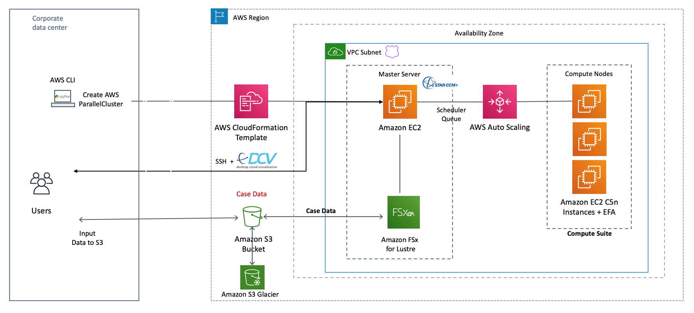
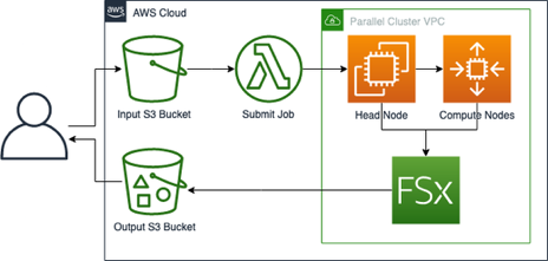

High-Performance Computing (HPC), also known as accelerated computing, aggregates the computing power from a cluster of nodes to divide and conquer complex tasks, achieving significantly higher performance than a single machine. It is essential for processing the massive amounts of data generated today and for solving intricate scientific and engineering problems, such as drug discovery, flight simulations, and financial risk analysis

**Limitations of On-Premises HPC**

Traditionally, HPC applications have faced several limitations when run on-premises [wilson2016experiences]:

- High upfront capital investment and long procurement cycles
- Challenges in maintaining infrastructure over its life cycle and managing technology refreshes
- Difficulty in forecasting annual budget and capacity requirements
- Limited scalability and elasticity, as specialized hardware like GPUs and serverless technologies are not readily available and require significant procurement and maintenance efforts
- Inability to efficiently cater to diverse HPC application needs such as parallel processing, low-latency/high-throughput networking, and fast I/O subsystems, leading to reduced efficiency and lost opportunities
- Traditional HPC systems are compute-centric, emphasizing floating-point performance, but scientific applications are increasingly data-intensive, posing challenges for existing architectures
- Voluminous data can consume network bandwidth and cause traffic issues during transfer, and local data centers struggle with data access, I/O, backup, power, and cooling [@mandoiu2016computational]
- Load imbalance is a common issue in parallel genomics applications due to heterogeneous processing costs and variable biological sequence sizes [fernandezfraga2024applying]

**Benefits of HPC in the Cloud**

Moving HPC workloads to the cloud offers significant advantages over on-premises solutions, effectively overcoming many of these limitations [@khanuja2022applied]:

- Virtually unlimited capacity: The cloud provides access to virtually unlimited HPC capacity, enabling users to move beyond fixed infrastructure constraints
- Drives innovation: It breaks barriers to innovation by allowing users to rapidly experiment with new approaches and make data-driven decisions
- This eliminates the need for rework and hardware maintenance, letting teams focus on business use cases. The elasticity of the cloud allows infrastructure to scale up or down based on demand
- Optimizes performance: Cloud HPC enables efficient resource utilization and supports rapid benchmarking and load testing, helping to optimize workloads without worrying about the cost, as you only pay for the resources used
- Cloud platforms provide compute, storage, and networking services specifically designed for HPC, eliminating long procurement cycles for specialized hardware
- Amplifies operational efficiency: Cloud platforms allow for process automation, frequent and reversible changes, and continuous improvement, supporting the development and execution of workloads efficiently
- On-demand access to compute capacity minimizes job queues, allowing teams to focus on critical problems
- Optimizes cost: The pay-per-use model significantly reduces high upfront capital investments
- Leveraging services like Amazon EC2 Spot Instances can lead to savings of up to 90% compared to on-demand instances for containerized workloads. Lyft, for example, utilized Spot Instances for over 75% of its computing fleet to reduce operational costs for autonomous vehicle simulations
- Enables secure collaboration: Cloud platforms provide a collaborative environment for distributed teams to interact with simulation models in near real-time, ensuring security and compliance without physically moving data

**Industry-Specific Needs: Science**

HPC in the cloud is driving innovation across various industries, particularly in science. Life Sciences and Healthcare (Genomics, Computational Chemistry & Drug Design):

- HPC technology in the cloud allows the analysis of massive amounts of sensitive genomic data to gain insights into critical diseases, significantly reducing time for lab sample testing and drug discovery, while meeting security and compliance requirements
- For example, Novartis used the AWS cloud to screen 10 million compounds against a cancer target in less than a week, taking only 9 hours and costing $4,232. This experiment would have required an estimated $40 million investment and much longer in-house
- Challenges like large genomic datasets with issues in discoverability, accessibility, availability, and scalable processing are addressed by cloud storage systems like Amazon S3 (for virtually unlimited, durable storage) and AWS DataSync (for secure transfer) [@fernandezfraga2024applying]
- Load imbalance in genomics applications can be minimized by dynamic load balancing methods within parallel processing techniques.

**Addressing Broader Computational Challenges** 

Cloud HPC platforms and related technologies address fundamental computational challenges:

- Heterogeneous Computing: Modern platforms integrate multi-core CPUs with GPUs and FPGAs
- FPGAs can implement specialized computer architectures by configuring logic elements, dramatically accelerating algorithms like the Smith-Waterman by up to 160-fold compared to software implementations. SYCL offers a robust ecosystem for heterogeneous C++ compute acceleration across various hardware platforms and vendors. Apple Silicon M-Series SoCs (M1, M2, M3, M4) integrate CPU, GPU, memory, storage controllers, and specialized accelerators like Advanced Matrix Extensions (AMX) and Neural Engine into a single chip, providing high memory bandwidth and energy-efficient HPC potential

**Distributed Computing and Programming Models**:

- Ray is an open-source, unified compute framework that scales AI and Python workloads from laptops to cloud clusters with minimal code changes
- It simplifies distributed computing challenges such as hardware failures, managing large cluster dependencies, job scheduling, and GPU optimization, particularly for training large language models. Ray provides core abstractions like tasks, actors, and objects, and high-level libraries like Ray AIR (AI Runtime) to unify ML workflows from data processing to model serving
- Hadoop and Spark frameworks, popular for Big Data analysis, can be efficiently run on HPC platforms in the cloud to avoid large data transfers and leverage powerful resources
- OpenMP and MPI are standard parallel programming models that work together (MPI+OpenMP tasking) for high performance and scalability on modern heterogeneous systems
- Hybrid Execution Models: New strategies like Mashup leverage both traditional VM-based cloud computing platforms (e.g., AWS EC2) and serverless platforms (e.g., AWS Lambda) to execute scientific workflows in a hybrid fashion
- This approach has shown an average of 34% reduction in execution time and 43% reduction in cost for widely-used HPC workflows by mitigating serverless-specific challenges like stateless execution, execution timeouts, and cold-start overheads
- Data Movement and I/O: Unconventional architectures like processing-in-memory are being explored to overcome data movement restrictions inherent in load-store architectures (CPU, GPU, FPGA)
- Cloud storage services like Amazon S3, EFS, and FSx offer scalable, high-throughput, and low-latency options to manage large datasets and reduce I/O overheads

**DNA Sequencing computation challenges:**

Processing whole‐genome data involves ingesting terabytes of error-prone short reads and running multi-stage pipelines—alignment, cleaning, sorting, and variant calling—across 15–20 tools that were not built for scale. 

Cloud HPC supplies virtually unlimited compute and storage, crushing through these bottlenecks: massive parallel alignment (e.g., GPU-accelerated BWA or DeepVariant), data cleaning at petabyte scale, and high-throughput variant inference. 

AWS offers C-, M-, and R-family instances for CPU-bound steps, G-family for GPU-enabled base-calling and deep-learning callers, and P4d instances—thousands of A100 GPUs with Petabit networking — for training and inference of neural variant detectors with near-linear scaling. 

The Elastic Fabric Adapter (EFA) further accelerates MPI-style workloads (e.g., distributed genome assembly), slashing end-to-end runtimes and moving us closer to clinical 1–2-day turnaround.

**Accelerated compute instances on AWS**
On AWS, P4d instances can be used to provision a supercomputer or an EC2 Ultracluster with more
than 4,000 A100 GPUs, Petabit-scale networking, and scalable, shared high throughput storage on
Amazon FSx for Lustre. Application and package developers use the NVIDIA CUDA library to build massively parallel applications for HPC and deep
learning [@khanuja2022applied].

**AWS ParallelCluster for a CFD application**

This reference architecture uses AWS ParallelCluster to deploy a turnkey HPC environment for running Siemens’ Simcenter STAR-CCM+ CFD application. It automates provisioning of C5n instances with EFA for low-latency MPI, mounts an Amazon FSx for Lustre parallel file system for high-throughput I/O, and leverages 100 Gbps networking—all in under 15 minutes. Users then install STAR-CCM+ on the cluster and submit simulation jobs, with optional NICE DCV desktops for remote visualization. The strategy emphasizes rapid, repeatable deployment of optimized HPC resources to accelerate large-scale CFD workloads in the cloud [@aws_compute_starccm].

