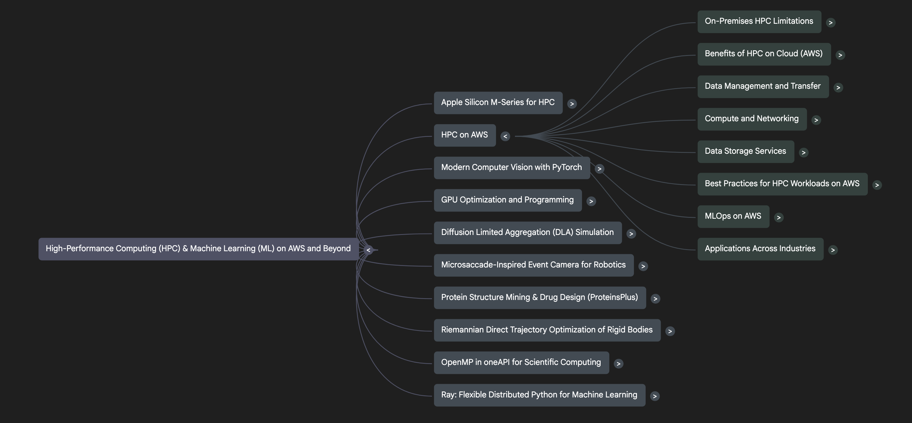

4 HPC AWS
    https://docs.aws.amazon.com/parallelcluster/latest/ug/install-v3-pip.html

https://docs.aws.amazon.com/parallelcluster/latest/ug/what-is-aws-parallelcluster.html

https://github.com/aws-samples/aws-hpc-recipes

https://aws.amazon.com/blogs/hpc/

Diagrams
    https://aws.amazon.com/blogs/compute/running-simcenter-star-ccm-on-aws

https://aws.amazon.com/blogs/hpc/automate-your-clusters-by-creating-self-documenting-hpc-with-aws-parallelcluster/

https://aws.amazon.com/blogs/hpc/deep-dive-into-the-aws-parallelcluster-3-configuration-file/
https://aws.amazon.com/blogs/hpc/improve-the-speed-and-cost-of-hpc-deployment-with-mountpoint-for-amazon-s3/

https://aws.amazon.com/blogs/hpc/securing-hpc-on-aws-isolated-clusters/

benchmark
    NAS nasa - https://www.nas.nasa.gov/software/npb.html

Benefits of Modular Architectures in HPC on AWS
◦
Enhanced Scalability and Flexibility: Modular design, as facilitated by cloud services and frameworks like Ray, allows for dynamic scaling of resources (e.g., EC2 instances, GPUs) to meet varying workload demands, moving beyond the limitations of on-premises fixed capacities
.
◦
Faster Innovation and Experimentation: Breaking down complex problems into modular components enables quicker experimentation and iteration on business use cases, accelerating the design, development, and testing of new products
.
◦
Improved Maintainability and Adaptability: Modular components are easier to update, debug, and maintain. This also allows for the adaptive allocation of compute resources and smoother integration into existing workflows
.
◦
Reduced Vendor Lock-in: By designing with modular, open-source frameworks like Ray that integrate with various backends and cloud providers, organizations can reduce dependency on a single vendor's proprietary solutions
.

