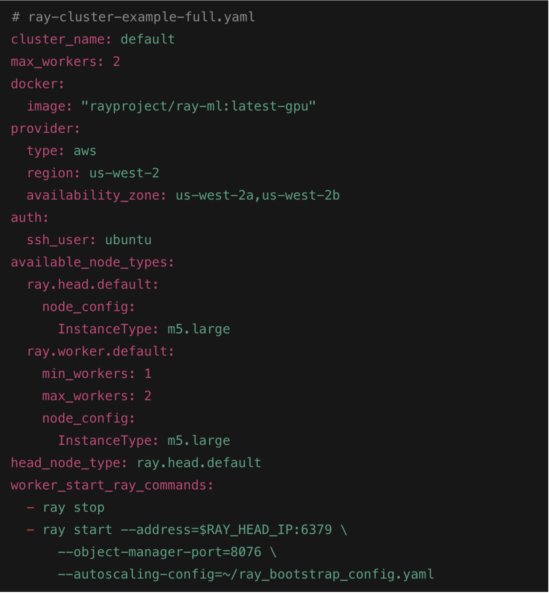
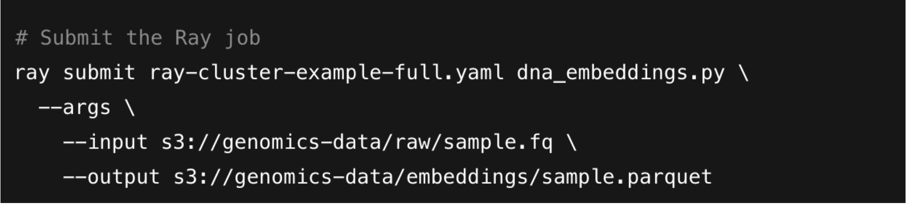
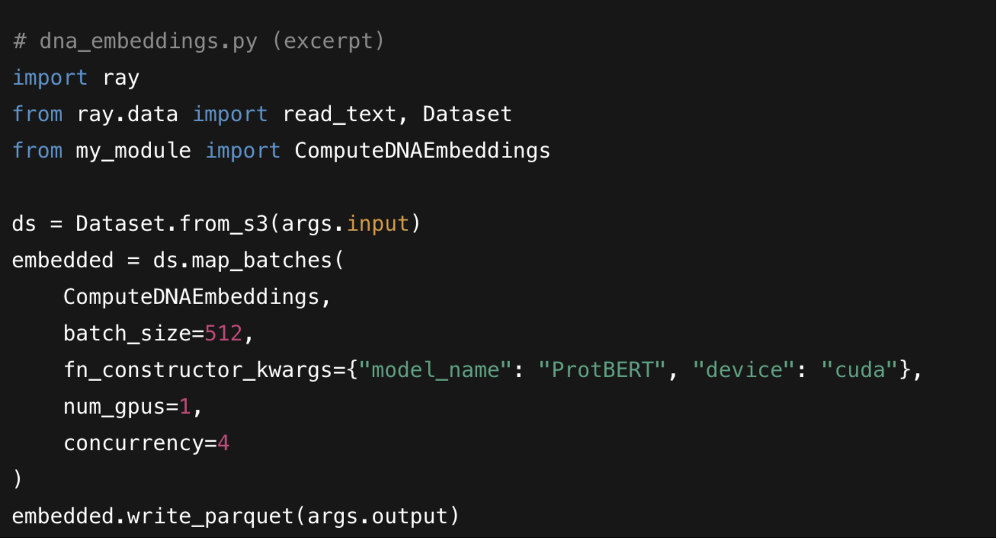
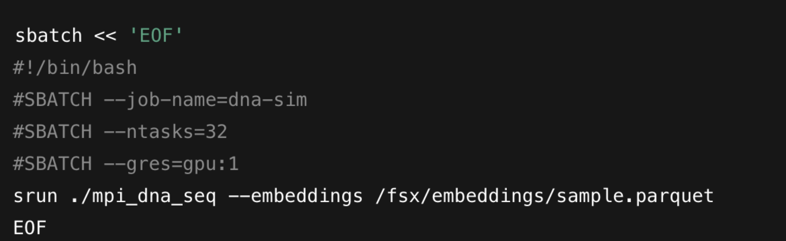

# Architecture

This work aims to evaluate a two phased architecture approach as a framework to
address the current needs for highly scalable pre-processing, storage and specific
numeric simulation purposes.

To validate this architecture, the Metagenomic read clustering, a real DNA
sequencing task, was chosen as it is a natural fit for our two‐phase pipeline. In
Phase 1, the Ray application ingests raw FASTQ reads, computes low‐dimensional
k-mer embeddings by leveraging the model “zhihan1996/DNABERT-2-117M” (as an
alternative to the model LSHvec [19]) for generating k-mer embeddings in the Ray
pipeline. This model produces fixed-length, numeric vectors that can be sharded and
fed into an HPC clustering job. This Ray application writes Parquet shards of (read ×
embedding) vectors to S3/FSx. Phase 2 then launches an HPC job — e.g., a parallel
LSH-based [19] or k-means clustering algorithm on a Slurm/MPI fleet — that
consumes those embeddings to group reads by organism, producing discrete
clusters that map directly to microbial taxa as a set of labeled clusters to identifying
community structure — all without manually managing intermediate formats or compute resources.

This chapter details the end‐to‐end (Figure 5) infrastructure and deployment
patterns that realize our two‐phase pipeline — Phase 1 for Ray-based data
preparation and Phase 2 for HPC-driven numerical simulation — entirely as code.
We begin with an overview of our Infrastructure as Code (IaC) strategy, then show
how to provision the Ray cluster and embed the GPU-accelerated preprocessing
logic, followed by the ParallelCluster setup for Slurm/MPI-based simulations, and
conclude with storage architectures that bridge the two phases.

**Figure 5**: End-to-end pipeline architecture that realises the two-phase pattern
(Ray to HPC).

## 4.1. Infrastructure as Code (IaC) Overview

All infrastructure — compute fleets, networking, and storage — is defined and
deployed via AWS CloudFormation (or CDK) and orchestrated in a CI/CD pipeline
(CodePipeline and CodeBuild). This ensures every change is versioned, tested, and
rolled out consistently:

- Ray Autoscaler Stack: A CloudFormation template (or CodeBuild step) invokes
the Ray CLI (ray up) with a YAML config (ray-cluster-example-full.yaml) to spin
up head and worker nodes on EC2, completed with Docker GPU support and
autoscaling policies.

- ParallelCluster Stack: A separate template defines the Slurm head node,
compute queues (including GPU-accelerated instances), Elastic Fabric
Adapter (EFA), and Amazon FSx for Lustre, and then bootstraps code
compilation.
- CI/CD Automation: CodeBuild builds and pushes Docker images (for dna embeddings.py) to ECR, updates CloudFormation stacks, and employs
CloudWatch alarms (e.g. Ray dashboard metrics or Slurm queue depth) to
trigger Lambda-backed scaling actions.

## 4.2. Phase 1: Ray Cluster Provisioning

We use the Ray autoscaler config below to provision a head node and GPU-capable
workers. This YAML is stored alongside application code and applied automatically
on each commit:

- This configuration launches Docker containers on each node, detects GPUs
automatically, and tears down idle nodes after five minutes, ensuring our
cluster right-sizes to workload demand.

## 4.3. Phase 1: Ray Application for Data Processing

Our preprocessing script, dna embeddings.py, reads FASTQ files from S3, applies
AI-based tokenization/encoding, and writes out Parquet shards of (N×D)
embeddings:

This modular design allows dna embeddings.py to invoke UDFs for tokenization and
ProtBERT inference on GPU actors, producing Parquet shards of (N×D) float arrays
ready for downstream simulation.
Within dna embeddings.py, each batch is processed by GPU-resident actors:

This pattern — loading data in parallel, caching models in long-lived actors, and
spilling to S3/FSx — leverages both CPU and GPU resources dynamically [14].

## 4.4. Phase 2: AWS ParallelCluster Provisioning

To consume the embeddings, we deploy an HPC cluster via AWS ParallelCluster. A
CloudFormation template (or pcluster create) defines:

- Head Node with SLURM controller
- Compute Queues (EC2 instance type): GPU (G4dn), CPU (Hpc6a),
- Memory-optimized (R5)
- Networking: EFA for low-latency MPI
- Storage: Amazon FSx for Lustre, mounted at /fsx

With this in place, users submit simulation jobs that read embeddings directly from
FSx or S3:

## 4.5. Storage and Data Flow

Embedding outputs and simulation inputs/results traverse a unified storage layer:

- Phase 1 Outputs: Parquet shards written to Amazon S3 and optionally cached
in FSx for Lustre for high-throughput reads.
- Phase 2 Inputs/Outputs: The Slurm jobs mount FSx at job startup; input
embeddings and output simulation data (NetCDF, HDF5) reside on Lustre and
are synced back to S3 for long-term archival and analysis.
- Data Catalog: AWS Glue crawlers register schemas in the Glue Data Catalog,
enabling Athena queries or downstream ML workflows.

Together, these sections — IaC patterns, Ray cluster setup, GPU-accelerated
preprocessing, ParallelCluster orchestration, and unified storage— form a
reproducible, modular, and scalable architecture for large-scale genomic workflows
and beyond.