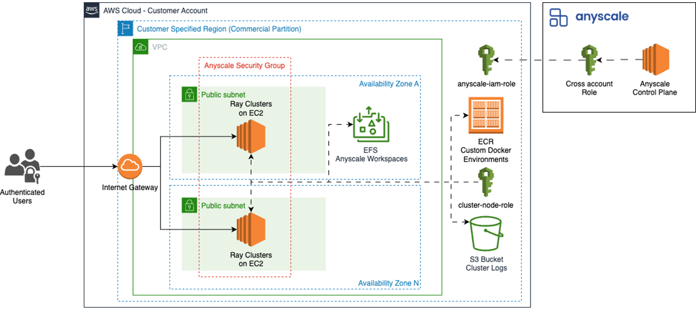
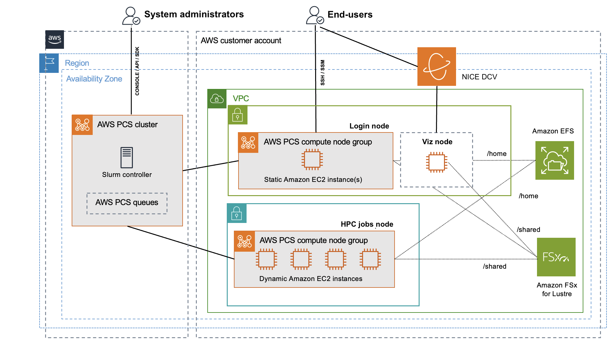

**AWS Data Enablers for Synergy between Ray and HPC:**

AWS provides a robust ecosystem that supports the synergy between Ray clusters (often used for data preprocessing and AI/ML purposes) and traditional HPC workloads:

- Infrastructure as Code (IaC) and Automation:
- AWS ParallelCluster: A key service for setting up and managing HPC clusters on AWS, enabling users to define and provision the necessary infrastructure (compute, networking, storage) using IaC principles [@aws_compute_starccm]
- It can integrate with services like Amazon FSx for Lustre and EFA
- AWS CloudFormation: Used to provision and manage AWS resources, supporting automated and reproducible infrastructure deployments for both HPC and Ray clusters
- AWS Batch & Amazon EKS: For managing containerized workloads. Ray clusters can be deployed on Amazon EKS [@nguyen2023building]. AWS Batch helps run HPC and big data applications without managing infrastructure

**Interoperability and Data Flow:**

- Amazon S3: Serves as a centralized, highly scalable, and cost-effective data lake for raw and processed data, accessible by all AWS services, including Ray and HPC clusters
- This alleviates the need for extensive data transfers between different compute environments.
- AWS DataSync: Facilitates secure and efficient transfer of large datasets from on-premises environments to Amazon S3, bridging the gap between existing data centers and cloud HPC/ML infrastructure
- Amazon FSx for Lustre & Amazon EFS: Provide high-performance, shared file systems necessary for HPC workloads and for efficient data access by Ray clusters [@khanuja2022applied]
- Amazon SageMaker HyperPod: A managed service that enables scalable and resilient distributed AI/ML workloads using Ray jobs [@vinciguerra2025rayhyperpod]
- This demonstrates AWS's direct support for integrating Ray with its managed ML services, offering enhanced resiliency and auto-resume capabilities crucial for long-running tasks
- Hybrid Execution Models: AWS supports hybrid architectures like Mashup, which leverages both traditional VM-based (EC2) and serverless (Lambda) platforms to execute scientific workflows
- This approach can optimize both execution time (average 34% reduction) and cost (average 43% reduction) by intelligently placing tasks on the most suitable platform (e.g., bursty, stateless tasks to serverless; long-running, stateful tasks to VMs). This concept applies directly to integrating Ray (for AI/ML preprocessing, training) with HPC (for traditional simulations) by selecting the optimal compute environment for each stage of a complex workflow.

