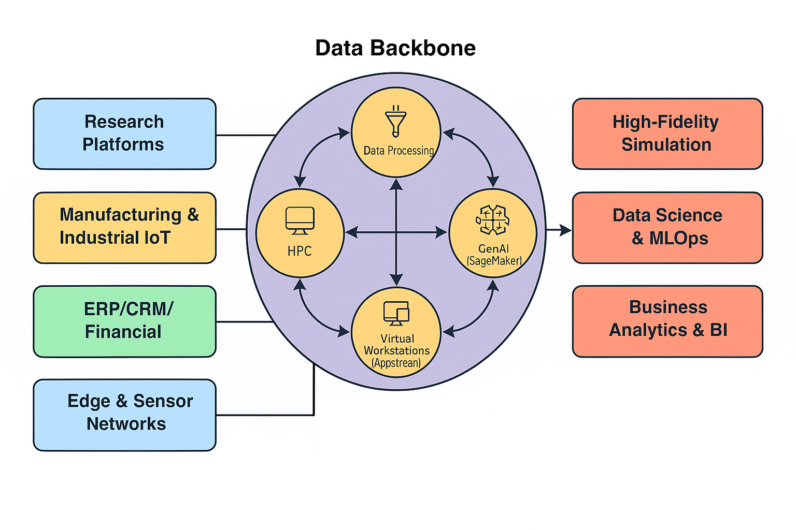

# Architecture Design Decisions for Ray Data Preparation and HPC on Cloud
This work aims to evaluate a two phased architecture approach as an framework to address the current needs for highly scalable pre-processing, storage and specific numeric simulation purposes.

Modular components is a key best practice for High-Performance Computing (HPC) workloads on Amazon Web Services (AWS), contributing to improved operational efficiency and reduced manual intervention. This approach is crucial for managing complex applications and facilitating continuous development practices in the cloud environment.

## Data centric - Data backbone

Trend in the cloud industry to ties easily integration between different processing engines and capabilities to simplify specially data exchange for one to feed another: HPC <-> AI.

### Storage - Data Structure and Format

AAmazon Feature store vs LanceDB vs S3:Parquet for embeddings or genomic DNA sequencing

Well architected for HPC
    https://docs.aws.amazon.com/wellarchitected/latest/framework/welcome.html/

Fully Automation Ray to HPC

###TODO design decisions from "massive..." for the structure, software artifacts, paragraphs, small objectives, scope/non scope, toolings, references where industry already have gone
###TODO metrics to evaluate, graphs, reports, diagrams

**Benefits of Modular Architectures in HPC on AWS**

- Enhanced Scalability and Flexibility: Modular design, as facilitated by cloud services and frameworks like Ray, allows for dynamic scaling of resources (e.g., EC2 instances, GPUs) to meet varying workload demands, moving beyond the limitations of on-premises fixed capacities
- Faster Innovation and Experimentation: Breaking down complex problems into modular components enables quicker experimentation and iteration on business use cases, accelerating the design, development, and testing of new products
- Improved Maintainability and Adaptability: Modular components are easier to update, debug, and maintain. This also allows for the adaptive allocation of compute resources and smoother integration into existing workflows
- Reduced Vendor Lock-in: By designing with modular, open-source frameworks like Ray that integrate with various backends and cloud providers, organizations can reduce dependency on a single vendor's proprietary solutions