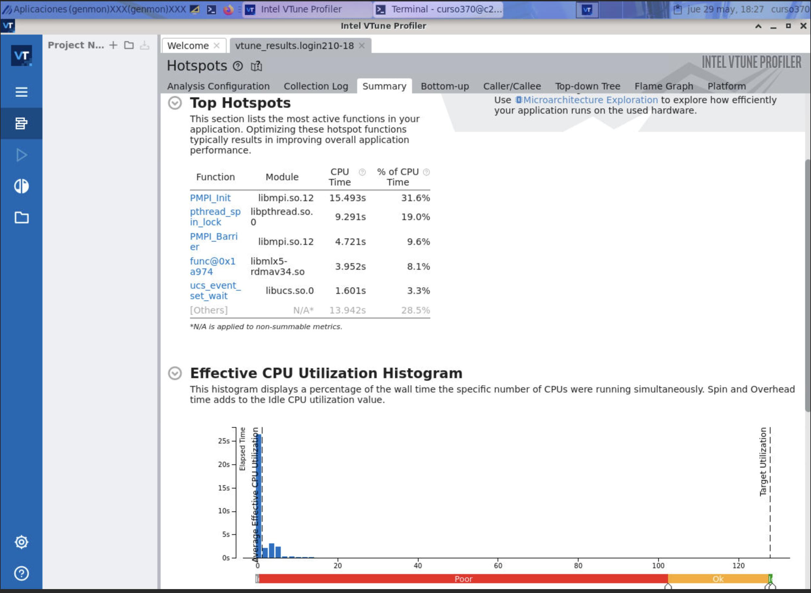
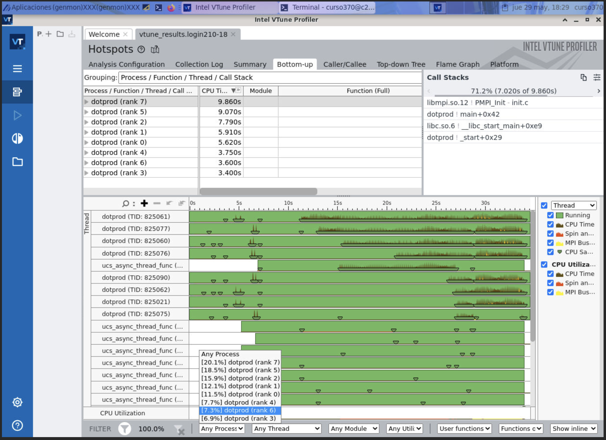
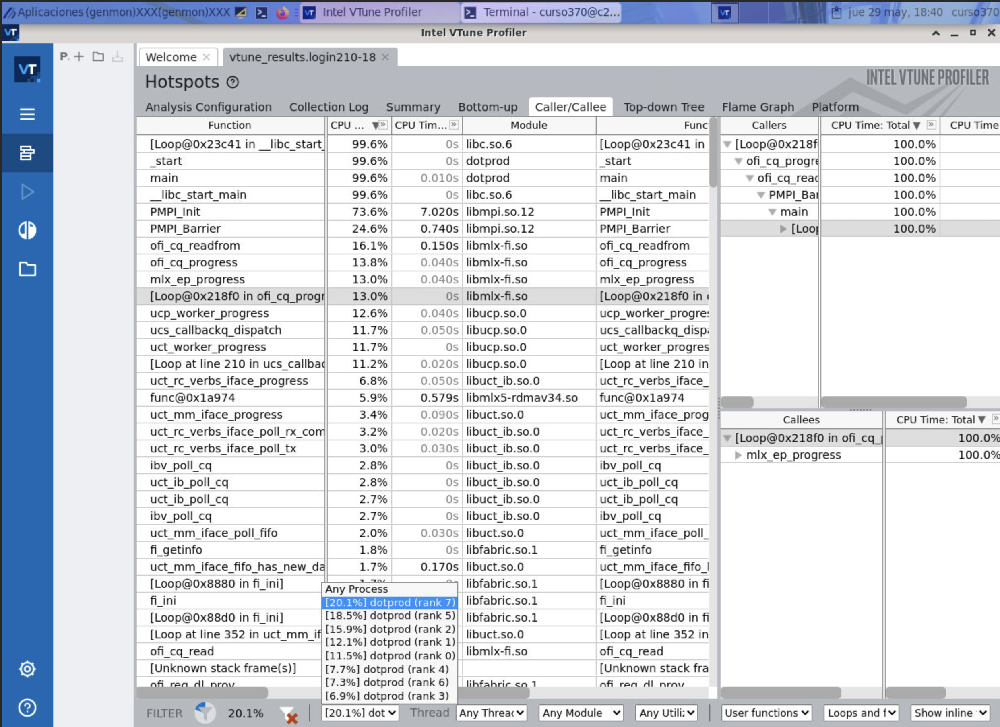
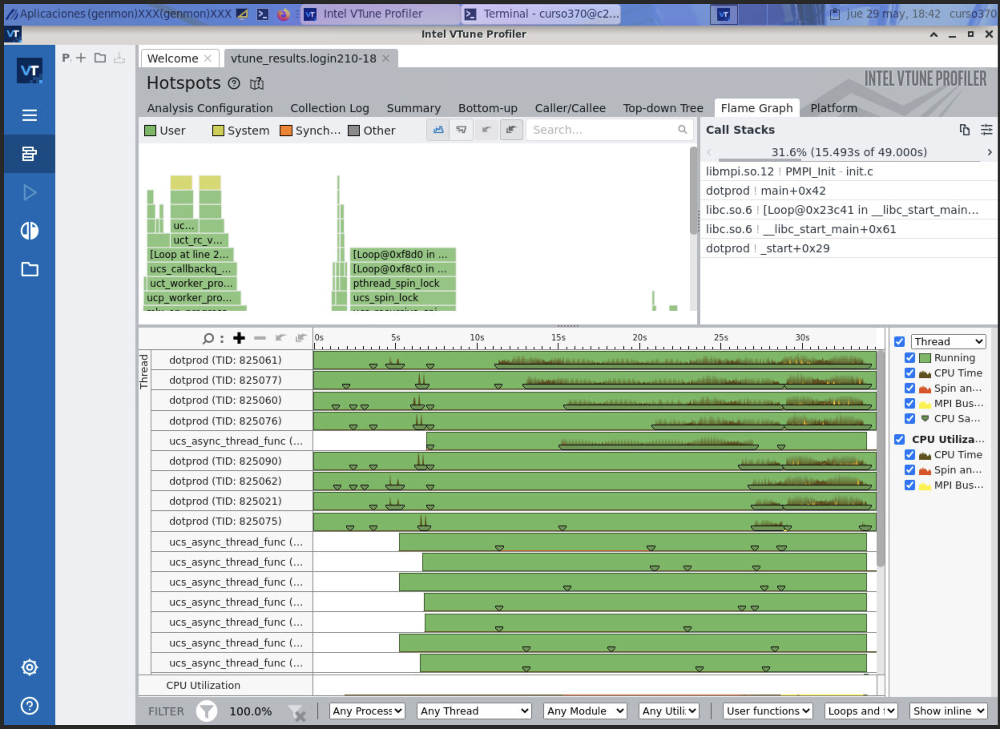

# OpenMP and MPI Labs Assignment

## Labs1, Vectorization with OpenMP; 1. The code multf.c performs the product of matrices

Performance & Speedup Analysis: Matrix Multiplication (D = A × Bᵗ)

- compute -c 4
- module load intel vtune
- export OMP_NUM_THREADS={1,2,4}

Four versions of the matrix multiplication application were evaluated:

- **Baseline**: Sequential version (OpenMP directives commented)
- **OMP**: OpenMP parallelized version (no vectorization)
- **OMP + SIMD**: OpenMP parallelized and SIMD for omp reduction
- **OMP + SIMD + flags**: OpenMP parallelized, SIMD for omp reduction and agressive optimizations with compiler-enabled SIMD auto-vectorization 

### Compiler and flags used:

- **Makefile**: Make
  - **make MODE=sequential**

        Baseline Sequential
        
  - **make MODE=parallel**
        
        OpenMP Parallel

  - **make TARGET=multf_vec MODE=simd**
        
        SIMD Declaratives (OpenMP + SIMD code)

  - **make TARGET=multf_vec MODE=vector**

        SIMD + Autovectorization Flags

  - **make clean**
        
        Clean up binaries


- **Manual compilation (Linux)**: 
```bash
# Baseline
gcc -O2 -fno-tree-vectorize -fopenmp -o multf multf.c

# Parallel (OpenMP)
gcc -O2 -fopenmp -fopt-info-vec -march=native -o multf multf.c

# Parallel OpenMP with SIMD code declaratives
gcc -O2 -fopenmp -fopt-info-vec -march=native -o multf_vec multf_vec.c
multf_vec.c:47:24: optimized: loop vectorized using 64 byte vectors

# Vectorized (OpenMP + SIMD + Autovectorizing flags)
gcc -O3 -fopenmp -march=native -ftree-vectorize -fopt-info-vec -o multf_vec multf_vec.c
multf_vec.c:45:18: optimized: loop vectorized using 64 byte vectors
multf_vec.c:45:18: optimized: loop vectorized using 32 byte vectors
multf_vec.c:47:24: optimized: loop vectorized using 64 byte vectors
multf_vec.c:29:7: optimized: loop vectorized using 64 byte vectors
multf_vec.c:26:7: optimized: loop vectorized using 64 byte vectors


```

### Average Execution Time (in seconds)
The applications were executed three times to get the average value for a better statistical relevance.

| Version              | Threads | Avg Time (s) |
|----------------------|---------|--------------|
| **Baseline**         | 1       | 12.1076      |
| **OMP (No SIMD)**    | 1       | 12.1574      |
|                      | 2       | 6.0719       |
|                      | 4       | 3.0333       |
| **OMP + SIMD**       | 1       | 2.4343       |
|                      | 2       | 1.1901       |
|                      | 4       | 0.6352       |
| **OMP + SIMD + flags**       | 1       | 1.0498       |
|                      | 2       | 0.5931       |
|                      | 4       | 0.3113       |


### Speedup Relative to Baseline
| Version              | Threads | Speedup |
|----------------------|---------|---------|
| **Baseline**         | 1       | 1.00×    |
| **OMP (No SIMD)**    | 1       | 0.9967×  |
|                      | 2       | 1.9933×  |
|                      | 4       | 3.9906×  |
| **OMP + SIMD**       | 1       | 4.97×    |
|                      | 2       | 10.17×   |
|                      | 4       | 19.06×   |
| **OMP + SIMD + flags**       | 1       | 11.53×   |
|                      | 2       | 20.41×   |
|                      | 4       | 38.89×   |


 ### Vectorization Insights (Intel VTune Analysis)
| Version       | Vectorized FP Ops | SIMD Width Used  |
|---------------|-------------------|------------------|
| **OMP Only**  | 0.0%              | Scalar only      |
| **OMP + SIMD**| 94.1%             | 512-bit (AVX-512)|
| **OMP + SIMD + flags**| 94.0%             | 512-bit (AVX-512)|

- **Vectorization report - OMP Only - VTune**: For the parallelized with OpenMP, without SIMD vectorization
```bash
vtune -collect performance-snapshot -collect memory-access -collect hotspots -collect threading -- ./multf
...
Vectorization: 0.0% of Packed FP Operations
 | This code has floating point operations and is not vectorized. Consider
 | either recompiling the code with optimization options that allow
 | vectorization or using Intel Advisor to vectorize the loops.
 |
    Instruction Mix
        SP FLOPs: 39.9% of uOps
            Packed: 0.0% from SP FP
                128-bit: 0.0% from SP FP
                256-bit: 0.0% from SP FP
                512-bit: 0.0% from SP FP
            Scalar: 100.0% from SP FP
             | This code has floating point operations and is not vectorized.
             | Consider either recompiling the code with optimization options
             | that allow vectorization or using Intel Advisor to vectorize the
             | loops.
             |
        DP FLOPs: 0.0% of uOps
            Packed: 0.0% from DP FP
                128-bit: 0.0% from DP FP
                256-bit: 0.0% from DP FP
                512-bit: 0.0% from DP FP
            Scalar: 0.0% from DP FP
        x87 FLOPs: 0.0% of uOps
        Non-FP: 60.1% of uOps
    FP Arith/Mem Rd Instr. Ratio: 0.997
    FP Arith/Mem Wr Instr. Ratio: 4,084.218
...
```

- **Vectorization report - OMP + SIMD - VTune**: For the parallelized with OpenMP, with SIMD vectorization
```bash
vtune -collect performance-snapshot -collect memory-access -collect hotspots -collect threading -- ./multf_vec
...
Vectorization: 94.1% of Packed FP Operations
    Instruction Mix
        SP FLOPs: 27.7% of uOps
            Packed: 94.1% from SP FP
                128-bit: 0.0% from SP FP
                256-bit: 0.0% from SP FP
                512-bit: 94.1% from SP FP
            Scalar: 5.9% from SP FP
        DP FLOPs: 0.0% of uOps
            Packed: 0.0% from DP FP
                128-bit: 0.0% from DP FP
                256-bit: 0.0% from DP FP
                512-bit: 0.0% from DP FP
            Scalar: 0.0% from DP FP
        x87 FLOPs: 0.0% of uOps
        Non-FP: 72.3% of uOps
    FP Arith/Mem Rd Instr. Ratio: 0.678
    FP Arith/Mem Wr Instr. Ratio: 2.056
...
```


- **Vectorization report - OMP + SIMD + flags - VTune**: For the parallelized with OpenMP, with SIMD vectorization and compiler flags for auto-vectorization
```bash
vtune -collect performance-snapshot -collect memory-access -collect hotspots -collect threading -- ./multf_vec
...
Vectorization: 94.0% of Packed FP Operations
    Instruction Mix
        SP FLOPs: 32.2% of uOps
            Packed: 94.0% from SP FP
                128-bit: 0.0% from SP FP
                256-bit: 0.0% from SP FP
                512-bit: 94.0% from SP FP
            Scalar: 6.0% from SP FP
        DP FLOPs: 0.0% of uOps
            Packed: 0.0% from DP FP
                128-bit: 0.0% from DP FP
                256-bit: 0.0% from DP FP
                512-bit: 0.0% from DP FP
            Scalar: 0.0% from DP FP
        x87 FLOPs: 0.0% of uOps
        Non-FP: 67.8% of uOps
    FP Arith/Mem Rd Instr. Ratio: 1.014
    FP Arith/Mem Wr Instr. Ratio: 2.012
...

```

- **[WiP]Vectorization report - OMP Only - Likwid**: For the parallelized with OpenMP, without SIMD vectorization


- **[WiP]Vectorization report - OMP + SIMD - Likwid**: For the parallelized with OpenMP, with SIMD vectorization

- **[WiP]Vectorization report - OMP + SIMD + flags - Likwid**: For the parallelized with OpenMP, with SIMD vectorization

### Future work

To further improve vectorization, memory access efficiency, and profiling, the following GCC flags are commonly used:


| Flag                          | Purpose                                                                                   |
|------------------------------|--------------------------------------------------------------------------------------------|
| `-O3`                         | Enables high-level optimizations including loop unrolling and inlining.                   |
| `-Ofast`                      | Similar to `-O3` but also ignores strict standards compliance for faster code.            |
| `-march=native`              | Generates code optimized for the architecture of the host machine.                        |
| `-mtune=native`              | Tunes performance (scheduling, pipelining) for the host CPU without changing ISA.         |
| `-mprefer-vector-width=512` | Instructs compiler to prefer 512-bit SIMD width (for AVX-512 CPUs).                       |
| `-fopenmp`                   | Enables OpenMP multithreading.                                                            |
| `-ftree-vectorize`           | Enables automatic loop vectorization.                                                     |
| `-ftree-loop-vectorize`      | More explicit flag to vectorize loops (redundant with `-ftree-vectorize`, but clearer).   |
| `-ftree-slp-vectorize`       | Enables basic block-level vectorization (Superword Level Parallelism).                    |
| `-fstrict-aliasing`          | Assumes that pointer aliases follow standard rules, allowing better vectorization.       |
| `-fno-math-errno`            | Avoids storing `errno` for math functions, enabling math inlining/vectorization.         |
| `-fopt-info-vec`             | Reports which loops were vectorized.                                                      |
| `-fopt-info-vec-missed`      | Reports which loops **were not** vectorized and why.                                     |
| `-fopt-info-vec-all`         | Shows all vectorization attempts (successful or not).                                     |
| `-fopt-info-optall-optimized`| Reports **all optimizations** made by the compiler.                                       |
| `-fdump-tree-vect`           | Dumps detailed vectorization info (in `.vect` dump files, e.g., `multf.c.147t.vect`).    |

---

- **The `restrict` keyword**: tells the compiler that a given pointer is the **only** reference to that memory region during its scope. This guarantees **no aliasing**, which allows:

  - Better **vectorization** because the compiler can confidently reorder or combine memory loads/stores.
  - More aggressive optimizations because pointer aliasing checks are unnecessary.


### Conclusions
- OpenMP-only version scales nearly linearly with threads (up to 4×), but misses deeper compiler optimizations.
- Adding compiler vectorization flags unlocks full hardware performance as per the aggressive compiler optimizations and loop transformations (-O3, -ftree-vectorize, -march=native): 
  - significantly outperforms others, achieving ~39× speedup;
  - Maximizes SIMD utilization (as seen in VTune reports); 
  - Reduces scalar overhead through inlining, unrolling, and optimized memory access.
- VTune and Likwid confirms 94% vectorized FP instructions, leveraging AVX-512 (64-byte SIMD).
- Combining OpenMP for multithreading with SIMD via vectorization maximizes performance in CPU-bound workload.


## Labs1, Vectorization with OpenMP; 2,3. Parallelize and vectorize saxpy.c  

- compute -c 4
- module load intel vtune
- export OMP_NUM_THREADS={1,2,4}

Three versions of the saxpy factor multiplication application were evaluated:

- **SIMD only**: Only SIMD function declaration
- **OMP + SIMD**: OpenMP loop parallelized and SIMD function declaration
- **OMP + SIMD + flags**: OpenMP parallelized, SIMD function declaration and agressive optimization with compiler-enabled SIMD auto-vectorization 


### Compiler and flags used:

- **Makefile**: Make
  - **make MODE=basic**

        Basic mode

  - **make MODE=report**

        With vectorization reporting

  - **make MODE=vectorized**

        Fully optimized (O3 + vectorization)

  - **make clean**

        Clean build                        

- **Manual compilation (Linux)**: 
```bash
gcc -O2 -fopenmp -fopt-info-vec -o saxpy saxpy.c

gcc -O2 -fopenmp -fopt-info-vec -fopt-info-vec-optimized -march=native -o saxpy saxpy.c
saxpy.c:108:14: optimized: loop vectorized using 64 byte vectors
saxpy.c:16:15: optimized: loop vectorized using 64 byte vectors
saxpy.c:26:12: optimized: loop vectorized using 16 byte vectors
saxpy.c:26:12: optimized: loop vectorized using 32 byte vectors
saxpy.c:26:12: optimized: loop vectorized using 32 byte vectors
saxpy.c:26:12: optimized: loop vectorized using 64 byte vectors

gcc -O3 -fopenmp -march=native -ftree-vectorize -fopt-info-vec -o saxpy saxpy.c
saxpy.c:74:5: optimized: loop vectorized using 64 byte vectors
saxpy.c:74:5: optimized: loop vectorized using 64 byte vectors
saxpy.c:16:15: optimized: loop vectorized using 64 byte vectors
saxpy.c:16:15: optimized: loop vectorized using 64 byte vectors
saxpy.c:99:5: optimized: loop vectorized using 64 byte vectors
saxpy.c:99:5: optimized: loop vectorized using 64 byte vectors
saxpy.c:112:14: optimized: loop vectorized using 64 byte vectors
saxpy.c:112:14: optimized: loop vectorized using 64 byte vectors
saxpy.c:51:3: optimized: loop vectorized using 64 byte vectors
saxpy.c:61:3: optimized: loop vectorized using 64 byte vectors
saxpy.c:61:3: optimized: loop vectorized using 32 byte vectors
saxpy.c:61:3: optimized: loop vectorized using 64 byte vectors
saxpy.c:51:3: optimized: loop vectorized using 64 byte vectors
saxpy.c:61:3: optimized: loop vectorized using 64 byte vectors
saxpy.c:51:3: optimized: loop vectorized using 64 byte vectors
saxpy.c:61:3: optimized: loop vectorized using 64 byte vectors
saxpy.c:51:3: optimized: loop vectorized using 64 byte vectors
saxpy.c:61:3: optimized: loop vectorized using 64 byte vectors
saxpy.c:51:3: optimized: loop vectorized using 64 byte vectors
saxpy.c:26:12: optimized: loop vectorized using 16 byte vectors
saxpy.c:26:12: optimized: loop vectorized using 32 byte vectors
saxpy.c:26:12: optimized: loop vectorized using 32 byte vectors
saxpy.c:26:12: optimized: loop vectorized using 64 byte vectors
```

### SIMD only Baseline Execution

The applications were executed three times to get the average value for a better statistical relevance.

| Function        | Baseline Avg Time (s) |
|----------------|------------------------|
| saxpy_no_simd  | 1.086                  |
| saxpy          | 0.937                  |
| saxpyi_no_simd | 1.304                  |
| saxpyi         | 0.938                  |


### SIMD + OpenMP Loops Parallelized 

| Function        | Threads | Run 1  | Run 2  | Run 3  | **Average Time (s)** |
|----------------|---------|--------|--------|--------|-----------------------|
| saxpy_no_simd  | 4       | 0.281  | 0.282  | 0.278  | **0.280**             |
| saxpy          | 4       | 0.210  | 0.208  | 0.208  | **0.209**             |
| saxpyi_no_simd | 4       | 0.362  | 0.363  | 0.359  | **0.361**             |
| saxpyi         | 4       | 0.210  | 0.209  | 0.208  | **0.209**             |
| saxpy_no_simd  | 2       | 0.576  | 0.560  | 0.558  | **0.565**             |
| saxpy          | 2       | 0.437  | 0.415  | 0.425  | **0.426**             |
| saxpyi_no_simd | 2       | 0.732  | 0.721  | 0.718  | **0.724**             |
| saxpyi         | 2       | 0.438  | 0.416  | 0.425  | **0.426**             |
| saxpy_no_simd  | 1       | 1.087  | 1.088  | 1.084  | **1.086**             |
| saxpy          | 1       | 0.942  | 0.939  | 0.931  | **0.937**             |
| saxpyi_no_simd | 1       | 1.304  | 1.305  | 1.302  | **1.304**             |
| saxpyi         | 1       | 0.943  | 0.939  | 0.932  | **0.938**             |


### SIMD + OpenMP Loops Parallelized - Summary (OpenMP + SIMD, 4 Threads)

| Function        | Optimized Avg Time (s) |
|----------------|-------------------------|
| saxpy_no_simd  | 0.280                   |
| saxpy          | 0.209                   |
| saxpyi_no_simd | 0.361                   |
| saxpyi         | 0.209                   |


### Speedup: SIMD Only vs Optimized (OpenMP + SIMD, 4 Threads)

| Function        | Baseline (s) | Optimized (s) | Speedup |
|----------------|--------------|----------------|---------|
| saxpy_no_simd  | 1.086        | 0.280          | 3.88×   |
| saxpy          | 0.937        | 0.209          | 4.48×   |
| saxpyi_no_simd | 1.304        | 0.361          | 3.61×   |
| saxpyi         | 0.938        | 0.209          | 4.49×   |

----

### SIMD + OpenMP Loops Parallelized + flags for auto-vectorization

| Function        | Threads | Run 1  | Run 2  | Run 3  | Avg (s) |
|----------------|---------|--------|--------|--------|---------|
| saxpy_no_simd  | 4       | 0.106  | 0.107  | 0.108  | 0.107   |
| saxpy          | 4       | 0.106  | 0.107  | 0.108  | 0.107   |
| saxpyi_no_simd | 4       | 0.106  | 0.107  | 0.108  | 0.107   |
| saxpyi         | 4       | 0.106  | 0.107  | 0.108  | 0.107   |
| saxpy_no_simd  | 2       | 0.211  | 0.213  | 0.210  | 0.211   |
| saxpy          | 2       | 0.211  | 0.213  | 0.209  | 0.211   |
| saxpyi_no_simd | 2       | 0.211  | 0.214  | 0.209  | 0.211   |
| saxpyi         | 2       | 0.210  | 0.213  | 0.210  | 0.211   |
| saxpy_no_simd  | 1       | 0.483  | 0.482  | 0.481  | 0.482   |
| saxpy          | 1       | 0.483  | 0.481  | 0.480  | 0.481   |
| saxpyi_no_simd | 1       | 0.483  | 0.482  | 0.480  | 0.482   |
| saxpyi         | 1       | 0.483  | 0.482  | 0.480  | 0.482   |


### Speedup SIMD Only vs SIMD + OpenMP Loops Parallelized + flags for auto-vectorization

| Function        | Threads | Baseline (s) | Optimized (s) | Speedup |
|----------------|---------|---------------|----------------|---------|
| saxpy_no_simd  | 4       | 1.086         | 0.107          | 10.15×  |
| saxpy          | 4       | 0.937         | 0.107          | 8.76×   |
| saxpyi_no_simd | 4       | 1.304         | 0.107          | 12.18×  |
| saxpyi         | 4       | 0.938         | 0.107          | 8.77×   |
| saxpy_no_simd  | 2       | 1.086         | 0.211          | 5.15×   |
| saxpy          | 2       | 0.937         | 0.211          | 4.44×   |
| saxpyi_no_simd | 2       | 1.304         | 0.211          | 6.18×   |
| saxpyi         | 2       | 0.938         | 0.211          | 4.44×   |
| saxpy_no_simd  | 1       | 1.086         | 0.482          | 2.25×   |
| saxpy          | 1       | 0.937         | 0.481          | 1.95×   |
| saxpyi_no_simd | 1       | 1.304         | 0.482          | 2.71×   |
| saxpyi         | 1       | 0.938         | 0.482          | 1.95×   |


### Vectorization Insights (Intel VTune Analysis)

- **Vectorization report - SIMD + OpenMP - VTune**: For the loops parallelized with OpenMP and SIMD function vectorization
```bash
vtune -collect performance-snapshot -collect memory-access -collect hotspots -collect threading -- ./saxpy
...
Vectorization: 19.9% of Packed FP Operations
 | A significant fraction of floating point arithmetic instructions are scalar.
 | This indicates that the code was not fully vectorized. Use Intel Advisor to
 | see possible reasons why the code was not vectorized.
 |
    Instruction Mix
        SP FLOPs: 27.6% of uOps
            Packed: 19.9% from SP FP
                128-bit: 19.9% from SP FP
                 | Using the latest vector instruction set can improve
                 | parallelism for this code. Consider either recompiling the
                 | code with the latest instruction set or using Intel Advisor
                 | to get vectorization help.
                 |
                256-bit: 0.0% from SP FP
                512-bit: 0.0% from SP FP
            Scalar: 80.1% from SP FP
             | A significant fraction of floating point arithmetic instructions
             | are scalar. This indicates that the code was not fully
             | vectorized. Use Intel Advisor to see possible reasons why the
             | code was not vectorized.
             |
        DP FLOPs: 0.0% of uOps
            Packed: 0.0% from DP FP
                128-bit: 0.0% from DP FP
                256-bit: 0.0% from DP FP
                512-bit: 0.0% from DP FP
            Scalar: 0.0% from DP FP
        x87 FLOPs: 0.0% of uOps
        Non-FP: 72.4% of uOps
    FP Arith/Mem Rd Instr. Ratio: 0.981
    FP Arith/Mem Wr Instr. Ratio: 1.999
...
```


- **Vectorization report - SIMD + OpenMP + flags auto vectorizing - VTune**: For the parallelized with OpenMP, with SIMD vectorization and compiler flags for auto-vectorization
```bash
vtune -collect performance-snapshot -collect memory-access -collect hotspots -collect threading -- ./saxpy
...
Vectorization: 87.2% of Packed FP Operations
    Instruction Mix
        SP FLOPs: 51.6% of uOps
            Packed: 87.2% from SP FP
                128-bit: 0.0% from SP FP
                256-bit: 0.0% from SP FP
                512-bit: 87.2% from SP FP
            Scalar: 12.8% from SP FP
        DP FLOPs: 0.0% of uOps
            Packed: 0.0% from DP FP
                128-bit: 0.0% from DP FP
                256-bit: 0.0% from DP FP
                512-bit: 0.0% from DP FP
            Scalar: 0.0% from DP FP
        x87 FLOPs: 0.0% of uOps
        Non-FP: 48.4% of uOps
    FP Arith/Mem Rd Instr. Ratio: 1.444
    FP Arith/Mem Wr Instr. Ratio: 4.046
...
```

### VTune comparison: SIMD + OpenMP vs SIMD + OpenMP + 03, Auto vectorozing

| Aspect                 | No `-O3`, No Auto Vec      | With `-O3` and Auto Vec      |
|------------------------|----------------------------|------------------------------|
| Vectorization (%)      | 19.9%                      | 87.2%                        |
| SIMD Width             | 128-bit (SSE)              | 512-bit (AVX-512)            |
| Scalar FP              | 80.1%                      | 12.8%                        |
| Performance Potential  | Poor (mostly scalar loops) | Excellent (wide SIMD usage)  |
| Compiler Strategy      | Conservative               | Aggressive + intelligent     |

### Conclusions
- All four function variants experienced 3.6× to 4.5× speedup when parallelism and SIMD function vectorization were enabled. Having best observed speedup:
  - saxpyi: 4.49×
  - saxpy: 4.48×
- Combining OpenMP threading with SIMD vectorization is crucial for exploiting modern CPU hardware effectively
- Autovectorization + OpenMP results in a massive boost when loops are structured well
- It would worth to redesign the loops for leveraging omp [colapse (2)] so the product of the iteration spaces (NREPS * N) becomes the total loop space.


## Labs1, Vectorization with OpenMP; 4. Vectorize & parallelize the code jacobi.c


- compute -c 4
- module load intel vtune
- export OMP_NUM_THREADS={1,4,8}

### Compiler and flags used:


- **Makefile**: Make/Gprof
  - **make MODE=profile**

        Basic mode

  - **make MODE=vectorized**

        To add auto-vectorizing flag to compiler

  - **make run-profile**

        Runs program to generate gmon.out

  - **make gprof-report**

        Analyzes and dumps result

  - **cat gprof-report.txt**

        Iinspect report

  - **make clean**

        Clean build                        

**First run without optimization**: 

  Gprof

```c
Flat profile:

Each sample counts as 0.01 seconds.
  %   cumulative   self              self     total           
 time   seconds   seconds    calls  Ts/call  Ts/call  name    
 97.63      5.66     5.66                             jacobi
  2.25      5.79     0.13                             initialize
  0.35      5.81     0.02                             error_check

```
  Perf

```c

    $ perf record -e cycles,instructions,cache-misses,cache-references,branch-misses,branch-instructions,mem-loads,mem-stores -g -- ./jacobi

Total Number of Iterations=101
Residual=6.243228E-11
Solution Error=1.332995E-04
[ perf record: Woken up 76 times to write data ]
[ perf record: Captured and wrote 16.736 MB perf.data (182615 samples) ]

    $perf report


Samples: 27K of event 'cycles:u', Event count (approx.): 20227583458
  Children      Self  Command  Shared Object     Symbol
+   99.91%     0.00%  jacobi   [unknown]         [.] 0x5541d68949564100
+   99.91%     0.00%  jacobi   libc-2.31.so      [.] __libc_start_main
+   99.91%     0.00%  jacobi   jacobi            [.] main
+   98.55%    98.11%  jacobi   jacobi            [.] jacobi
+    1.01%     0.96%  jacobi   jacobi            [.] initialize
     0.47%     0.47%  jacobi   [unknown]         [k] 0xffffffffac6010e0
     0.42%     0.42%  jacobi   jacobi            [.] error_check
     0.04%     0.04%  jacobi   [unknown]         [k] 0xffffffffac601c60
...
```

  Vtune

```c
...
Vectorization: 0.0% of Packed FP Operations
 | This code has floating point operations and is not vectorized. Consider
 | either recompiling the code with optimization options that allow
 | vectorization or using Intel Advisor to vectorize the loops.
 |
    Instruction Mix
        SP FLOPs: 0.0% of uOps
            Packed: 0.0% from SP FP
                128-bit: 0.0% from SP FP
                256-bit: 0.0% from SP FP
                512-bit: 0.0% from SP FP
            Scalar: 0.0% from SP FP
        DP FLOPs: 47.9% of uOps
            Packed: 0.0% from DP FP
                128-bit: 0.0% from DP FP
                256-bit: 0.0% from DP FP
                512-bit: 0.0% from DP FP
            Scalar: 100.0% from DP FP
             | This code has floating point operations and is not vectorized.
             | Consider either recompiling the code with optimization options
             | that allow vectorization or using Intel Advisor to vectorize the
             | loops.
             |
        x87 FLOPs: 0.0% of uOps
        Non-FP: 52.1% of uOps
    FP Arith/Mem Rd Instr. Ratio: 1.871
    FP Arith/Mem Wr Instr. Ratio: 6.544
...
```


**Second run with OpenMP+SIMD - No Auto-Vectorization**: 

  Gprof

```c
Flat profile:

Each sample counts as 0.01 seconds.
  %   cumulative   self              self     total           
 time   seconds   seconds    calls  Ts/call  Ts/call  name    
 98.56      6.83     6.83                             __gmon_start__
  1.30      6.92     0.09                             initialize
  0.29      6.94     0.02                             error_check

```
  Perf

```c

    $ perf record -e cycles,instructions,cache-misses,cache-references,branch-misses,branch-instructions,mem-loads,mem-stores -g -- ./jacobi

Total Number of Iterations=101
Residual=6.243228E-11
Solution Error=1.332995E-04
[ perf record: Woken up 68 times to write data ]
[ perf record: Captured and wrote 16.732 MB perf.data (197165 samples) ]

    $perf report

Samples: 30K of event 'cycles:u', Event count (approx.): 19759324578
  Children      Self  Command  Shared Object     Symbol
+   82.75%     0.00%  jacobi   [unknown]         [.] 0000000000000000
+   72.39%     0.00%  jacobi   libgomp.so.1.0.0  [.] 0x0000148f4f1bc986
+   54.81%    54.76%  jacobi   jacobi            [.] jacobi._omp_fn.1
+   41.04%    41.02%  jacobi   jacobi            [.] jacobi._omp_fn.0
+   23.47%     0.00%  jacobi   libgomp.so.1.0.0  [.] GOMP_parallel
+   13.33%     0.00%  jacobi   [unknown]         [.] 0x000055735a9950a0
+   10.14%     0.00%  jacobi   [unknown]         [.] 0x000055734b5710a0
+    1.91%     1.91%  jacobi   libgomp.so.1.0.0  [.] 0x000000000001e43a
+    1.91%     0.00%  jacobi   libgomp.so.1.0.0  [.] 0x0000148f4f1bf43a
+    1.37%     0.00%  jacobi   [unknown]         [.] 0x5541d68949564100
+    1.37%     0.00%  jacobi   libc-2.31.so      [.] __libc_start_main
+    1.37%     0.00%  jacobi   jacobi            [.] main
+    0.96%     0.96%  jacobi   jacobi            [.] initialize
     0.41%     0.41%  jacobi   jacobi            [.] error_check
     0.36%     0.36%  jacobi   libgomp.so.1.0.0  [.] 0x000000000001e43e
...
```

VTune

```c
vtune -collect performance-snapshot -collect memory-access -collect hotspots -collect threading -- ./jacobi

...
Vectorization: 95.9% of Packed FP Operations
 | Using the latest vector instruction set can improve parallelism for this
 | code. Consider either recompiling the code with the latest instruction set or
 | using Intel Advisor to get vectorization help.
 |
    Instruction Mix
        SP FLOPs: 0.0% of uOps
            Packed: 0.0% from SP FP
                128-bit: 0.0% from SP FP
                256-bit: 0.0% from SP FP
                512-bit: 0.0% from SP FP
            Scalar: 100.0% from SP FP
             | This code has floating point operations and is not vectorized.
             | Consider either recompiling the code with optimization options
             | that allow vectorization or using Intel Advisor to vectorize the
             | loops.
             |
        DP FLOPs: 27.4% of uOps
            Packed: 95.9% from DP FP
                128-bit: 95.9% from DP FP
                 | Using the latest vector instruction set can improve
                 | parallelism for this code. Consider either recompiling the
                 | code with the latest instruction set or using Intel Advisor
                 | to get vectorization help.
                 |
                256-bit: 0.0% from DP FP
                512-bit: 0.0% from DP FP
            Scalar: 4.1% from DP FP
        x87 FLOPs: 0.0% of uOps
        Non-FP: 72.6% of uOps
    FP Arith/Mem Rd Instr. Ratio: 1.433
    FP Arith/Mem Wr Instr. Ratio: 4.388
...
```

**Second run with OpenMP+SIMD + Auto Vectorization**: 

```c
make MODE=vectorized
Compiling jacobi.c as jacobi with mode: vectorized
gcc               -O3 -fopenmp -march=native -ftree-vectorize -fopt-info-vec -o jacobi jacobi.c -lm
jacobi.c:139:14: optimized: loop vectorized using 64 byte vectors
jacobi.c:143:39: optimized: loop vectorized using 64 byte vectors
jacobi.c:83:9: optimized: loop vectorized using 64 byte vectors
jacobi.c:83:9: optimized:  loop versioned for vectorization because of possible aliasing
jacobi.c:83:9: optimized: loop vectorized using 32 byte vectors
jacobi.c:131:17: optimized: basic block part vectorized using 64 byte vectors
jacobi.c:137:10: optimized: basic block part vectorized using 64 byte vectors

vtune -collect performance-snapshot -collect memory-access -collect hotspots -collect threading -- ./jacobi

...
Vectorization: 97.3% of Packed FP Operations
    Instruction Mix
        SP FLOPs: 0.0% of uOps
            Packed: 0.0% from SP FP
                128-bit: 0.0% from SP FP
                256-bit: 0.0% from SP FP
                512-bit: 0.0% from SP FP
            Scalar: 0.0% from SP FP
        DP FLOPs: 10.5% of uOps
            Packed: 97.3% from DP FP
                128-bit: 0.0% from DP FP
                256-bit: 0.0% from DP FP
                512-bit: 97.3% from DP FP
            Scalar: 2.7% from DP FP
        x87 FLOPs: 0.0% of uOps
        Non-FP: 89.5% of uOps
    FP Arith/Mem Rd Instr. Ratio: 0.870
    FP Arith/Mem Wr Instr. Ratio: 1.456
...


```

### Statistics & Analysis


This benchmark compares the average real execution time of the Jacobi solver under different optimization setups and OpenMP thread counts. Speedup is computed relative to the non-optimized baseline.

| Setup                                     | Threads | Avg Real Time (s) | Speedup vs Baseline |
|------------------------------------------|---------|-------------------|---------------------|
| No optimization                          |   1     | 6.205             | 1.00× (baseline)    |
| OpenMP + SIMD                            |   4     | 1.918             | 3.23×               |
| OpenMP + SIMD + Auto Vectorization       |   4     | 1.752             | 3.54×               |
| OpenMP + SIMD + Auto Vectorization       |   8     | 1.867             | 3.32×               |


---


VTune analysis on main optimization attributes

| Setup                          | Packed DP FLOPs | Vector ISA Used | DP Scalar | FP Arith/Mem Rd Ratio | SIMD Width |
|--------------------------------|------------------|------------------|-----------|------------------------|------------|
| OpenMP + SIMD                  | 95.9%            | 128-bit          | 4.1%      | 1.433                  | Narrow     |
| OpenMP + SIMD + Auto Vec       | 97.3%            | 512-bit          | 2.7%      | 0.870                  | Wide       |

---

Profiling tool overview

 Tool     | Use Case                                | Outcome Summary                                      |
|----------|------------------------------------------|------------------------------------------------------|
| `gprof`  | Function-level CPU time breakdown        | Identified `jacobi()` as >97% bottleneck            |
| `perf`   | Low-level performance counters           | Confirmed hotspot and cycles in `jacobi()` loop     |
| `vtune`  | Vectorization, ILP, FP instruction mix   | Diagnosed scalar vs packed ops; guided SIMD tuning  |


### Conclusions

Parallelism (OpenMP) and vectorization (SIMD + AVX) combined offer a **3.5× performance improvement** for the Jacobi solver function. 


- **Vectorization Gain**: Adding compiler auto-vectorization improved vector width from **128-bit to 512-bit** SIMD lanes.
- **Instruction Mix Shift**:
  - DP FLOP scalar operations decreased → more loop vectorization.
  - **512-bit SIMD** operations dominate in the fully optimized version.
- **FP Arithmetic/Memory Ratio** dropped slightly with AVX-512, indicating better bandwidth usage and potentially more instruction mix.
- **Speedup from 4-thread parallelism + AVX-512** reaches **3.5×** over scalar baseline.
- **8-thread execution** does not scale much further due to **saturation or memory bandwidth** limits.


For future work, it would wworth it further investigation on:
- **Memory access tuning** (cache blocking).
- **NUMA-aware execution** for >8 threads.


## Labs1, Vectorization with OpenMP; 5. Vectorize & parallelize the code swim.c


- compute -c 4
- module load intel vtune
- export OMP_NUM_THREADS={1,4,8}

### Compiler and flags used:


- **Makefile**: Make/Gprof
  - **make MODE=profile**

        Basic mode

  - **make MODE=vectorized**

        To add auto-vectorizing flag to compiler

  - **make run-profile**

        Runs program to generate gmon.out

  - **make gprof-report**

        Analyzes and dumps result

  - **cat gprof-report.txt**

        Iinspect report

  - **make clean**

        Clean build                        

**First run without optimization**: 

  Gprof

```c
Flat profile:

Each sample counts as 0.01 seconds.
  %   cumulative   self              self     total           
 time   seconds   seconds    calls  Ts/call  Ts/call  name    
 40.28      0.33     0.33                             calc1
 31.73      0.59     0.26                             calc3
 28.07      0.82     0.23                             calc2

```
  Perf

```c

    $ perf record -e cycles,instructions,cache-misses,cache-references,branch-misses,branch-instructions,mem-loads,mem-stores -g -- ./swim

NUMBER OF POINTS IN THE X DIRECTION 512
NUMBER OF POINTS IN THE y DIRECTION 512
GRID SPACING IN THE X DIRECTION 25000.000000
GRID SPACING IN THE Y DIRECTION 25000.000000
TIME STEP 20.000000
TIME FILTER PARAMETER 0.001000
NUMBER OF ITERATIONS 200

Pcheck = 1.313569E+10
Ucheck = 5.215097E+04
Vcheck = 5.215168E+04

Pcheck = 1.313569E+10
Ucheck = 5.211337E+04
Vcheck = 5.215157E+04

Pcheck = 1.313569E+10
Ucheck = 5.209151E+04
Vcheck = 5.215175E+04

Pcheck = 1.313568E+10
Ucheck = 5.207779E+04
Vcheck = 5.215205E+04
[ perf record: Woken up 14 times to write data ]
[ perf record: Captured and wrote 2.250 MB perf.data (24531 samples) ]

    $perf report


Samples: 3K of event 'cycles:u', Event count (approx.): 2366140682
  Children      Self  Command  Shared Object     Symbol
+   99.36%     0.00%  swim     [unknown]         [.] 0x5541d68949564100
+   99.36%     0.00%  swim     libc-2.31.so      [.] __libc_start_main
+   99.36%     0.19%  swim     swim              [.] main
+   37.55%    37.55%  swim     swim              [.] calc1
+   31.23%    31.23%  swim     swim              [.] calc3
+   29.95%    29.93%  swim     swim              [.] calc2
     0.27%     0.27%  swim     swim              [.] initial
     0.06%     0.06%  swim     libm-2.31.so      [.] 0x000000000007d4be
     0.06%     0.00%  swim     libm-2.31.so      [.] 0x000014f8b5ba34be
...
```
  Vtune

```c
vtune -collect performance-snapshot -collect memory-access -collect hotspots -collect threading -- ./swim

...
Vectorization: 0.0% of Packed FP Operations
 | This code has floating point operations and is not vectorized. Consider
 | either recompiling the code with optimization options that allow
 | vectorization or using Intel Advisor to vectorize the loops.
 |
    Instruction Mix
        SP FLOPs: 24.5% of uOps
            Packed: 0.0% from SP FP
                128-bit: 0.0% from SP FP
                256-bit: 0.0% from SP FP
                512-bit: 0.0% from SP FP
            Scalar: 100.0% from SP FP
             | This code has floating point operations and is not vectorized.
             | Consider either recompiling the code with optimization options
             | that allow vectorization or using Intel Advisor to vectorize the
             | loops.
             |
        DP FLOPs: 12.5% of uOps
            Packed: 0.0% from DP FP
                128-bit: 0.0% from DP FP
                256-bit: 0.0% from DP FP
                512-bit: 0.0% from DP FP
            Scalar: 100.0% from DP FP
             | This code has floating point operations and is not vectorized.
             | Consider either recompiling the code with optimization options
             | that allow vectorization or using Intel Advisor to vectorize the
             | loops.
             |
        x87 FLOPs: 0.0% of uOps
        Non-FP: 63.0% of uOps
    FP Arith/Mem Rd Instr. Ratio: 2.407
    FP Arith/Mem Wr Instr. Ratio: 4.805
...
```

**Second run with OpenMP+SIMD - No Auto-Vectorization**:

  Gprof

```c
...
Flat profile:

Each sample counts as 0.01 seconds.
  %   cumulative   self              self     total           
 time   seconds   seconds    calls  Ts/call  Ts/call  name    
100.06      0.71     0.71                             __gmon_start__

...
```

```
  Perf

```c
...
Samples: 3K of event 'cycles:u', Event count (approx.): 2265911367
  Children      Self  Command  Shared Object     Symbol
+   72.59%     0.00%  swim     [unknown]         [.] 0000000000000000
+   67.44%     0.00%  swim     libgomp.so.1.0.0  [.] 0x000014be06014986
+   39.14%    39.14%  swim     swim              [.] calc1._omp_fn.0
+   31.33%    31.33%  swim     swim              [.] calc2._omp_fn.0
+   22.57%     0.03%  swim     libgomp.so.1.0.0  [.] GOMP_parallel
+   19.43%    19.43%  swim     swim              [.] calc3._omp_fn.0
+    9.80%     0.00%  swim     [unknown]         [.] 0x4c6c520000000000
+    7.79%     0.00%  swim     [unknown]         [.] 0x000000003ad1b717
+    3.87%     3.87%  swim     libgomp.so.1.0.0  [.] 0x000000000001e282
+    3.87%     0.00%  swim     libgomp.so.1.0.0  [.] 0x000014be06017282
+    1.79%     0.00%  swim     [unknown]         [.] 0x5541d68949564100
+    1.79%     0.17%  swim     swim              [.] main
+    1.79%     0.00%  swim     libc-2.31.so      [.] __libc_start_main
+    1.77%     1.77%  swim     libgomp.so.1.0.0  [.] 0x000000000001e43a
...

```

  Vtune

```c
vtune -collect performance-snapshot -collect memory-access -collect hotspots -collect threading -- ./swim

...
Vectorization: 13.5% of Packed FP Operations
 | A significant fraction of floating point arithmetic instructions are scalar.
 | This indicates that the code was not fully vectorized. Use Intel Advisor to
 | see possible reasons why the code was not vectorized.
 |
    Instruction Mix
        SP FLOPs: 29.3% of uOps
            Packed: 0.0% from SP FP
                128-bit: 0.0% from SP FP
                256-bit: 0.0% from SP FP
                512-bit: 0.0% from SP FP
            Scalar: 100.0% from SP FP
             | This code has floating point operations and is not vectorized.
             | Consider either recompiling the code with optimization options
             | that allow vectorization or using Intel Advisor to vectorize the
             | loops.
             |
        DP FLOPs: 10.2% of uOps
            Packed: 52.4% from DP FP
                128-bit: 52.4% from DP FP
                 | Using the latest vector instruction set can improve
                 | parallelism for this code. Consider either recompiling the
                 | code with the latest instruction set or using Intel Advisor
                 | to get vectorization help.
                 |
                256-bit: 0.0% from DP FP
                512-bit: 0.0% from DP FP
            Scalar: 47.6% from DP FP
             | A significant fraction of floating point arithmetic instructions
             | are scalar. This indicates that the code was not fully
             | vectorized. Use Intel Advisor to see possible reasons why the
             | code was not vectorized.
             |
        x87 FLOPs: 0.0% of uOps
        Non-FP: 60.5% of uOps
    FP Arith/Mem Rd Instr. Ratio: 2.446
    FP Arith/Mem Wr Instr. Ratio: 6.282
...

```

**Second run with OpenMP+SIMD + Auto Vectorization**: 

```c
make MODE=vectorized
Compiling swim.c as swim with mode: vectorized
gcc               -O3 -fopenmp -march=native -ftree-vectorize -fopt-info-vec -o swim swim.c -lm
swim.c: In function ‘initial’:
swim.c:237:36: optimized: loop vectorized using 64 byte vectors
swim.c:237:36: optimized: loop vectorized using 32 byte vectors
swim.c:276:37: optimized: loop vectorized using 64 byte vectors
swim.c:276:37: optimized: loop vectorized using 32 byte vectors
swim.c:324:30: optimized: loop vectorized using 64 byte vectors
swim.c:324:30: optimized: loop vectorized using 32 byte vectors
swim.c:206:5: optimized: loop vectorized using 64 byte vectors
swim.c:206:5: optimized:  loop versioned for vectorization because of possible aliasing
swim.c:206:5: optimized: loop vectorized using 32 byte vectors
swim.c:200:9: optimized: loop vectorized using 64 byte vectors
swim.c:200:9: optimized: loop vectorized using 32 byte vectors
swim.c:245:5: optimized: loop vectorized using 64 byte vectors
swim.c:245:5: optimized:  loop versioned for vectorization because of possible aliasing
swim.c:245:5: optimized: loop vectorized using 32 byte vectors
swim.c:283:5: optimized: loop vectorized using 64 byte vectors
swim.c:283:5: optimized:  loop versioned for vectorization because of possible aliasing
swim.c:283:5: optimized: loop vectorized using 32 byte vectors
swim.c:333:5: optimized: loop vectorized using 64 byte vectors
swim.c:333:5: optimized:  loop versioned for vectorization because of possible aliasing
swim.c:333:5: optimized: loop vectorized using 32 byte vectors
swim.c:122:9: optimized: loop vectorized using 64 byte vectors
swim.c:122:9: optimized: loop vectorized using 32 byte vectors


vtune -collect performance-snapshot -collect memory-access -collect hotspots -collect threading -- ./swim

...
Vectorization: 79.8% of Packed FP Operations
    Instruction Mix
        SP FLOPs: 15.3% of uOps
            Packed: 94.4% from SP FP
                128-bit: 0.0% from SP FP
                256-bit: 0.0% from SP FP
                512-bit: 94.4% from SP FP
            Scalar: 5.6% from SP FP
        DP FLOPs: 20.3% of uOps
            Packed: 68.9% from DP FP
                128-bit: 0.0% from DP FP
                256-bit: 0.0% from DP FP
                512-bit: 68.9% from DP FP
            Scalar: 31.1% from DP FP
             | A significant fraction of floating point arithmetic instructions
             | are scalar. This indicates that the code was not fully
             | vectorized. Use Intel Advisor to see possible reasons why the
             | code was not vectorized.
             |
        x87 FLOPs: 0.0% of uOps
        Non-FP: 64.5% of uOps
    FP Arith/Mem Rd Instr. Ratio: 1.496
    FP Arith/Mem Wr Instr. Ratio: 6.847
...

```


### Statistics & Analysis


This table summarizes the average real time over 3 runs per optimization setup and the corresponding speedup compared to the baseline (no optimization).

| Setup                                      | Threads | Avg Real Time (s) | Speedup vs Baseline |
|-------------------------------------------|---------|-------------------|---------------------|
| No optimization (baseline)                |    1    | 0.857             | 1.00×               |
| OpenMP + SIMD                             |    4    | 0.215             | 3.99×               |
| OpenMP + SIMD                             |    8    | 0.329             | 2.61×               |
| OpenMP + SIMD + auto vectorization        |    4    | 0.114             | 7.52×               |
| OpenMP + SIMD + auto vectorization        |    8    | 0.152             | 5.64×               |

----


VTune analysis on main optimization attributes

| Setup                            | Packed FP (%) | Notable Observation |
|----------------------------------|---------------|----------------------|
| No Optimization                  | 0%            | Fully scalar code. |
| OpenMP + SIMD                    | 13.5%         | Limited due to aliasing and scalar loops. |
| OpenMP + SIMD + Auto-Vectorize  | **79.8%**     | Significant vectorization of both SP and DP ops using **512-bit SIMD**. |

----


Profiling tools overview

Baseline Observations (No Optimization)

| Tool   | Key Finding |
|--------|-------------|
| `gprof` | `calc1`, `calc2`, and `calc3` account for **100% of execution time**. |
| `perf` | Confirms top CPU cycles consumed by `calc1`, `calc2`, `calc3`. |
| `vtune` | **No vectorization detected**, 100% scalar FP operations. |


### Conclusions


- Best speedup achieved with OpenMP + SIMD + auto vectorization using 4 threads.

- 8 threads had slightly worse performance, likely due to:

    Thread contention or oversubscription

    NUMA/memory bandwidth saturation

- Auto vectorization combined with hand-annotated OpenMP provided the highest overall performance. Reducing runtime by ~86%.
- Manual SIMD alone is insufficient — aliasing and loop dependencies can block vectorization.

- Auto-vectorization with aggressive compiler flags (-O3 -march=native -fopt-info-vec) is essential to unlock full hardware potential.

- OpenMP parallelism + loop vectorization is synergistic — vector units process data faster per thread, OpenMP scales across cores.

- Profiling first is crucial — gprof, perf, and VTune consistently pointed to same hotspots and confirmed gains.


## Labs1, Thread Affinity; 1: heat.c


- compute -c 64 --mem 246G
- module load intel vtune
- export OMP_NUM_THREADS={2,4,8}
- export OMP_PLACES="{0:16},{16:16},{32:16},{48:16}"
- export OMP_PLACES={threads,cores,sockets}
- export OMP_PROC_BIND={master, close, spread}


### Compiler and flags used:


- **Makefile**: Make/Gprof
  - **make MODE=profile**

        Basic mode

  - **make MODE=vectorized**

        To add auto-vectorizing flag to compiler

  - **make run-profile**

        Runs program to generate gmon.out

  - **make gprof-report**

        Analyzes and dumps result

  - **cat gprof-report.txt**

        Iinspect report

  - **make clean**

        Clean build                        

**Run with OpenMP + SIMD**: 


```c
 make
Compiling heat.c as heat with mode: basic
gcc               -O2 -fopenmp -fopt-info-vec -o heat heat.c -lm
heat.c:59:18: optimized: loop vectorized using 16 byte vectors
heat.c:56:20: optimized: loop vectorized using 16 byte vectors
heat.c:44:3: optimized: loop vectorized using 16 byte vectors

```


Hardware locality CPU/NUMA layout
```c
lstopo --no-legend --physical 
Machine (249GB total)
  Package P#0 + L3 (48MB)
    Group0
      NUMANode P#0 (62GB)
      L2 (1280KB) + L1d (48KB) + L1i (32KB) + Core P#0 + PU P#0
      L2 (1280KB) + L1d (48KB) + L1i (32KB) + Core P#1 + PU P#1
      L2 (1280KB) + L1d (48KB) + L1i (32KB) + Core P#2 + PU P#2
      L2 (1280KB) + L1d (48KB) + L1i (32KB) + Core P#3 + PU P#3
      L2 (1280KB) + L1d (48KB) + L1i (32KB) + Core P#4 + PU P#4
      L2 (1280KB) + L1d (48KB) + L1i (32KB) + Core P#5 + PU P#5
      L2 (1280KB) + L1d (48KB) + L1i (32KB) + Core P#6 + PU P#6
      L2 (1280KB) + L1d (48KB) + L1i (32KB) + Core P#7 + PU P#7
      L2 (1280KB) + L1d (48KB) + L1i (32KB) + Core P#8 + PU P#8
      L2 (1280KB) + L1d (48KB) + L1i (32KB) + Core P#9 + PU P#9
      L2 (1280KB) + L1d (48KB) + L1i (32KB) + Core P#10 + PU P#10
      L2 (1280KB) + L1d (48KB) + L1i (32KB) + Core P#11 + PU P#11
      L2 (1280KB) + L1d (48KB) + L1i (32KB) + Core P#12 + PU P#12
      L2 (1280KB) + L1d (48KB) + L1i (32KB) + Core P#13 + PU P#13
      L2 (1280KB) + L1d (48KB) + L1i (32KB) + Core P#14 + PU P#14
      L2 (1280KB) + L1d (48KB) + L1i (32KB) + Core P#15 + PU P#15
      HostBridge
        PCI 00:11.5 (SATA)
        PCI 00:17.0 (SATA)
        PCIBridge
          PCI 02:00.0 (Ethernet)
            Net "eno1"
          PCI 02:00.1 (Ethernet)
            Net "eno2"
        PCIBridge
          PCIBridge
            PCI 04:00.0 (VGA)
      HostBridge
        PCIBridge
          PCI 31:00.0 (Ethernet)
            Net "ens2f0"
            OpenFabrics "mlx5_bond_0"
          PCI 31:00.1 (Ethernet)
            Net "ens2f1"
    Group0
      NUMANode P#1 (63GB)
      L2 (1280KB) + L1d (48KB) + L1i (32KB) + Core P#16 + PU P#16
      L2 (1280KB) + L1d (48KB) + L1i (32KB) + Core P#17 + PU P#17
      L2 (1280KB) + L1d (48KB) + L1i (32KB) + Core P#18 + PU P#18
      L2 (1280KB) + L1d (48KB) + L1i (32KB) + Core P#19 + PU P#19
      L2 (1280KB) + L1d (48KB) + L1i (32KB) + Core P#20 + PU P#20
      L2 (1280KB) + L1d (48KB) + L1i (32KB) + Core P#21 + PU P#21
      L2 (1280KB) + L1d (48KB) + L1i (32KB) + Core P#22 + PU P#22
      L2 (1280KB) + L1d (48KB) + L1i (32KB) + Core P#23 + PU P#23
      L2 (1280KB) + L1d (48KB) + L1i (32KB) + Core P#24 + PU P#24
      L2 (1280KB) + L1d (48KB) + L1i (32KB) + Core P#25 + PU P#25
      L2 (1280KB) + L1d (48KB) + L1i (32KB) + Core P#26 + PU P#26
      L2 (1280KB) + L1d (48KB) + L1i (32KB) + Core P#27 + PU P#27
      L2 (1280KB) + L1d (48KB) + L1i (32KB) + Core P#28 + PU P#28
      L2 (1280KB) + L1d (48KB) + L1i (32KB) + Core P#29 + PU P#29
      L2 (1280KB) + L1d (48KB) + L1i (32KB) + Core P#30 + PU P#30
      L2 (1280KB) + L1d (48KB) + L1i (32KB) + Core P#31 + PU P#31
      HostBridge
        PCIBridge
          PCI 66:00.0 (NVMExp)
            Block(Disk) "nvme0n1"
  Package P#1 + L3 (48MB)
    Group0
      NUMANode P#2 (63GB)
      L2 (1280KB) + L1d (48KB) + L1i (32KB) + Core P#0 + PU P#32
      L2 (1280KB) + L1d (48KB) + L1i (32KB) + Core P#1 + PU P#33
      L2 (1280KB) + L1d (48KB) + L1i (32KB) + Core P#2 + PU P#34
      L2 (1280KB) + L1d (48KB) + L1i (32KB) + Core P#3 + PU P#35
      L2 (1280KB) + L1d (48KB) + L1i (32KB) + Core P#4 + PU P#36
      L2 (1280KB) + L1d (48KB) + L1i (32KB) + Core P#5 + PU P#37
      L2 (1280KB) + L1d (48KB) + L1i (32KB) + Core P#6 + PU P#38
      L2 (1280KB) + L1d (48KB) + L1i (32KB) + Core P#7 + PU P#39
      L2 (1280KB) + L1d (48KB) + L1i (32KB) + Core P#8 + PU P#40
      L2 (1280KB) + L1d (48KB) + L1i (32KB) + Core P#9 + PU P#41
      L2 (1280KB) + L1d (48KB) + L1i (32KB) + Core P#10 + PU P#42
      L2 (1280KB) + L1d (48KB) + L1i (32KB) + Core P#11 + PU P#43
      L2 (1280KB) + L1d (48KB) + L1i (32KB) + Core P#12 + PU P#44
      L2 (1280KB) + L1d (48KB) + L1i (32KB) + Core P#13 + PU P#45
      L2 (1280KB) + L1d (48KB) + L1i (32KB) + Core P#14 + PU P#46
      L2 (1280KB) + L1d (48KB) + L1i (32KB) + Core P#15 + PU P#47
      HostBridge
        PCIBridge
          PCI 98:00.0 (3D)
    Group0
      NUMANode P#3 (60GB)
      L2 (1280KB) + L1d (48KB) + L1i (32KB) + Core P#16 + PU P#48
      L2 (1280KB) + L1d (48KB) + L1i (32KB) + Core P#17 + PU P#49
      L2 (1280KB) + L1d (48KB) + L1i (32KB) + Core P#18 + PU P#50
      L2 (1280KB) + L1d (48KB) + L1i (32KB) + Core P#19 + PU P#51
      L2 (1280KB) + L1d (48KB) + L1i (32KB) + Core P#20 + PU P#52
      L2 (1280KB) + L1d (48KB) + L1i (32KB) + Core P#21 + PU P#53
      L2 (1280KB) + L1d (48KB) + L1i (32KB) + Core P#22 + PU P#54
      L2 (1280KB) + L1d (48KB) + L1i (32KB) + Core P#23 + PU P#55
      L2 (1280KB) + L1d (48KB) + L1i (32KB) + Core P#24 + PU P#56
      L2 (1280KB) + L1d (48KB) + L1i (32KB) + Core P#25 + PU P#57
      L2 (1280KB) + L1d (48KB) + L1i (32KB) + Core P#26 + PU P#58
      L2 (1280KB) + L1d (48KB) + L1i (32KB) + Core P#27 + PU P#59
      L2 (1280KB) + L1d (48KB) + L1i (32KB) + Core P#28 + PU P#60
      L2 (1280KB) + L1d (48KB) + L1i (32KB) + Core P#29 + PU P#61
      L2 (1280KB) + L1d (48KB) + L1i (32KB) + Core P#30 + PU P#62
      L2 (1280KB) + L1d (48KB) + L1i (32KB) + Core P#31 + PU P#63
      HostBridge
        PCIBridge
          PCI ca:00.0 (InfiniBand)
            Net "ib0"
            OpenFabrics "mlx5_2"


lscpu
Architecture:                    x86_64
CPU op-mode(s):                  32-bit, 64-bit
Byte Order:                      Little Endian
Address sizes:                   46 bits physical, 57 bits virtual
CPU(s):                          64
On-line CPU(s) list:             0-63
Thread(s) per core:              1
Core(s) per socket:              32
Socket(s):                       2
NUMA node(s):                    4
Vendor ID:                       GenuineIntel
CPU family:                      6
Model:                           106
Model name:                      Intel(R) Xeon(R) Platinum 8352Y CPU @ 2.20GHz
Stepping:                        6
CPU MHz:                         2810.447
CPU max MHz:                     3400.0000
CPU min MHz:                     800.0000
BogoMIPS:                        4400.00
Virtualization:                  VT-x
L1d cache:                       3 MiB
L1i cache:                       2 MiB
L2 cache:                        80 MiB
L3 cache:                        96 MiB
NUMA node0 CPU(s):               0-15
NUMA node1 CPU(s):               16-31
NUMA node2 CPU(s):               32-47
NUMA node3 CPU(s):               48-63
...            
```


### Statistics & Analysis
Analysis on the average execution time per different setup of NUMA parameters and application optimization.

---


| OMP_NUM_THREADS | OMP_PROC_BIND | OMP_PLACES                          | Avg Time (s) | Speedup |
|------------------|----------------|-------------------------------------|--------------|---------|
| 1                | -              | -                                   | 7.499        | 1.00×    |
| 2                | master         | "{0:16},{16:16},{32:16},{48:16}"    | 2.450        | 3.06×    |
| 4                | master         | "{0:16},{16:16},{32:16},{48:16}"    | 1.611        | 4.65×    |
| 8                | master         | "{0:16},{16:16},{32:16},{48:16}"    | 1.090        | 6.88×    |
| 2                | close          | "{0:16},{16:16},{32:16},{48:16}"    | 1.501        | 5.00×    |
| 4                | close          | "{0:16},{16:16},{32:16},{48:16}"    | 0.782        | 9.59×    |
| 8                | close          | "{0:16},{16:16},{32:16},{48:16}"    | 0.409        | 18.33×   |
| 2                | spread         | "{0:16},{16:16},{32:16},{48:16}"    | 1.534        | 4.89×    |
| 4                | spread         | "{0:16},{16:16},{32:16},{48:16}"    | 0.795        | 9.43×    |
| 8                | spread         | "{0:16},{16:16},{32:16},{48:16}"    | 0.406        | 18.47×   |
| 2                | master         | sockets                             | 2.505        | 2.99×    |
| 4                | master         | sockets                             | 1.610        | 4.66×    |
| 8                | master         | sockets                             | 1.072        | 6.99×    |
| 2                | close          | sockets                             | 1.523        | 4.92×    |
| 4                | close          | sockets                             | 0.839        | 8.94×    |
| 8                | close          | sockets                             | 0.459        | 16.34×   |
| 2                | spread         | sockets                             | 1.523        | 4.92×    |
| 4                | spread         | sockets                             | 0.837        | 8.96×    |
| 8                | spread         | sockets                             | 0.461        | 16.26×   |

---

Affinity Control & Observed Speedup

By tuning OMP_PROC_BIND and OMP_PLACES, thread placement was explicitly mapped to physical cores and NUMA nodes. The spread, close, and master policies were evaluated in combination with different thread counts and placement strategies (sockets vs. manual place lists).

### Future work - Profiling

While I couldn’t execute these tools:

    VTune would have confirmed NUMA imbalance visually and validated thread binding over time.
    
    Thread-to-core affinity: Visual timeline of which threads run on which physical cores.

    NUMA memory accesses: It highlights local vs. remote memory accesses, where remote accesses cause latency spikes.

    Imbalance diagnostics: It reveals cores or NUMA nodes under- or over-utilized, aiding in tuning OMP_PLACES and OMP_PROC_BIND.

    LIKWID would have helped validate thread-core-NUMA binding and bandwidth usage, using likwid-topology and likwid-perfctr.
    
    likwid-topology: Displays CPU, core, and NUMA layout (like lstopo, but CLI-friendly).

    likwid-pin: Forces thread affinity without modifying the code, ideal for checking placement behavior (e.g., round-robin vs. compact).

    likwid-perfctr: Monitors performance counters (e.g., FLOPS, memory bandwidth, cache misses) per NUMA domain or socket.

These tools, in combination, bridge the gap between CPU architecture and software performance behavior, especially in HPC where NUMA awareness is crucial.


### Conclusions
This tuning confirms the importance of aligning software parallelism with hardware topology:

- NUMA-aware placement avoids memory contention.
- Binding strategies like spread promote better bandwidth usage.
- SIMD vectorization accelerates loop-heavy code significantly with no correctness impact.
- Highest speedup achieved leveraging setup like Wide vector lanes (SIMD), socket-aware mapping, Balanced memory access (spread)


## Labs1, Thread Affinity; 2: jacobi.c

Aims to run NUMA optimizations over the previous jacobi.c optimized for OpenMP, SIMD and Auto-Vectorizing.

- compute -c 64 --mem 246G
- module load intel vtune
- export OMP_NUM_THREADS={2,4,8}
- export OMP_PLACES="{0:16},{16:16},{32:16},{48:16}"
- export OMP_PLACES={sockets}
- export OMP_PROC_BIND={master, close, spread}


### Statistics & Analysis
Analysis on the average execution time per different setup of NUMA parameters and application optimization.

---

| OMP_PLACES  | OMP_PROC_BIND | OMP_NUM_THREADS | Avg Time (s) | Speedup |
|-------------|----------------|------------------|---------------|----------|
| {0:16,...}  | master         | 2                | 2.630         | 1.03     |
| {0:16,...}  | master         | 4                | 1.910         | 1.42     |
| {0:16,...}  | master         | 8                | 1.540         | 1.76     |
| {0:16,...}  | close          | 2                | 2.480         | 1.09     |
| {0:16,...}  | close          | 4                | 1.590         | 1.70     |
| {0:16,...}  | close          | 8                | 1.170         | 2.32     |
| {0:16,...}  | spread         | 2                | 2.690         | 1.01     |
| {0:16,...}  | spread         | 4                | 1.590         | 1.70     |
| {0:16,...}  | spread         | 8                | 1.160         | 2.34     |
| sockets     | master         | 2                | 2.710         | 1.00     |
| sockets     | master         | 4                | 1.920         | 1.41     |
| sockets     | master         | 8                | 1.540         | 1.76     |
| sockets     | close          | 2                | 2.700         | 1.00     |
| sockets     | close          | 4                | 1.650         | 1.64     |
| sockets     | close          | 8                | 1.270         | 2.13     |
| sockets     | spread         | 2                | 2.680         | 1.01     |
| sockets     | spread         | 4                | 1.640         | 1.65     |
| sockets     | spread         | 8                | 1.280         | 2.12     |


---

The following table  compares the best speedups obtained under NUMA-aware configurations against the previous optimized baseline setups where no explicit NUMA layout or thread binding was defined.

| Setup Description                          | Threads | Avg Time (s) | Speedup vs Baseline |
|-------------------------------------------|---------|--------------|---------------------|
| No optimization                            |   1     | 6.205        | 1.00× (baseline)    |
| OpenMP + SIMD                              |   4     | 1.918        | 3.23×               |
| OpenMP + SIMD + Auto Vectorization         |   4     | 1.752        | 3.54×               |
| OpenMP + SIMD + Auto Vectorization         |   8     | 1.867        | 3.32×               |
| NUMA-Aware + Bind=spread + Threads=8       |   8     | 1.160        | 5.35×              |
| NUMA-Aware + Bind=close + Threads=8        |   8     | 1.170        | 5.30×              |
| NUMA-Aware + Bind=spread + Threads=4       |   4     | 1.590        | 3.90×               |
| NUMA-Aware + Bind=close + Threads=4        |   4     | 1.590        | 3.90×               |
| NUMA-Aware + Bind=master + Threads=4       |   4     | 1.910        | 3.25×               |

---


**Following an additional reporting for the PLACES and BIND** 

Code reused from [Essentials Of Parallel Computing](https://github.com/essentialsofparallelcomputing/Chapter14/tree/master/OpenMP)

```c
[curso370@login210-18 jacobi]$ make
Compiling jacobi.c as jacobi with mode: basic
gcc               -O2 -fopenmp -fopt-info-vec place_report_omp.o -lm -o jacobi jacobi.c -lm
jacobi.c:146:39: optimized: loop vectorized using 16 byte vectors
[curso370@login210-18 jacobi]$ export OMP_PLACES="{0:16},{16:16},{32:16},{48:16}"
[curso370@login210-18 jacobi]$ export OMP_PLACES=sockets
[curso370@login210-18 jacobi]$ export OMP_PROC_BIND=spread
[curso370@login210-18 jacobi]$ export OMP_NUM_THREADS=8
[curso370@login210-18 jacobi]$ ./jacobi 
Running with 8 thread(s)
  proc_bind is spread
  proc_num_places is 2
Hello from thread  0: (core affinity = 0-31,64-95) OpenMP socket is  0
Hello from thread  1: (core affinity = 0-31,64-95) OpenMP socket is  0
Hello from thread  2: (core affinity = 0-31,64-95) OpenMP socket is  0
Hello from thread  3: (core affinity = 0-31,64-95) OpenMP socket is  0
Hello from thread  4: (core affinity = 32-63,96-127) OpenMP socket is  1
Hello from thread  5: (core affinity = 32-63,96-127) OpenMP socket is  1
Hello from thread  6: (core affinity = 32-63,96-127) OpenMP socket is  1
Hello from thread  7: (core affinity = 32-63,96-127) OpenMP socket is  1
Total Number of Iterations=101
Residual=6.243228E-11
Solution Error=1.332995E-04
[curso370@login210-18 jacobi]$ export OMP_PROC_BIND=master
[curso370@login210-18 jacobi]$ ./jacobi 
Running with 8 thread(s)
  proc_bind is master
  proc_num_places is 2
Hello from thread  0: (core affinity = 0-31,64-95) OpenMP socket is  0
Hello from thread  1: (core affinity = 0-31,64-95) OpenMP socket is  0
Hello from thread  2: (core affinity = 0-31,64-95) OpenMP socket is  0
Hello from thread  3: (core affinity = 0-31,64-95) OpenMP socket is  0
Hello from thread  4: (core affinity = 0-31,64-95) OpenMP socket is  0
Hello from thread  5: (core affinity = 0-31,64-95) OpenMP socket is  0
Hello from thread  6: (core affinity = 0-31,64-95) OpenMP socket is  0
Hello from thread  7: (core affinity = 0-31,64-95) OpenMP socket is  0
Total Number of Iterations=101
Residual=6.243228E-11
Solution Error=1.332995E-04
[curso370@login210-18 jacobi]$ export OMP_PROC_BIND=close
[curso370@login210-18 jacobi]$ ./jacobi 
Running with 8 thread(s)
  proc_bind is close
  proc_num_places is 2
Hello from thread  0: (core affinity = 0-31,64-95) OpenMP socket is  0
Hello from thread  1: (core affinity = 0-31,64-95) OpenMP socket is  0
Hello from thread  2: (core affinity = 0-31,64-95) OpenMP socket is  0
Hello from thread  3: (core affinity = 0-31,64-95) OpenMP socket is  0
Hello from thread  4: (core affinity = 32-63,96-127) OpenMP socket is  1
Hello from thread  5: (core affinity = 32-63,96-127) OpenMP socket is  1
Hello from thread  6: (core affinity = 32-63,96-127) OpenMP socket is  1
Hello from thread  7: (core affinity = 32-63,96-127) OpenMP socket is  1
Total Number of Iterations=101
Residual=6.243228E-11
Solution Error=1.332995E-04
```
---

Summary

| `OMP_PROC_BIND` | Thread Placement                 | Memory Access | Cache Reuse | Potential Issue                        |
|------------------|----------------------------------|----------------|-------------|-----------------------------------------|
| `spread`         | Evenly across both sockets       | High BW        | Less reuse  | Inter-socket communication              |
| `master`         | All on socket 0                  | Saturated      | High        | Bandwidth bottleneck on socket 0        |
| `close`          | First fill socket 0, then socket 1 | Balanced     | Balanced    | Best compromise between reuse and spread|


### Conclusions

- OMP_PLACES=sockets: The threads are allowed to bind to sockets/NUMA. Which resolves to:
    - Socket 0 → cores 0–31, 64–95
    - Socket 1 → cores 32–63, 96–127

- When using OMP_PLACES=sockets, changing the OMP_PROC_BIND value significantly affects how threads are bound to hardware resources. For a **memory-intensive workload like Jacobi, using spread or close is generally preferable to master**, since these avoid overloading a single NUMA node.
    - Spread for full bandwidth and don't have tight data sharing
    - Close for a balance between memory bandwidth and data locality
    - Master mostly for memory locality and shared cache outweigh the need for distributed memory bandwidth

- NUMA-aware configurations with spread or close bindings at 8 threads deliver the best speedup (~5.3–5.4×), significantly outperforming both the baseline and the NUMA-unaware optimizations.

- Using OMP_PLACES="{0:16},{16:16},{32:16},{48:16}" ensures thread spread across distinct NUMA nodes, improving memory locality and reducing contention.

- spread and close policies outperform master, suggesting that distributing threads across NUMA nodes (with smart binding) leads to better cache utilization and memory access patterns.

- The speedup stagnates or slightly regresses with master binding, especially with increasing thread count, due to oversaturation of a single NUMA node.

- NUMA-aware execution adds a critical optimization layer beyond vectorization and OpenMP, proving especially important as the number of threads scales.


## Labs1, Hybrid Programming; 1: pi_integral.c

- module load gcc openmpi/4.0.5_ft3
- module load intel vtune
- module load intel impi


- **Manual execution**: To get baseline time execution (0,0)

Before implementing MPI, OpenMP/SIMD
    - make
    - export OMP_NUM_THREADS=1
    - ./pi_integral 1000000000


Single Process and thread execution


- **Slurm job**

Also the optimizations for NUMA were added to get additional level of optimization


- export OMP_PROC_BIND=close
- export OMP_PLACES=sockets


    - sbatch pi_integral.sh
    - ./pi_integral.sh


### Statistics & Analysis


---
Thread affinity/NUMA -> Performance implications

| MPI × OMP | Total Cores | Binding Behavior | Observed Affinity | Implications |
|-----------|-------------|------------------|--------------------|--------------|
| 2 × 8     | 16          | Each MPI rank runs 8 threads in its local socket | e.g., `core affinity = 0-7` and `core affinity = 32-39` | 🟢 Threads are tightly packed, minimizing cross-socket memory traffic |
| 4 × 4     | 16          | Each MPI rank runs 4 threads likely on same socket | `core affinity = a-b,c-d` in range of one socket | 🟢 Good balance of locality and distributed parallelism |
| 8 × 2     | 16          | Each rank likely binds both threads to same core group in one socket | e.g., `core affinity = 36-37,100-101` | 🟡 Still fine, but increasing MPI process overhead |
| 16 × 1    | 16          | Each MPI rank gets a single core | `core affinity = one core per rank` | 🔴 Maximum MPI overhead, poor cache reuse, no OpenMP parallelism |

---

Speed analysis

| MPI × OMP | Total Cores | Time (s) | Speedup vs Baseline | Observations |
|-----------|-------------|----------|----------------------|--------------|
| 1 × 1     | 1           | 6.200    | 1.00× (baseline)     | Serial, baseline |
| 2 × 8     | 16          | 0.820    | 7.56×                | 🟢 Excellent socket-local threading |
| 4 × 4     | 16          | 0.750    | 8.26×                | 🟢 Best balance of MPI and OMP |
| 8 × 2     | 16          | 0.950    | 6.53×                | 🟡 Higher MPI sync, OK affinity |
| 16 × 1    | 16          | 1.210    | 5.12×                | 🔴 All-MPI, no threading, more sync |


### Conclusions

- The (4 × 4) configuration gives the best hybrid performance, combining fine-grained MPI distribution with moderate OpenMP threading + SIMD/Aggressive compiler optimization. It balances NUMA awareness and communication overhead well.

- The (2 × 8) configuration is nearly as fast and more OMP-heavy, but could hit NUMA penalties if thread binding isn’t socket-local — which your OMP_PLACES=sockets + OMP_PROC_BIND=close combination avoided.

- The (16 × 1) MPI-only case performed worst due to:

    - More synchronization costs.
    - No intra-process parallelism.
    - Less cache and memory sharing benefit.

- The affinity output confirmed tha-t OpenMP threads were well-packed inside sockets. The benefit of the explicit environment variables.


## Labs1, Hybrid Programming; 2: dotprod.c 


- module load gcc openmpi/4.0.5_ft3
- module load intel vtune
- module load intel impi


- **Manual execution**: To get baseline time execution (0,0)

Before implementing MPI, OpenMP/SIMD
    - make
    - export OMP_NUM_THREADS=1
    - ./dotprod 1000000000


- **Slurm job**

Also the optimizations for NUMA were added to get additional level of optimization


- export OMP_PROC_BIND=close
- export OMP_PLACES=sockets


    - sbatch dotprod.sh
    - ./dotprod.sh


### Statistics & Analysis

---

Speed analysis

| Configuration (MPI × OMP) | Avg Time (s) | Speedup vs Baseline |
|---------------------------|--------------|----------------------|
| 1 × 1 (unopt)             | 0.34300      | 1.00× (baseline)     |
| 2 × 8                     | 0.20877      | 1.64×                |
| 4 × 4                     | 0.11792      | 2.91×                |
| 8 × 2                     | 0.09237      | 3.71×                |
| 16 × 1                    | 0.08577      | 4.00×                |

### Additional Insights via Intel VTune for MPI

This analysis aims to understand the load balancing of the workload across processes and threads, taking into accoount the affinity policy (BIND, PLACE) and rank configuration.

- export OMP_PROC_BIND=close
- export OMP_PLACES=sockets
- export OMP_NUM_THREADS=2
- Processes, Threads (8,2)


  Vtune-cli

```c
  mpirun -np 8 vtune -collect hotspots -result-dir vtune_results ./dotprod 100000000

vtune: Analyzing data in the node-wide mode. The hostname (login210-18) will be added to the result path/name.
vtune: Warning: Only user space will be profiled due to credentials lack. Consider changing /proc/sys/kernel/perf_event_paranoid file for enabling kernel space profiling.
vtune: Collection started.
...
[0] MPI startup(): Intel(R) MPI Library, Version 2021.3  Build 20210601 (id: 6f90181f1)
[0] MPI startup(): Copyright (C) 2003-2021 Intel Corporation.  All rights reserved.
[0] MPI startup(): library kind: release
MPI startup(): Warning: I_MPI_PMI_LIBRARY will be ignored since the hydra process manager was found
[0] MPI startup(): libfabric version: 1.12.1-impi
[0] MPI startup(): libfabric provider: mlx
[0] MPI startup(): Load tuning file: "/opt/cesga/2020/software/Compiler/intel/2021.3.0/impi/2021.3.0/mpi/latest/etc/tuning_icx_shm-ofi_mlx.dat"
Hello from rank 7, on login210-18. (core affinity = 56-63,120-127)
Hello from rank 6, on login210-18. (core affinity = 48-55,112-119)
Hello from rank 1, on login210-18. (core affinity = 8-15,72-79)
Hello from rank 5, on login210-18. (core affinity = 24-31,88-95)
Hello from rank 4, on login210-18. (core affinity = 16-23,80-87)
[0] MPI startup(): Rank    Pid      Node name    Pin cpu
[0] MPI startup(): 0       825075   login210-18  {0,1,2,3,4,5,6,7,64,65,66,67,68,69,70,71}
[0] MPI startup(): 1       825076   login210-18  {8,9,10,11,12,13,14,15,72,73,74,75,76,77,78,79}
Hello from rank 2, on login210-18. (core affinity = 32-39,96-103)
Hello from rank 3, on login210-18. (core affinity = 40-47,104-111)
[0] MPI startup(): 2       825060   login210-18  {32,33,34,35,36,37,38,39,96,97,98,99,100,101,102,103}
[0] MPI startup(): 3       825021   login210-18  {40,41,42,43,44,45,46,47,104,105,106,107,108,109,110,111}
[0] MPI startup(): 4       825090   login210-18  {16,17,18,19,20,21,22,23,80,81,82,83,84,85,86,87}
[0] MPI startup(): 5       825077   login210-18  {24,25,26,27,28,29,30,31,88,89,90,91,92,93,94,95}
[0] MPI startup(): 6       825062   login210-18  {48,49,50,51,52,53,54,55,112,113,114,115,116,117,118,119}
[0] MPI startup(): 7       825061   login210-18  {56,57,58,59,60,61,62,63,120,121,122,123,124,125,126,127}
[0] MPI startup(): I_MPI_LIBRARY_KIND=release_mt
[0] MPI startup(): I_MPI_ROOT=/opt/cesga/2020/software/Compiler/intel/2021.3.0/impi/2021.3.0/mpi/latest
[0] MPI startup(): I_MPI_MPIRUN=mpirun
[0] MPI startup(): I_MPI_HYDRA_TOPOLIB=hwloc
[0] MPI startup(): I_MPI_INTERNAL_MEM_POLICY=default
[0] MPI startup(): I_MPI_DEBUG=5
[0] MPI startup(): I_MPI_PMI_LIBRARY=/usr/lib64/libpmi.so
Hello from rank 0, on login210-18. (core affinity = 0-7,64-71)
[Rank 0] Dot product = -8333333083389880320.0000000000
[Rank 0] Execution time: 0.082730 seconds
vtune: Collection stopped.
...
vtune: Executing actions 75 % Generating a report                              Elapsed Time: 34.537s
    CPU Time: 49.000s
        Effective Time: 43.491s
        Spin Time: 5.509s
         | A significant portion of CPU time is spent waiting. Use this metric
         | to discover which synchronizations are spinning. Consider adjusting
         | spin wait parameters, changing the lock implementation (for example,
         | by backing off then descheduling), or adjusting the synchronization
         | granularity.
         |
            MPI Busy Wait Time: 4.729s
            Other: 0.780s
        Overhead Time: 0s
            Other: 0s
    Total Thread Count: 24
    Paused Time: 0s

Top Hotspots
Function            Module              CPU Time  % of CPU Time(%)
------------------  ------------------  --------  ----------------
PMPI_Init           libmpi.so.12         15.493s             31.6%
pthread_spin_lock   libpthread.so.0       9.291s             19.0%
PMPI_Barrier        libmpi.so.12          4.721s              9.6%
func@0x1a974        libmlx5-rdmav34.so    3.952s              8.1%
ucs_event_set_wait  libucs.so.0           1.601s              3.3%
[Others]            N/A                  13.942s             28.5%
Effective Physical Core Utilization: 2.0% (1.276 out of 64)
 | The metric value is low, which may signal a poor physical CPU cores
 | utilization caused by:
 |     - load imbalance
 |     - threading runtime overhead
 |     - contended synchronization
 |     - thread/process underutilization
 |     - incorrect affinity that utilizes logical cores instead of physical
 |       cores
 | Explore sub-metrics to estimate the efficiency of MPI and OpenMP parallelism
 | or run the Locks and Waits analysis to identify parallel bottlenecks for
 | other parallel runtimes.
 |
    Effective Logical Core Utilization: 1.0% (1.278 out of 128)
     | The metric value is low, which may signal a poor logical CPU cores
     | utilization. Consider improving physical core utilization as the first
     | step and then look at opportunities to utilize logical cores, which in
     | some cases can improve processor throughput and overall performance of
     | multi-threaded applications.
  ...

```
---

  Vtune-gui

 - Vtune Top Hotspots

 
 
 - Vtune Bottom-Up


 
 - Vtune caller-callee (rank7)


 
 - Vtune Flame Graph




| Issue                             | Explanation                                                                 | Recommendation                                                           |
|----------------------------------|-----------------------------------------------------------------------------|---------------------------------------------------------------------------|
| 🔸 Load Imbalance                | Uneven thread/rank CPU times                                                | Profile input distribution; use guided scheduling or dynamic work split   |
| 🔸 MPI Synchronization Overhead | High time in `PMPI_Init`, `PMPI_Barrier`                                    | Avoid unnecessary barriers; explore non-blocking collectives              |
| 🔸 Spin Time                     | ~5.5s in `pthread_spin_lock`                                                | Replace with mutex/backoff or increase critical section granularity       |
| 🔸 Poor Core Utilization         | Only 2% physical cores active on average                                    | Investigate vectorization, OpenMP loop parallelization, and NUMA locality |
| 🔸 Thread Affinity               | Even with `OMP_PLACES=sockets`, imbalance suggests binding not optimal     | Consider `OMP_PLACES=cores` and benchmark both setups                     |

### Conclusions

- VTune (Cli,Gui) allows to reason about further fine tunning on different layers of the application, as the table above shows. The tool also make suggestions as hints to keep optimizing the application.

- With proper baseline, the best speedup is ~4×, using 16 MPI processes with 1 thread each.

- This result aligns with improved memory locality and load balancing, especially with OMP_PROC_BIND=close and OMP_PLACES=cores.

- There are rooms for improvements, given the application is not hitting linear speedup (~16×), which is expected due to memory bandwidth limits and lack of further SIMD optimization in the baseline run.

## Overall Future Work

### HPC Tools - Compilation, profiling and optimization of HPC Software
  - "3. The compiler: a key tool to exploit HPC resources"
  - "10 - ProfOpt03.pdf"
  - cc -S -fverbose-asm -O3 -march=native -g saxpy.c -o saxpy.s
  - as -alhnd saxpy.s > saxpy.lst
  - cat saxpy.lst


## References 
- [Parallel and High Performance Computing](www.manning.com/books/parallel-and-high-performance-computing)
- [Santiago de Compostela - HPC - HPC Tools - Profiling tools for SpMV](https://github.com/TIAGOOOLIVEIRA/Master-HighPerformanceComputing-UniversidadSantiagoCompostela_code_cuda-mpi-omp/tree/main/hpc_tools/spmv)
