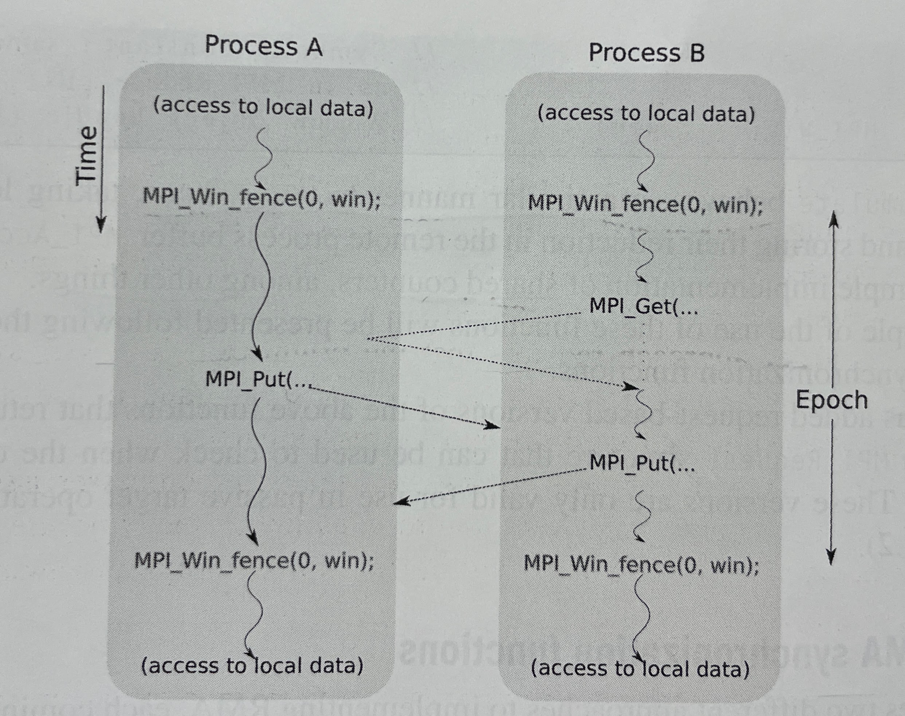
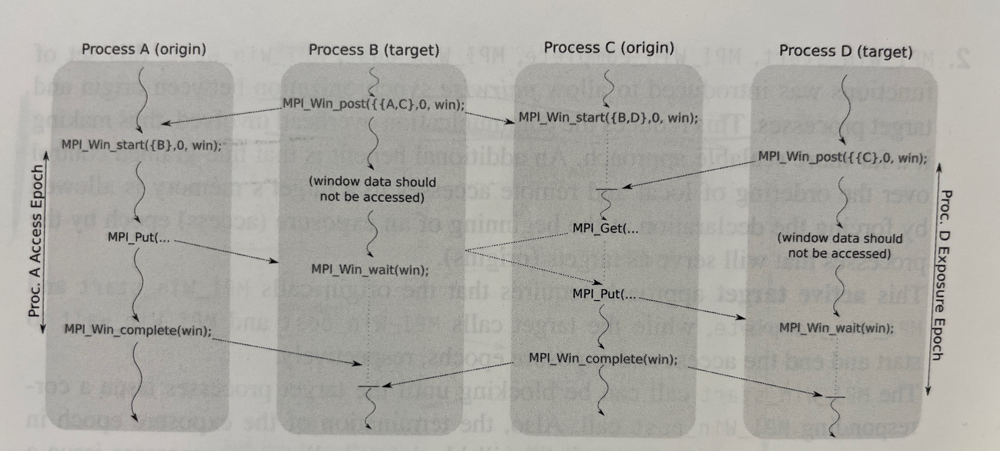
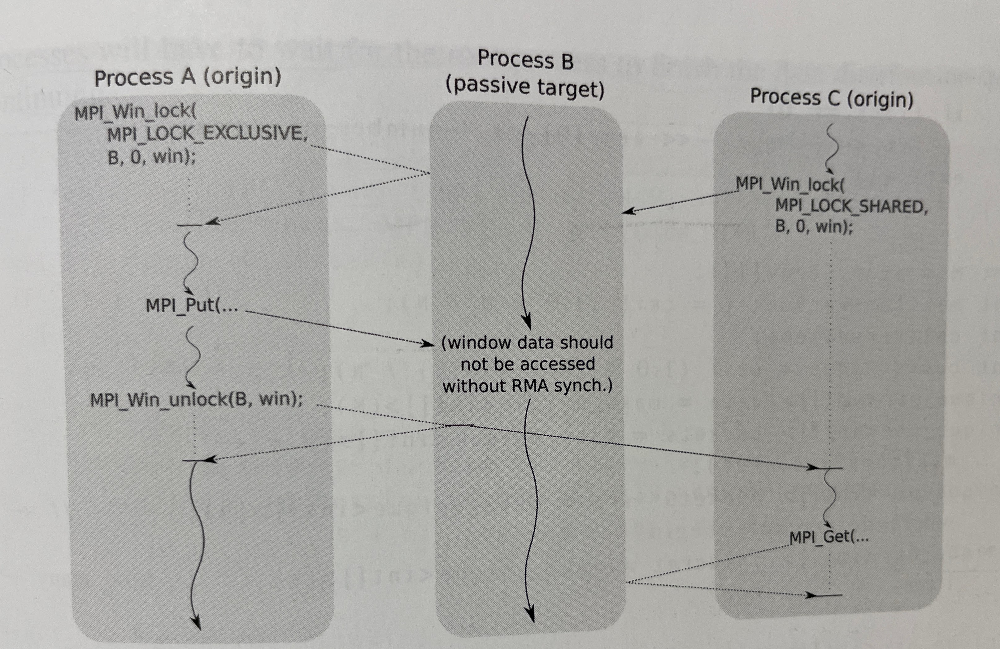

 # MPI One-Sided Communications and MPI I/O

 ## RMA synchornization functions
MPI’s Remote Memory Access (RMA) model enables one-sided communication where a process can directly read from or write to another process’s memory using MPI_Put, MPI_Get, or MPI_Accumulate. To ensure correctness, synchronization is required between the origin (access epoch) and target (exposure epoch).

***Active Target Synchronization***: Both origin and target processes participate in synchronization explicitly. Requires coordination.

    - Example: MPI_Win_fence, MPI_Win_start/post/complete/wait

***Passive Target Synchronization***: Only the origin synchronizes; the target is unaware of the operation. Allows greater overlap and asynchrony.

    - Example: MPI_Win_lock/unlock

***Schema diagrams from Multicore and GPU Programming - An Integrated Approach, Gerassimos Barlas***

FIGURE 5.17
An example of the interaction between two processes when MPI_Win_fence is used to establish and terminate an epoch. The slanted dashed lines represent communications. The vertical dotted lines represent idle times.

FIGURE 5.18
An example of the interaction between four processes when MPI_Win_post and MPI_Win_start are used to begin epochs. The slanted dashed lines represent communications. The {} notation is used to represent groups of processes without deviating too much from the C-language syntax. MPI_Win_start calls can block until the corresponding targets issue MPI_Win_post statements, as shown. However, this is not the default behavior. The exact action depends on the assert flags specified and the particular MPI implementation. The vertical dotted lines represent idle times.

FIGURE 5.19
An example of the interaction between three processes when MPI_Win_lock and MPI_Win_unlock are used to establish passive target synchronization. Process A is trying to get an exclusive lock in order to modify the target’s memory, while process C is trying to get a shared lock in order to read the target’s memory. The slanted dashed lines represent communications, while the vertical dotted lines represent idle times.

| Synchronization Method       | Type           | Functions                                   | Participation       | Key Attributes                      |
| ---------------------------- | -------------- | ------------------------------------------- | ------------------- | ----------------------------------- |
| **Fence**                    | Active Target  | `MPI_Win_fence`                             | All processes       | Simple, collective, coarse-grained  |
| **Post/Start/Complete/Wait** | Active Target  | `MPI_Win_post`, `start`, `complete`, `wait` | Specific group sync | Fine-grained, group-based, flexible |
| **Lock/Unlock**              | Passive Target | `MPI_Win_lock`, `unlock`                    | Origin only         | Fully asynchronous, thread-friendly |
