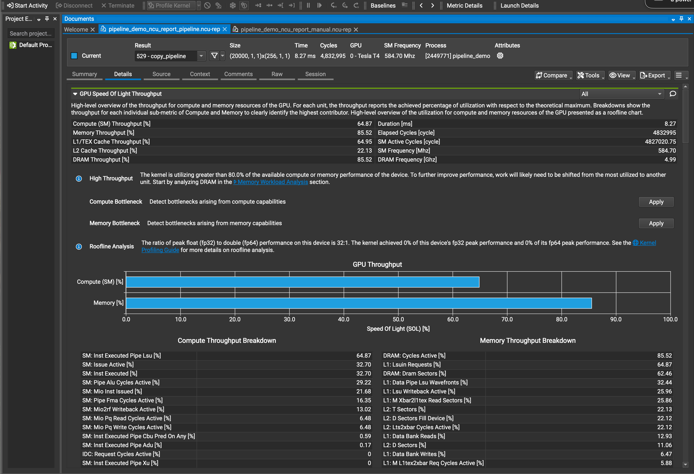
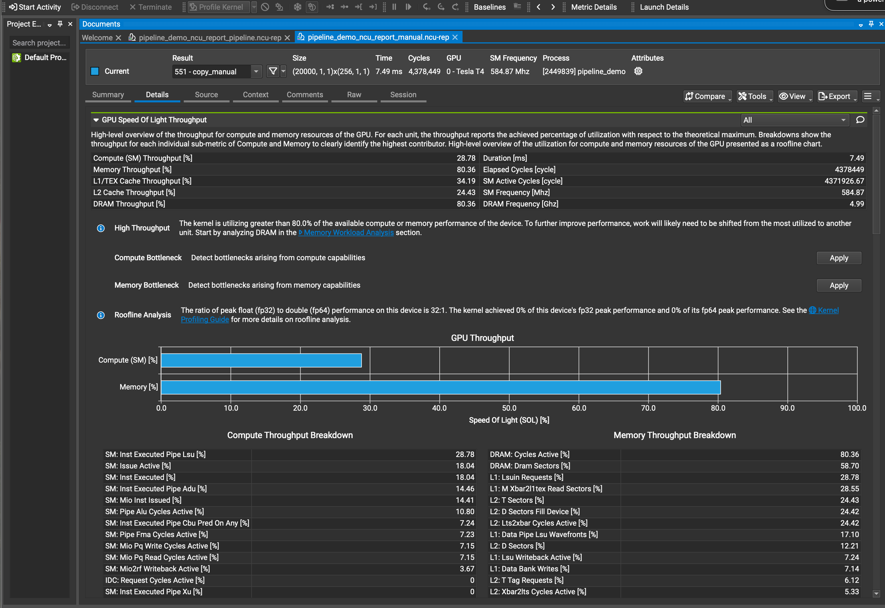
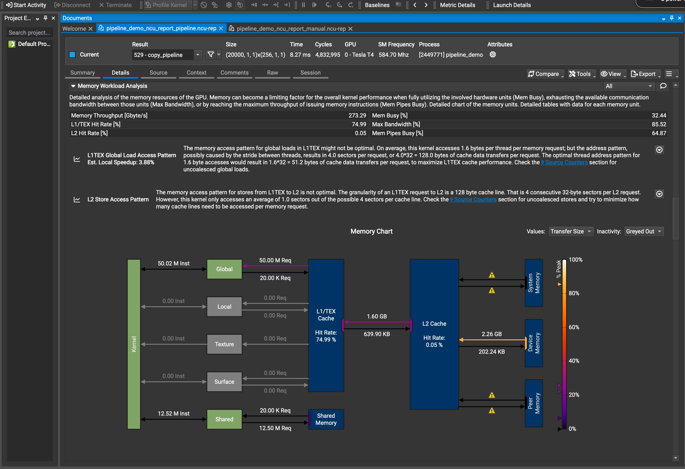
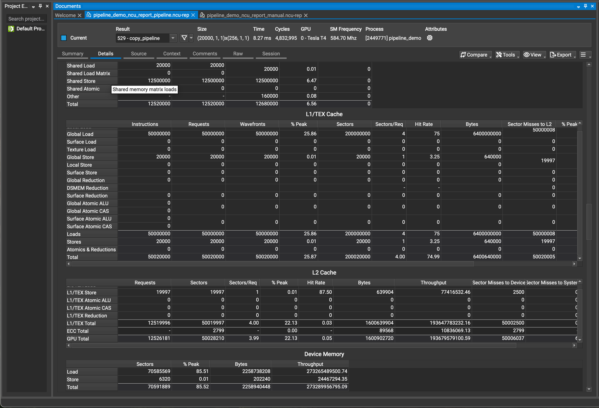
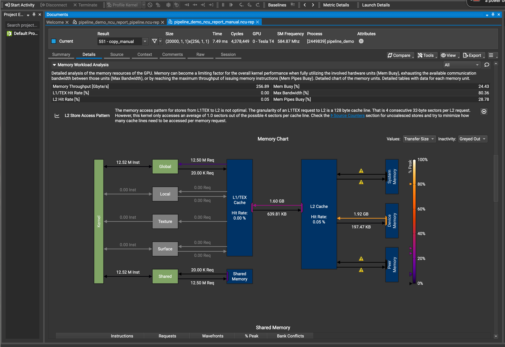
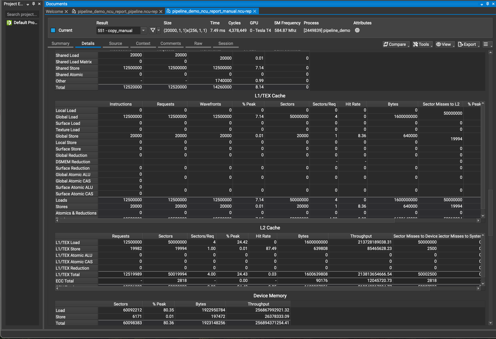
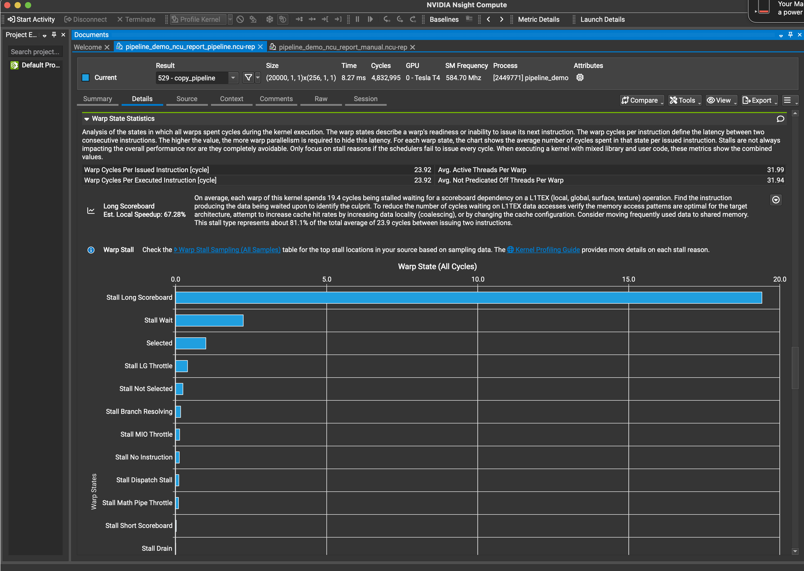
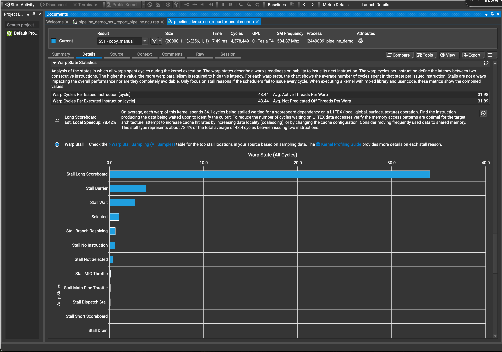

# Exploring the Impact of `cuda::pipeline` for Asynchronous Memory Staging and Overlap in CUDA

## Introduction

As GPU architectures evolve, improving memory bandwidth utilization and reducing data movement latency remain central to advancing performance in high-throughput workloads. The launch of NVIDIA CUDA 11 introduced a set of C++ primitives, including `cuda::pipeline`, designed to offer fine-grained control over asynchronous memory staging and to simplify compute/data transfer overlap in GPU kernels. This repository explores the hypothesis that `cuda::pipeline` provides measurable benefits in terms of throughput, latency, and efficiency compared to more traditional CUDA techniques such as manual memory staging with `__syncthreads()`.

## CUDA Pipeline Overview

### Key Concepts

- **Weak Memory Model:** CUDA requires explicit synchronization. `cuda::pipeline` enforces scoped memory ordering.
- **Thread Scopes:** Scopes include `thread`, `block`, and `device`.
- **Async Copy Primitives:** Includes `memcpy_async()`, `producer_commit()`, and `consumer_wait_prior()`.
- **Avoid Warp Entanglement:** Encourages converged control flow.

### Comparison with Other Techniques

| Technique             | Memory Overlap | Granularity | Sync Model       | Ease of Use |
|----------------------|----------------|-------------|------------------|-------------|
| `__syncthreads()`     | ❌             | Block       | Barrier (coarse) | ✅          |
| Streams + Events     | Host           | Stream      | Events           | ⚠️          |
| CUDA Graphs          | Host           | Node        | Auto DAG         | ⚠️          |
| `cuda::pipeline`     | ✅             | Tile/Thread | Producer/Consumer| ✅✅         |

## Results and Comparison

### 1. GPU Speed of Light Throughput (Tesla T4)

| Metric                  | `copy_pipeline` | `copy_manual` |
|------------------------|------------------|----------------|
| Compute (SM) [%]       | 64.87%           | 28.78%         |
| Memory [%]             | 85.52%           | 80.36%         |
| L1 Cache [%]           | 74.99%           | 8.36%          |
| L2 Cache [%]           | 22.13%           | 24.42%         |
| DRAM Throughput [%]    | 85.52%           | 80.36%         |

- Pipeline

- Manual

### 2. Memory Workload Analysis

| Metric                  | `copy_pipeline`   | `copy_manual`    |
|------------------------|-------------------|------------------|
| Memory Throughput [GB/s]| 273.29            | 256.89           |
| L1 Hit Rate             | 74.99%            | 8.36%            |
| L2 Hit Rate             | 0.05%             | 0.05%            |
| Global Load Requests    | 50M               | 12.5M            |
| Shared Load/Store       | 12.5M / 12.5M     | 12.5M / 12.5M    |

- Pipeline

- Manual

### 3. Warp State Statistics

| Metric                      | `copy_pipeline` | `copy_manual` |
|-----------------------------|------------------|----------------|
| Warp Cycles per Inst.       | 23.92            | 43.44          |
| Long Scoreboard Stalls [%]  | 81.1%            | 78.4%          |
| Barrier/Wait Stalls         | Low              | High           |
| Local Speedup Est.          | 67.28%           | 78.42%         |

- Piipeline

- Manual

## Conclusion

- `cuda::pipeline` leads to **higher occupancy** and **SM throughput**.
- Dramatically increases **L1 cache effectiveness**.
- Minimizes warp latency and execution stalls.
- Suits memory-bound workloads demanding compute/data overlap.

## Supplementary Concepts

- **Bytes-in-flight**: `latency × bandwidth`. If insufficient, prefetch strategies are recommended.
- **LDGSTS and TMA**:
  - Use LDGSTS for 4/8/16-byte aligned tiles < 2 KiB.
  - Use TMA for bulk async transfer (especially for tiles > 2 KiB).
- **Producer-Consumer Model**: Enables warp-scope overlapped execution.

## 📚 References & Learning Resources

### CUDA Code Examples & Libraries
- [Boosting Matrix Multiplication Speed and Flexibility with NVIDIA cuBLAS 12.9](https://developer.nvidia.com/blog/boosting-matrix-multiplication-speed-and-flexibility-with-nvidia-cublas-12-9/)
- [cuVS: Vector Search and Clustering on the GPU](https://github.com/rapidsai/cuvs)
- [cuSparse: Accelerate Large Linear Programming Problems with NVIDIA cuOpt](https://developer.nvidia.com/blog/accelerate-large-linear-programming-problems-with-nvidia-cuopt)
- [CUDA samples](https://github.com/NVIDIA/cuda-samples/)
- [Dev CUDA samples](https://developer.nvidia.com/cuda-code-samples)
- [NVIDIA CUDA Library Samples](https://github.com/NVIDIA/CUDALibrarySamples)
- [CUDA Examples by Dr. Ken Netz](https://github.com/drkennetz/cuda_examples/)
- [CUDA Examples by A. Hamdi](https://github.com/a-hamdi/GPU/tree/main)
- [OpenHackathons Multi-GPU Samples](https://github.com/openhackathons-org/nways_multi_gpu)
- [OpenHackathons GPU Bootcamp](https://github.com/openhackathons-org/gpubootcamp)
- [3.2.9.5. Peer-to-Peer Memory Copy NVLink](https://docs.nvidia.com/cuda/cuda-c-programming-guide) 
- [Volta compatibility guide](https://docs.nvidia.com/cuda/volta-compatibility-guide/index.html)
- [CUDA c programming guide - UVA](https://docs.nvidia.com/cuda/cuda-c-programming-guide/#unified-virtual-address-space)
- [Multi GPU programming](https://medium.com/gpgpu/multi-gpu-programming-6768eeb42e2c)
- [NVLink P2p](https://codingbyexample.com/2020/09/14/p2p-memcpy-with-nvlink)
- [nvgraph - deprecated after CUDA 10.x](https://docs.nvidia.com/cuda/archive/9.0/nvgraph/index.html)

### CUDA Programming Guides & Documentation
- [CUDA C++ Programming Guide – NVIDIA Docs](https://docs.nvidia.com/cuda/cuda-c-programming-guide/index.html#tiled-partitions-cg)
- [Cooperative Groups – NVIDIA Developer Blog](https://developer.nvidia.com/blog/cooperative-groups/)
- [Robust and Scalable CUDA with Cooperative Groups (PDF)](https://leimao.github.io/downloads/blog/2024-08-06-CUDA-Cooperative-Groups/s7622-Kyrylo-perelygin-robust-and-scalable-cuda.pdf)
- [CUDA C/C++ Streams and Concurrency](https://developer.download.nvidia.com/CUDA/training/StreamsAndConcurrencyWebinar.pdf)

### Research Papers & Technical Reports
- **Characterizing GPU Resilience and Impact on AI/HPC Systems**  
  [arXiv:2503.11901](https://arxiv.org/pdf/2503.11901)
- **Hardware Compute Partitioning on NVIDIA GPUs**  
  [UNC RTAS '23](https://www.cs.unc.edu/~jbakita/rtas23.pdf)
- **CUDA and Applications to Task-based Programming**  
  [Eurographics Digital Library](https://diglib.eg.org/server/api/core/bitstreams/3e283a2e-e6a3-4908-8d77-1741d01cc06f/content)
- **The AI CUDA Engineer: Agentic CUDA Kernel Discovery, Optimization and Composition**  
 - [Sakana.ai](https://pub.sakana.ai/static/paper.pdf)
 - [DeepSeek-V3 Technical Report](https://arxiv.org/abs/2412.19437)

### HPC Toolchains & Infrastructure
- [NVIDIA Bright Cluster Manager 9.2 – Admin Manual (PDF)](https://support.brightcomputing.com/manuals/9.2/admin-manual.pdf)

### Educational Resources
- [Coding the Matrix – Applied Linear Algebra Course](https://codingthematrix.com/)
- [NVIDIA CUDA-Q Academic: Quick Start to Quantum](https://github.com/NVIDIA/cuda-q-academic/blob/main/quick-start-to-quantum/01_quick_start_to_quantum.ipynb)

