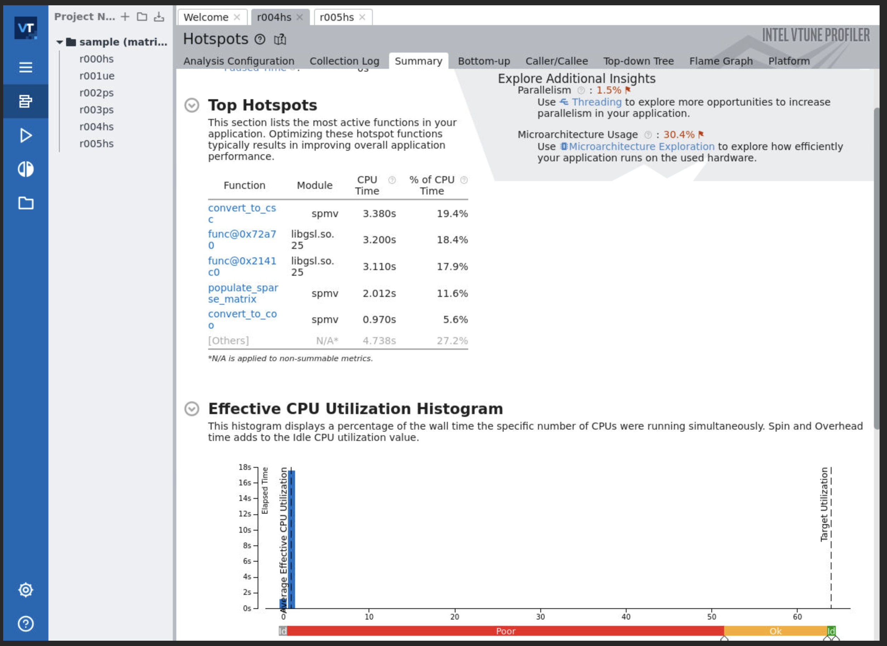
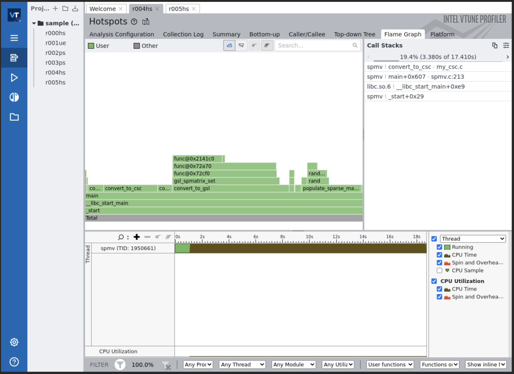
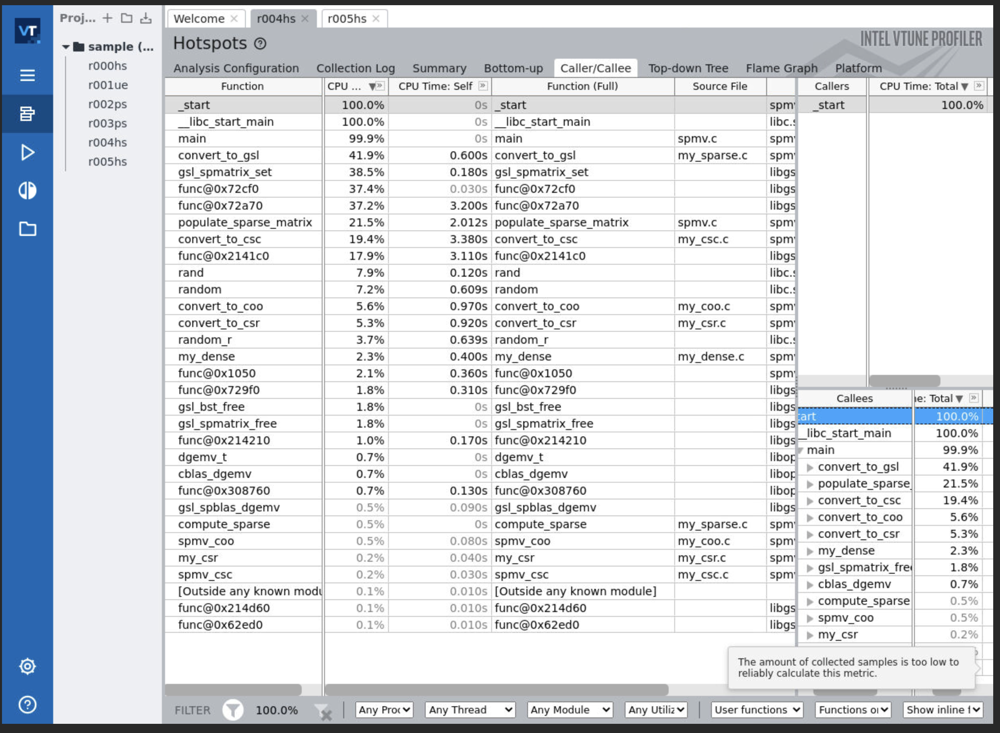
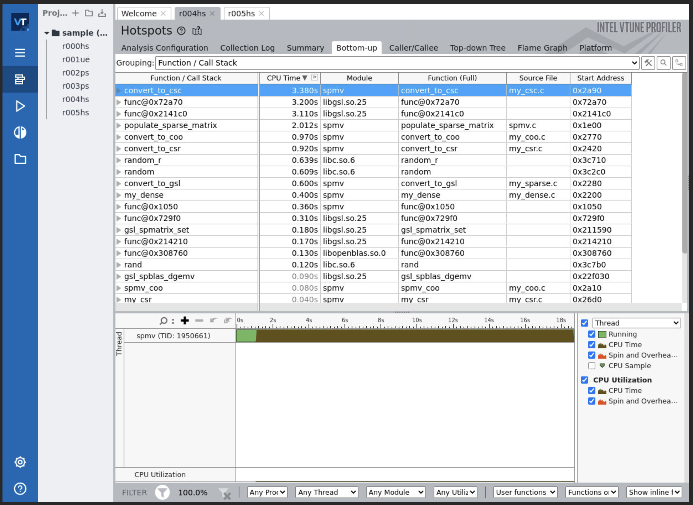
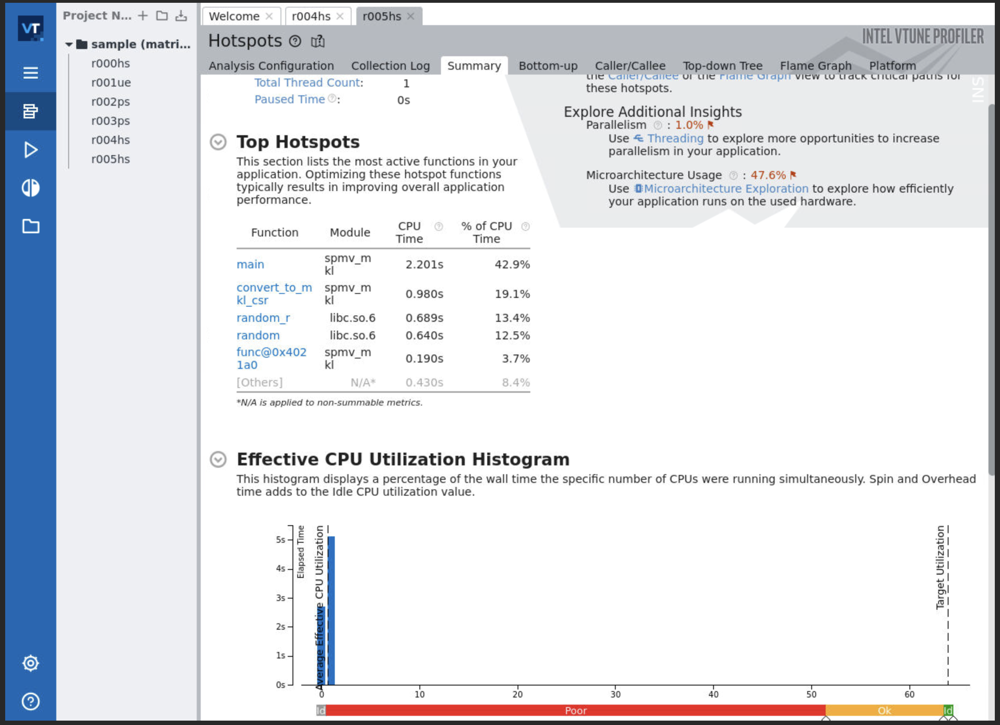
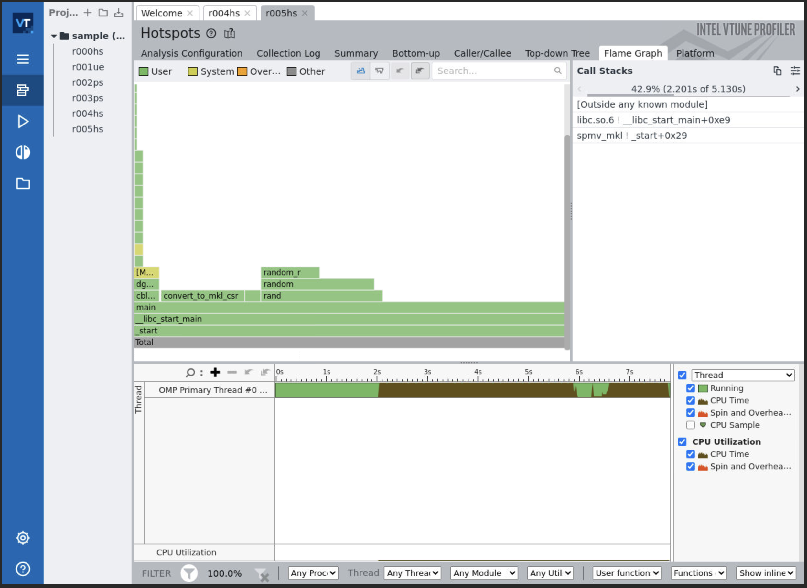
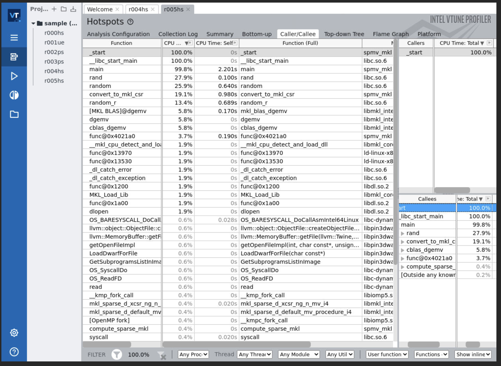
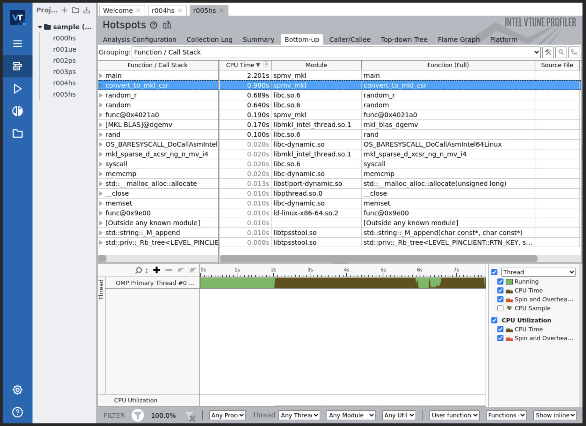

# HPC Tool - HPC Tools block 2 - Task 2: SpMV benchmarking

• Ok, you already have your own CSR and dense SpMV functions. Now, code your COO (triplet) and your CSC versions of SpMV, and run a benchmark with all 4 implementations.

• Fill out two tables with the measured execution times obtained for your 4 kernels when working with 16384 × 16384 matrices with a 10% non-zero elements, compiled with different optimizations (see next slide).

• In the first table, GCC is used for the experiments, while ICC binaries are employed on the second table.

• For each compiler, you will compare 4 different versions of your functions, applying different compiler optimizations (according to the column names in the tables): no optimization at all, O2 without vectorization, O3 with autovectorization, and Ofast with autovectorization (use -fast in ICC instead).
• The last column, Ref, will show the reference time for each operation, using GSL in Table 1 and Intel MKL in Table 2.

Table 1 gcc Benchmark - 16384 x 16384 matrices, 10% non-zero elements
| SpMV-func   | O0    | 02-novec | 03-vec | Ofast-vec |
|-------------|--------|----------|--------|-----------|
| My_Dense    | 768    | 360      | 365.3  | 365.7     |
| My_coo      | 131    | 76.7     | 74.3   | 74        |
| My_csr      | 104.7  | 35       | 36     | 37.7      |
| My_csc      | 120.3  | 34       | 32.3   | 31        |
| Ref         | 74.3   | 77.3     | 75.3   | 74.3      |


Table 1 icc Benchmark - 16384 x 16384 matrices, 10% non-zero elements
| SpMV-func   | O0    | 02-novec | 03-vec | Ofast-vec |
|-------------|--------|----------|--------|-----------|
| My_Dense    | 766    | 337.7    | 150    | 149.7     |
| My_coo      | 135.7  | 72       | 72     | 71.7      |
| My_csr      | 99.7   | 37       | 22.7   | 22        |
| My_csc      | 110.7  | 28       | 27.7   | 28.3      |
| Ref         | 22.3   | 22       | 22     | 22.7      |

**Execution time scale is in milliseconds for all benchmarking

## Memory of work:
- GCC 

$module load openblas


    O0
    gcc -O0 -lopenblas -lgsl -lgslcblas spmv.c timer.c my_dense.c my_sparse.c my_csr.c my_coo.c my_csc.c -o spmv

|       | My_Dense | My_coo | My_csr | My_csc | Ref   |
|-------|----------|--------|--------|--------|-------|
| #1    | 768      | 131    | 105    | 121    | 74    |
| #2    | 767      | 131    | 105    | 120    | 74    |
| #3    | 769      | 131    | 104    | 120    | 75    |
| **avg** | 768      | 131    | 104.7  | 120.3  | 74.3  |


    O2 -fno-tree-vectorize
    gcc -O2 -fno-tree-vectorize -lopenblas -lgsl -lgslcblas spmv.c timer.c my_dense.c my_sparse.c my_csr.c my_coo.c my_csc.c -o spmv

|       | My_Dense | My_coo | My_csr | My_csc | Ref   |
|-------|----------|--------|--------|--------|-------|
| #1    | 361      | 83     | 35     | 30     | 75    |
| #2    | 358      | 74     | 35     | 37     | 83    |
| #3    | 361      | 73     | 35     | 35     | 74    |
| **avg** | 360      | 76.7   | 35     | 34     | 77.3  |


    O3
    gcc -O3 -lopenblas -lgsl -lgslcblas spmv.c timer.c my_dense.c my_sparse.c my_csr.c my_coo.c my_csc.c -o spmv

|       | My_Dense | My_coo | My_csr | My_csc | Ref   |
|-------|----------|--------|--------|--------|-------|
| #1    | 364      | 74     | 34     | 33     | 74    |
| #2    | 371      | 75     | 35     | 34     | 78    |
| #3    | 361      | 74     | 39     | 30     | 74    |
| **avg** | 365.3    | 74.3   | 36     | 32.3   | 75.3  |


    Ofast
    gcc -Ofast -lopenblas -lgsl -lgslcblas spmv.c timer.c my_dense.c my_sparse.c my_csr.c my_coo.c my_csc.c -o spmv

|       | My_Dense | My_coo | My_csr | My_csc | Ref   |
|-------|----------|--------|--------|--------|-------|
| #1    | 359      | 74     | 40     | 31     | 74    |
| #2    | 371      | 75     | 39     | 32     | 75    |
| #3    | 367      | 73     | 34     | 30     | 74    |
| **avg** | 365.7    | 74     | 37.7   | 31     | 74.3  |


- ICC 

$module load intel imkl


    O0
    icc -O0 spmv.c timer.c my_dense.c my_sparse.c my_csr.c my_coo.c my_csc.c -lgsl -lgslcblas -lpthread -lm -ldl -o spmv

    O0 --> MKL
    icc -O0 spmv_mkl.c my_sparseCSR_mkl.c timer.c -lmkl_core -lmkl_intel_lp64 -lmkl_intel_thread -liomp5 -lpthread -lm -o spmv_mkl

|       | My_Dense | My_coo | My_csr | My_csc | Ref   |
|-------|----------|--------|--------|--------|-------|
| #1    | 760      | 130    | 98     | 109    |  23   |
| #2    | 766      | 144    | 100    | 112    |  22   |
| #3    | 772      | 133    | 101    | 111    |  23   |
| **avg** | 766      | 135.7  | 99.7  | 110.7  | 22.3 |


    O2 -fno-tree-vectorize
    icc -O2 -fno-tree-vectorize spmv.c timer.c my_dense.c my_sparse.c my_csr.c my_coo.c my_csc.c -lgsl -lgslcblas -lpthread -lm -ldl -o spmv

    O2 -fno-tree-vectorize --> MKL
    icc -O2 -fno-tree-vectorize spmv_mkl.c my_sparseCSR_mkl.c timer.c -lmkl_core -lmkl_intel_lp64 -lmkl_intel_thread -liomp5 -lpthread -lm -o spmv_mkl

|       | My_Dense | My_coo | My_csr | My_csc | Ref   |
|-------|----------|--------|--------|--------|-------|
| #1    | 338      | 72     | 44     | 28     | 22    |
| #2    | 337      | 72     | 33     | 28     | 22    |
| #3    | 338      | 72     | 34     | 28     | 22    |
| **avg** | 337.7    | 72     | 37     | 28     | 22    |


    O3
    icc -O3 spmv.c timer.c my_dense.c my_sparse.c my_csr.c my_coo.c my_csc.c -lgsl -lgslcblas -lpthread -lm -ldl -o spmv

    O3 --> MKL
    icc -O3 spmv_mkl.c my_sparseCSR_mkl.c timer.c -lmkl_core -lmkl_intel_lp64 -lmkl_intel_thread -liomp5 -lpthread -lm -o spmv_mkl

|       | My_Dense | My_coo | My_csr | My_csc | Ref   |
|-------|----------|--------|--------|--------|-------|
| #1    | 151      | 72     | 24     | 28     | 22    |
| #2    | 149      | 72     | 22     | 27     | 22    |
| #3    | 150      | 72     | 22     | 28     |  22   |
| **avg** | 150      | 72     | 22.7   | 27.7   | 22    |


    Ofast
    icc -Ofast spmv.c timer.c my_dense.c my_sparse.c my_csr.c my_coo.c my_csc.c -lgsl -lgslcblas -lpthread -lm -ldl -o spmv

    Ofast --> MKL
    icc -Ofast spmv_mkl.c my_sparseCSR_mkl.c timer.c -lmkl_core -lmkl_intel_lp64 -lmkl_intel_thread -liomp5 -lpthread -lm -o spmv_mkl

|       | My_Dense | My_coo | My_csr | My_csc | Ref   |
|-------|----------|--------|--------|--------|-------|
| #1    | 150      | 72     | 22     | 28     | 22    |
| #2    | 148      | 72     | 22     | 29     | 23    |
| #3    | 151      | 71     | 22     | 28     | 23    |
| **avg** | 149.7    | 71.7   | 22     | 28.3   | 22.7  |


________________________________________________________________________________________________________
- Make

  -- make -f Makefile.gcc
  - make -f Makefile.gcc spmv_O2
  - make -f Makefile.gcc spmv_O0
  - make -f Makefile.gcc spmv_O3
  - make -f Makefile.gcc spmv_Ofast
  - make -f Makefile.gcc clean


  -- make -f Makefile.icc
  - make -f Makefile.icc spmv_O0
  - make -f Makefile.icc spmv_O2
  - make -f Makefile.icc spmv_O3
  - make -f Makefile.icc spmv_Ofast
  - make -f Makefile.icc clean


  -- make -f Makefile.icc.mkl
  - make -f Makefile.icc.mkl spmv_mkl_O0
  - make -f Makefile.icc.mkl spmv_mkl_O2
  - make -f Makefile.icc.mkl spmv_mkl_O3
  - make -f Makefile.icc.mkl spmv_mkl_Ofast
  - make -f Makefile.icc.mkl clean


________________________________________________________________________________________________________
## Profiling tools and tecniques for optimization

- Profiling (to spot optimization made on the code by the compiler):
  - Likwid
  - Valgrind
  - VTune
  - Perf

$ module load intel vtune imkl valgrind


- Compile for the best possible vectorization and profiling enabled
    
    $ gcc -pg -O3 -lopenblas -lgsl -lgslcblas spmv.c timer.c my_dense.c my_sparse.c my_csr.c my_coo.c my_csc.c -o spmv
    

    $ icc -pg -O3 spmv_mkl.c my_sparseCSR_mkl.c timer.c -lmkl_core -lmkl_intel_lp64 -lmkl_intel_thread -liomp5 -lpthread -lm -o spmv_mkl


### Optimization
- VTune

  - GCC
    $ vtune -collect performance-snapshot -collect memory-access -collect hotspots -collect threading -- ./spmv








```c
vtune: Collection started. To stop the collection, either press CTRL-C or enter from another console window: vtune -r /mnt/netapp2/Home_FT2/home/ulc/cursos/curso370/hpctools/2025/git_emilio/spmv/r000ps -command stop.
Matriz size: 16384 x 16384 (268435456 elements)
26837519 non-zero elements (10.00%)

Dense computation
----------------
Time taken by CBLAS dense computation: 957 ms
Time taken by my dense matrix-vector product: 371 ms
Result is ok!

Sparse computation
------------------
Time taken by convert_to_gsl (Ref table 1:gsl-sparse): 7599 ms
Time taken by compute_sparse (Ref table 1:gsl-matmul): 74 ms
Result is correct for my_sparse!

CSR Sparse computation
------------------
Time taken by conversion to CSR computation: 960 ms
Time taken by CSR sparse computation: 34 ms
Result is ok for CSR sparse!

COO Sparse computation
------------------
Time taken by conversion to COO: 999 ms
Time taken by COO sparse computation: 85 ms
Result is ok for COO sparse!

CSC Sparse computation
------------------
Time taken by conversion to CSC: 4549 ms
Time taken by CSC sparse computation: 32 ms
Result is ok for CSC sparse!
vtune: Collection stopped.
vtune: Using result path `/mnt/netapp2/Home_FT2/home/ulc/cursos/curso370/hpctools/2025/git_emilio/spmv/r000ps'
vtune: Executing actions 75 % Generating a report                              Elapsed Time: 19.836s
    IPC: 1.193
    DP GFLOPS: 0.085
    Average CPU Frequency: 3.380 GHz
Logical Core Utilization: 0.7% (0.868 out of 128)
 | The metric value is low, which may signal a poor logical CPU cores
 | utilization. Consider improving physical core utilization as the first step
 | and then look at opportunities to utilize logical cores, which in some cases
 | can improve processor throughput and overall performance of multi-threaded
 | applications.
 |
    Physical Core Utilization: 1.3% (0.861 out of 64)
     | The metric value is low, which may signal a poor physical CPU cores
     | utilization caused by:
     |     - load imbalance
     |     - threading runtime overhead
     |     - contended synchronization
     |     - thread/process underutilization
     |     - incorrect affinity that utilizes logical cores instead of physical
     |       cores
     | Run the HPC Performance Characterization analysis to estimate the
     | efficiency of MPI and OpenMP parallelism or run the Locks and Waits
     | analysis to identify parallel bottlenecks for other parallel runtimes.
     |
Microarchitecture Usage: 24.6% of Pipeline Slots
 | You code efficiency on this platform is too low.
 | 
 | Possible cause: memory stalls, instruction starvation, branch misprediction
 | or long latency instructions.
 | 
 | Next steps: Run Microarchitecture Exploration analysis to identify the cause
 | of the low microarchitecture usage efficiency.
 |
    Retiring: 24.6% of Pipeline Slots
    Front-End Bound: 9.8% of Pipeline Slots
    Bad Speculation: 15.8% of Pipeline Slots
     | A significant proportion of pipeline slots containing useful work are
     | being cancelled. This can be caused by mispredicting branches or by
     | machine clears. Note that this metric value may be highlighted due to
     | Branch Resteers issue.
     |
    Back-End Bound: 49.8% of Pipeline Slots
     | A significant portion of pipeline slots are remaining empty. When
     | operations take too long in the back-end, they introduce bubbles in the
     | pipeline that ultimately cause fewer pipeline slots containing useful
     | work to be retired per cycle than the machine is capable to support. This
     | opportunity cost results in slower execution. Long-latency operations
     | like divides and memory operations can cause this, as can too many
     | operations being directed to a single execution port (for example, more
     | multiply operations arriving in the back-end per cycle than the execution
     | unit can support).
     |
        Memory Bound: 29.6% of Pipeline Slots
         | The metric value is high. This can indicate that the significant
         | fraction of execution pipeline slots could be stalled due to demand
         | memory load and stores. Use Memory Access analysis to have the metric
         | breakdown by memory hierarchy, memory bandwidth information,
         | correlation by memory objects.
         |
            L1 Bound: 5.5% of Clockticks
             | This metric shows how often machine was stalled without missing
             | the L1 data cache. The L1 cache typically has the shortest
             | latency. However, in certain cases like loads blocked on older
             | stores, a load might suffer a high latency even though it is
             | being satisfied by the L1. Note that this metric value may be
             | highlighted due to DTLB Overhead or Cycles of 1 Port Utilized
             | issues.
             |
            L2 Bound: 7.5% of Clockticks
             | This metric shows how often machine was stalled on L2 cache.
             | Avoiding cache misses (L1 misses/L2 hits) will improve the
             | latency and increase performance.
             |
            L3 Bound: 0.7% of Clockticks
                L3 Latency: 5.3% of Clockticks
            DRAM Bound: 21.1% of Clockticks
             | This metric shows how often CPU was stalled on the main memory
             | (DRAM). Caching typically improves the latency and increases
             | performance.
             |
                Memory Bandwidth: 31.2% of Clockticks
                 | Issue: A significant fraction of cycles was stalled due to
                 | approaching bandwidth limits of the main memory (DRAM).
                 | 
                 | Tips: Improve data accesses to reduce cacheline transfers
                 | from/to memory using these possible techniques:
                 |     - Consume all bytes of each cacheline before it is
                 |       evicted (for example, reorder structure elements and
                 |       split non-hot ones).
                 |     - Merge compute-limited and bandwidth-limited loops.
                 |     - Use NUMA optimizations on a multi-socket system.
                 | 
                 | Note: software prefetches do not help a bandwidth-limited
                 | application.
                 |
                Memory Latency: 8.1% of Clockticks
                    Local DRAM: 40.5% of Clockticks
                    Remote DRAM: 3.0% of Clockticks
                    Remote Cache: 0.6% of Clockticks
            Store Bound: 0.1% of Clockticks
        Core Bound: 20.3% of Pipeline Slots
         | This metric represents how much Core non-memory issues were of a
         | bottleneck. Shortage in hardware compute resources, or dependencies
         | software's instructions are both categorized under Core Bound. Hence
         | it may indicate the machine ran out of an OOO resources, certain
         | execution units are overloaded or dependencies in program's data- or
         | instruction- flow are limiting the performance (e.g. FP-chained long-
         | latency arithmetic operations).
         |
Memory Bound: 29.6% of Pipeline Slots
 | The metric value is high. This can indicate that the significant fraction of
 | execution pipeline slots could be stalled due to demand memory load and
 | stores. Use Memory Access analysis to have the metric breakdown by memory
 | hierarchy, memory bandwidth information, correlation by memory objects.
 |
    Cache Bound: 13.7% of Clockticks
    DRAM Bound: 21.1% of Clockticks
     | The metric value is high. This indicates that a significant fraction of
     | cycles could be stalled on the main memory (DRAM) because of demand loads
     | or stores.
     |
     | The code is memory bandwidth bound, which means that there are a
     | significant fraction of cycles during which the bandwidth limits of the
     | main memory are being reached and the code could stall. Review the
     | Bandwidth Utilization Histogram to estimate the scale of the issue.
     | Improve data accesses to reduce cacheline transfers from/to memory using
     | these possible techniques: 1) consume all bytes of each cacheline before
     | it is evicted (for example, reorder structure elements and split non-hot
     | ones); 2) merge compute-limited and bandwidth-limited loops; 3) use NUMA
     | optimizations on a multi-socket system.
     |
    NUMA: % of Remote Accesses: 5.1%
Vectorization: 11.8% of Packed FP Operations
    Instruction Mix
        SP FLOPs: 0.0% of uOps
            Packed: 0.0% from SP FP
                128-bit: 0.0% from SP FP
                256-bit: 0.0% from SP FP
                512-bit: 0.0% from SP FP
            Scalar: 0.0% from SP FP
        DP FLOPs: 1.7% of uOps
            Packed: 11.8% from DP FP
                128-bit: 0.0% from DP FP
                256-bit: 11.8% from DP FP
                512-bit: 0.0% from DP FP
            Scalar: 88.2% from DP FP
        x87 FLOPs: 0.0% of uOps
        Non-FP: 98.3% of uOps
    FP Arith/Mem Rd Instr. Ratio: 0.065
    FP Arith/Mem Wr Instr. Ratio: 0.177
Collection and Platform Info
    Application Command Line: ./spmv 
    Operating System: 4.18.0-305.3.1.el8_4.x86_64 \S Kernel \r on an \m 
    Computer Name: login210-19
    Result Size: 3.5 MB 
    Collection start time: 22:34:12 12/02/2025 UTC
    Collection stop time: 22:34:32 12/02/2025 UTC
    Collector Type: Driverless Perf per-process counting
    CPU
        Name: Intel(R) Xeon(R) Processor code named Icelake
        Frequency: 2.200 GHz
        Logical CPU Count: 128
        Cache Allocation Technology
            Level 2 capability: not detected
            Level 3 capability: available

Recommendations:
    Hotspots: Start with Hotspots analysis to understand the efficiency of your algorithm.
     | Use Hotspots analysis to identify the most time consuming functions.
     | Drill down to see the time spent on every line of code.
    Threading: There is poor utilization of logical CPU cores (0.7%) in your application.
     |  Use Threading to explore more opportunities to increase parallelism in
     | your application.
    Microarchitecture Exploration: There is low microarchitecture usage (24.6%) of available hardware resources.
     | Run Microarchitecture Exploration analysis to analyze CPU
     | microarchitecture bottlenecks that can affect application performance.
    Memory Access: The Memory Bound metric is high  (29.6%). A significant fraction of execution pipeline slots could be stalled due to demand memory load and stores.
     | Use Memory Access analysis to measure metrics that can identify memory
     | access issues.

If you want to skip descriptions of detected performance issues in the report,
enter: vtune -report summary -report-knob show-issues=false -r <my_result_dir>.
Alternatively, you may view the report in the csv format: vtune -report
<report_name> -format=csv.
vtune: Executing actions 100 % done   

```


  - ICC

    $ vtune -collect performance-snapshot -collect memory-access -collect hotspots -collect threading -- ./spmv_mkl







```c
vtune: Collection started. To stop the collection, either press CTRL-C or enter from another console window: vtune -r /mnt/netapp2/Home_FT2/home/ulc/cursos/curso370/hpctools/2025/git_emilio/spmv/r001ps -command stop.
Matriz size: 16384 x 16384 (268435456 elements)
26837519 non-zero elements (10.00%)

Dense computation
----------------
Time taken by CBLAS dense computation: 323 ms
Time taken by convert_to_mkl_csr (Ref table 2:mkl-sparse): 909 ms
MKL CSR Matrix created successfully.
Matrix size: 16384
NNZ: 26837519
mkl_sparse_d_mv completed successfully
Time taken by compute_sparse_mkl (Ref table 2: mkl-sparse): 41 ms
Result is correct for MKL sparse computation!
vtune: Collection stopped.
vtune: Using result path `/mnt/netapp2/Home_FT2/home/ulc/cursos/curso370/hpctools/2025/git_emilio/spmv/r001ps'
vtune: Executing actions 75 % Generating a report                              Elapsed Time: 5.248s
    IPC: 2.127
    DP GFLOPS: 0.189
    Average CPU Frequency: 3.298 GHz
Logical Core Utilization: 0.6% (0.773 out of 128)
 | The metric value is low, which may signal a poor logical CPU cores
 | utilization. Consider improving physical core utilization as the first step
 | and then look at opportunities to utilize logical cores, which in some cases
 | can improve processor throughput and overall performance of multi-threaded
 | applications.
 |
    Physical Core Utilization: 1.2% (0.774 out of 64)
     | The metric value is low, which may signal a poor physical CPU cores
     | utilization caused by:
     |     - load imbalance
     |     - threading runtime overhead
     |     - contended synchronization
     |     - thread/process underutilization
     |     - incorrect affinity that utilizes logical cores instead of physical
     |       cores
     | Run the HPC Performance Characterization analysis to estimate the
     | efficiency of MPI and OpenMP parallelism or run the Locks and Waits
     | analysis to identify parallel bottlenecks for other parallel runtimes.
     |
Microarchitecture Usage: 47.2% of Pipeline Slots
 | You code efficiency on this platform is too low.
 | 
 | Possible cause: memory stalls, instruction starvation, branch misprediction
 | or long latency instructions.
 | 
 | Next steps: Run Microarchitecture Exploration analysis to identify the cause
 | of the low microarchitecture usage efficiency.
 |
    Retiring: 47.2% of Pipeline Slots
    Front-End Bound: 21.1% of Pipeline Slots
     | Issue: A significant portion of Pipeline Slots is remaining empty due to
     | issues in the Front-End.
     | 
     | Tips:  Make sure the code working size is not too large, the code layout
     | does not require too many memory accesses per cycle to get enough
     | instructions for filling four pipeline slots, or check for microcode
     | assists.
     |
    Bad Speculation: 18.9% of Pipeline Slots
     | A significant proportion of pipeline slots containing useful work are
     | being cancelled. This can be caused by mispredicting branches or by
     | machine clears. Note that this metric value may be highlighted due to
     | Branch Resteers issue.
     |
    Back-End Bound: 12.8% of Pipeline Slots
        Memory Bound: 4.2% of Pipeline Slots
            L1 Bound: 2.7% of Clockticks
            L2 Bound: 1.6% of Clockticks
            L3 Bound: 1.0% of Clockticks
                L3 Latency: 0.4% of Clockticks
            DRAM Bound: 4.6% of Clockticks
                Memory Bandwidth: 13.3% of Clockticks
                Memory Latency: 4.9% of Clockticks
                    Local DRAM: 0.9% of Clockticks
                    Remote DRAM: 30.5% of Clockticks
                    Remote Cache: 25.4% of Clockticks
            Store Bound: 0.2% of Clockticks
        Core Bound: 8.6% of Pipeline Slots
Memory Bound: 4.2% of Pipeline Slots
    Cache Bound: 5.3% of Clockticks
    DRAM Bound: 4.6% of Clockticks
    NUMA: % of Remote Accesses: 43.2%
Vectorization: 18.9% of Packed FP Operations
    Instruction Mix
        SP FLOPs: 0.0% of uOps
            Packed: 0.0% from SP FP
                128-bit: 0.0% from SP FP
                256-bit: 0.0% from SP FP
                512-bit: 0.0% from SP FP
            Scalar: 0.0% from SP FP
        DP FLOPs: 1.4% of uOps
            Packed: 18.9% from DP FP
                128-bit: 0.0% from DP FP
                256-bit: 0.0% from DP FP
                512-bit: 18.9% from DP FP
            Scalar: 81.1% from DP FP
        x87 FLOPs: 0.0% of uOps
        Non-FP: 98.6% of uOps
    FP Arith/Mem Rd Instr. Ratio: 0.055
    FP Arith/Mem Wr Instr. Ratio: 0.111
Collection and Platform Info
    Application Command Line: ./spmv_mkl 
    Operating System: 4.18.0-305.3.1.el8_4.x86_64 \S Kernel \r on an \m 
    Computer Name: login210-19
    Result Size: 3.5 MB 
    Collection start time: 23:21:20 12/02/2025 UTC
    Collection stop time: 23:21:25 12/02/2025 UTC
    Collector Type: Driverless Perf per-process counting
    CPU
        Name: Intel(R) Xeon(R) Processor code named Icelake
        Frequency: 2.200 GHz
        Logical CPU Count: 128
        Cache Allocation Technology
            Level 2 capability: not detected
            Level 3 capability: available

Recommendations:
    Hotspots: Start with Hotspots analysis to understand the efficiency of your algorithm.
     | Use Hotspots analysis to identify the most time consuming functions.
     | Drill down to see the time spent on every line of code.
    Threading: There is poor utilization of logical CPU cores (0.6%) in your application.
     |  Use Threading to explore more opportunities to increase parallelism in
     | your application.
    Microarchitecture Exploration: There is low microarchitecture usage (47.2%) of available hardware resources.
     | Run Microarchitecture Exploration analysis to analyze CPU
     | microarchitecture bottlenecks that can affect application performance.

If you want to skip descriptions of detected performance issues in the report,
enter: vtune -report summary -report-knob show-issues=false -r <my_result_dir>.
Alternatively, you may view the report in the csv format: vtune -report
<report_name> -format=csv.
vtune: Executing actions 100 % done  
```


- Valgrind


  - GCC

    $ valgrind --tool=cachegrind --cachegrind-out-file=spmv_cachegrind.out ./spmv


```c
==200851== Cachegrind, a cache and branch-prediction profiler
==200851== Copyright (C) 2002-2017, and GNU GPL'd, by Nicholas Nethercote et al.
==200851== Using Valgrind-3.19.0 and LibVEX; rerun with -h for copyright info
==200851== Command: ./spmv
==200851== 
--200851-- warning: L3 cache found, using its data for the LL simulation.
Matriz size: 16384 x 16384 (268435456 elements)
26837519 non-zero elements (10.00%)

Dense computation
----------------
Time taken by CBLAS dense computation: 35832 ms
Time taken by my dense matrix-vector product: 8926 ms
Result is ok!

Sparse computation
------------------
Time taken by convert_to_gsl (Ref table 1:gsl-sparse): 142880 ms
Time taken by compute_sparse (Ref table 1:gsl-matmul): 1697 ms
Result is correct for my_sparse!

CSR Sparse computation
------------------
Time taken by conversion to CSR computation: 9723 ms
Time taken by CSR sparse computation: 1104 ms
Result is ok for CSR sparse!

COO Sparse computation
------------------
Time taken by conversion to COO: 9966 ms
Time taken by COO sparse computation: 1571 ms
Result is ok for COO sparse!

CSC Sparse computation
------------------
Time taken by conversion to CSC: 40023 ms
Time taken by CSC sparse computation: 1245 ms
Result is ok for CSC sparse!
==200851== 
==200851== Process terminating with default action of signal 27 (SIGPROF)
==200851==    at 0x59D37D6: __open_nocancel (in /mnt/netapp1/Optcesga_FT2_RHEL7/2020/gentoo/22072020/lib64/libc-2.31.so)
==200851==    by 0x59DF62F: ??? (in /mnt/netapp1/Optcesga_FT2_RHEL7/2020/gentoo/22072020/lib64/libc-2.31.so)
==200851==    by 0x59DFDCA: _mcleanup (in /mnt/netapp1/Optcesga_FT2_RHEL7/2020/gentoo/22072020/lib64/libc-2.31.so)
==200851==    by 0x591EAE5: __cxa_finalize (in /mnt/netapp1/Optcesga_FT2_RHEL7/2020/gentoo/22072020/lib64/libc-2.31.so)
==200851==    by 0x109DD2: ??? (in /mnt/netapp2/Home_FT2/home/ulc/cursos/curso370/hpctools/2025/git_emilio/spmv/spmv)
==200851==    by 0x40100E2: ??? (in /mnt/netapp1/Optcesga_FT2_RHEL7/2020/gentoo/22072020/lib64/ld-2.31.so)
==200851==    by 0x591E4F6: ??? (in /mnt/netapp1/Optcesga_FT2_RHEL7/2020/gentoo/22072020/lib64/libc-2.31.so)
==200851==    by 0x591E699: exit (in /mnt/netapp1/Optcesga_FT2_RHEL7/2020/gentoo/22072020/lib64/libc-2.31.so)
==200851==    by 0x5906CD0: (below main) (in /mnt/netapp1/Optcesga_FT2_RHEL7/2020/gentoo/22072020/lib64/libc-2.31.so)
==200851== 
==200851== I   refs:      69,397,863,712
==200851== I1  misses:             2,219
==200851== LLi misses:             2,132
==200851== I1  miss rate:           0.00%
==200851== LLi miss rate:           0.00%
==200851== 
==200851== D   refs:      25,662,386,606  (19,378,168,492 rd   + 6,284,218,114 wr)
==200851== D1  misses:     2,050,457,912  ( 1,978,939,856 rd   +    71,518,056 wr)
==200851== LLd misses:       644,439,366  (   573,957,348 rd   +    70,482,018 wr)
==200851== D1  miss rate:            8.0% (          10.2%     +           1.1%  )
==200851== LLd miss rate:            2.5% (           3.0%     +           1.1%  )
==200851== 
==200851== LL refs:        2,050,460,131  ( 1,978,942,075 rd   +    71,518,056 wr)
==200851== LL misses:        644,441,498  (   573,959,480 rd   +    70,482,018 wr)
==200851== LL miss rate:             0.7% (           0.6%     +           1.1%  )
Profiling timer expired

```

  - ICC

    $ valgrind --tool=cachegrind --cachegrind-out-file=spmv_cachegrind.out ./spmv_mkl


```c
==230710== Cachegrind, a cache and branch-prediction profiler
==230710== Copyright (C) 2002-2017, and GNU GPL'd, by Nicholas Nethercote et al.
==230710== Using Valgrind-3.19.0 and LibVEX; rerun with -h for copyright info
==230710== Command: ./spmv_mkl
==230710== 
--230710-- warning: L3 cache found, using its data for the LL simulation.
Matriz size: 16384 x 16384 (268435456 elements)
26837519 non-zero elements (10.00%)

Dense computation
----------------
Time taken by CBLAS dense computation: 16569 ms
Time taken by convert_to_mkl_csr (Ref table 2:mkl-sparse): 9141 ms
MKL CSR Matrix created successfully.
Matrix size: 16384
NNZ: 26837519
mkl_sparse_d_mv completed successfully
Time taken by compute_sparse_mkl (Ref table 2: mkl-sparse): 923 ms
Result is correct for MKL sparse computation!
==230710== 
==230710== Process terminating with default action of signal 27 (SIGPROF)
==230710==    at 0xDC387D6: __open_nocancel (in /mnt/netapp1/Optcesga_FT2_RHEL7/2020/gentoo/22072020/lib64/libc-2.31.so)
==230710==    by 0xDC4462F: ??? (in /mnt/netapp1/Optcesga_FT2_RHEL7/2020/gentoo/22072020/lib64/libc-2.31.so)
==230710==    by 0xDC44DCA: _mcleanup (in /mnt/netapp1/Optcesga_FT2_RHEL7/2020/gentoo/22072020/lib64/libc-2.31.so)
==230710==    by 0xDB83AE5: __cxa_finalize (in /mnt/netapp1/Optcesga_FT2_RHEL7/2020/gentoo/22072020/lib64/libc-2.31.so)
==230710==    by 0x402342: ??? (in /mnt/netapp2/Home_FT2/home/ulc/cursos/curso370/hpctools/2025/git_emilio/spmv/spmv_mkl)
==230710==    by 0x40100E2: ??? (in /mnt/netapp1/Optcesga_FT2_RHEL7/2020/gentoo/22072020/lib64/ld-2.31.so)
==230710==    by 0xDB834F6: ??? (in /mnt/netapp1/Optcesga_FT2_RHEL7/2020/gentoo/22072020/lib64/libc-2.31.so)
==230710==    by 0xDB83699: exit (in /mnt/netapp1/Optcesga_FT2_RHEL7/2020/gentoo/22072020/lib64/libc-2.31.so)
==230710==    by 0xDB6BCD0: (below main) (in /mnt/netapp1/Optcesga_FT2_RHEL7/2020/gentoo/22072020/lib64/libc-2.31.so)
==230710== 
==230710== I   refs:      28,650,096,898
==230710== I1  misses:             8,058
==230710== LLi misses:             6,087
==230710== I1  miss rate:           0.00%
==230710== LLi miss rate:           0.00%
==230710== 
==230710== D   refs:      10,993,719,143  (7,876,298,227 rd   + 3,117,420,916 wr)
==230710== D1  misses:       172,147,108  (  133,448,291 rd   +    38,698,817 wr)
==230710== LLd misses:       144,485,372  (  105,805,652 rd   +    38,679,720 wr)
==230710== D1  miss rate:            1.6% (          1.7%     +           1.2%  )
==230710== LLd miss rate:            1.3% (          1.3%     +           1.2%  )
==230710== 
==230710== LL refs:          172,155,166  (  133,456,349 rd   +    38,698,817 wr)
==230710== LL misses:        144,491,459  (  105,811,739 rd   +    38,679,720 wr)
==230710== LL miss rate:             0.4% (          0.3%     +           1.2%  )
Profiling timer expired

```


- Perf

  - GCC

    $ perf record -e cycles,instructions,cache-misses,cache-references,branch-misses,branch-instructions,mem-loads,mem-stores -g -- ./spmv

    $perf report


```c
Samples: 69K of event 'cycles:u', Event count (approx.): 51915756493
  Children      Self  Comm  Shared Object                    Symbol
+   57.35%     0.00%  spmv  [unknown]                        [.] 0x5541d68949564100
+   57.35%     0.00%  spmv  libc-2.31.so                     [.] __libc_start_main
+   57.35%     0.00%  spmv  spmv                             [.] main
+   21.11%    21.02%  spmv  spmv                             [.] convert_to_csc
+   13.34%     0.00%  spmv  libgsl.so.25.0.0                 [.] 0x00007f72fceea1dd
+   13.32%    13.32%  spmv  libgsl.so.25.0.0                 [.] 0x00000000002141dd
+    8.34%     8.34%  spmv  spmv                             [.] populate_sparse_matrix
+    5.17%     5.07%  spmv  spmv                             [.] convert_to_coo
+    5.16%     5.09%  spmv  spmv                             [.] convert_to_csr
+    4.72%     0.00%  spmv  libgsl.so.25.0.0                 [.] 0x00007f72fcd48adc
+    4.72%     4.72%  spmv  libgsl.so.25.0.0                 [.] 0x0000000000072adc
+    4.29%     4.29%  spmv  libc-2.31.so                     [.] random
+    3.66%     3.66%  spmv  libc-2.31.so                     [.] random_r
+    3.31%     0.00%  spmv  libgsl.so.25.0.0                 [.] 0x00007f72fcd48acc
+    3.31%     3.31%  spmv  libgsl.so.25.0.0                 [.] 0x0000000000072acc
+    2.91%     2.91%  spmv  spmv                             [.] convert_to_gsl
+    2.45%     0.00%  spmv  [unknown]                        [.] 0000000000000000
+    2.22%     2.22%  spmv  spmv                             [.] my_dense
+    1.72%     1.72%  spmv  spmv                             [.] rand@plt
+    1.51%     0.00%  spmv  libgsl.so.25.0.0                 [.] 0x00007f72fcd48ac5
+    1.51%     1.51%  spmv  libgsl.so.25.0.0                 [.] 0x0000000000072ac5
+    1.47%     1.47%  spmv  libc-2.31.so                     [.] rand
+    1.32%     0.00%  spmv  libgsl.so.25.0.0                 [.] 0x00007f72fceea1c0
+    1.32%     1.32%  spmv  libgsl.so.25.0.0                 [.] 0x00000000002141c0
+    1.32%     0.00%  spmv  libgsl.so.25.0.0                 [.] 0x00007f72fceea1e3
+    1.31%     1.31%  spmv  libgsl.so.25.0.0                 [.] 0x00000000002141e3
+    1.28%     0.00%  spmv  libgsl.so.25.0.0                 [.] 0x00007f72fcd48a19
+    1.27%     1.27%  spmv  libgsl.so.25.0.0                 [.] 0x0000000000072a19
+    1.27%     0.00%  spmv  libgsl.so.25.0.0                 [.] 0x00007f72fceea202
+    1.26%     1.26%  spmv  libgsl.so.25.0.0                 [.] 0x0000000000214202
+    1.26%     0.00%  spmv  libgsl.so.25.0.0                 [.] 0x00007f72fceea1d1
+    1.26%     1.26%  spmv  libgsl.so.25.0.0                 [.] 0x00000000002141d1
+    1.11%     0.00%  spmv  [unknown]                        [.] 0x0000000000004000
+    1.05%     0.00%  spmv  libgsl.so.25.0.0                 [.] 0x00007f72fcd48ad1
+    1.05%     1.05%  spmv  libgsl.so.25.0.0                 [.] 0x0000000000072ad1
+    1.03%     0.97%  spmv  libgsl.so.25.0.0                 [.] gsl_spmatrix_set
+    0.94%     0.00%  spmv  libgsl.so.25.0.0                 [.] 0x00007f72fcd48af5
+    0.94%     0.94%  spmv  libgsl.so.25.0.0                 [.] 0x0000000000072af5


Samples: 68K of event 'instructions:u', Event count (approx.): 69398054993
  Children      Self  Command  Shared Object                    Symbol
+   60.74%     0.00%  spmv     [unknown]                        [.] 0x5541d68949564100
+   60.74%     0.00%  spmv     libc-2.31.so                     [.] __libc_start_main
+   60.74%     0.00%  spmv     spmv                             [.] main
+   16.54%    16.54%  spmv     spmv                             [.] populate_sparse_matrix
+   14.25%    14.25%  spmv     libgsl.so.25.0.0                 [.] 0x00000000002141dd
+   14.25%     0.00%  spmv     libgsl.so.25.0.0                 [.] 0x00007f72fceea1dd
+    8.40%     8.40%  spmv     libc-2.31.so                     [.] random
+    7.14%     7.14%  spmv     libc-2.31.so                     [.] random_r
+    6.04%     6.04%  spmv     libgsl.so.25.0.0                 [.] 0x0000000000072adc
+    6.04%     0.00%  spmv     libgsl.so.25.0.0                 [.] 0x00007f72fcd48adc
+    6.03%     6.03%  spmv     spmv                             [.] convert_to_gsl
+    4.74%     4.74%  spmv     spmv                             [.] convert_to_coo
+    4.70%     4.70%  spmv     spmv                             [.] convert_to_csc
+    4.70%     4.70%  spmv     spmv                             [.] convert_to_csr
+    3.48%     3.48%  spmv     spmv                             [.] my_dense
+    2.48%     2.48%  spmv     libgsl.so.25.0.0                 [.] 0x0000000000072acc
+    2.48%     0.00%  spmv     libgsl.so.25.0.0                 [.] 0x00007f72fcd48acc
+    1.94%     1.94%  spmv     libc-2.31.so                     [.] rand
+    1.82%     1.82%  spmv     spmv                             [.] rand@plt
+    1.52%     1.52%  spmv     libgsl.so.25.0.0                 [.] 0x00000000002141e3
+    1.52%     0.00%  spmv     libgsl.so.25.0.0                 [.] 0x00007f72fceea1e3
+    1.21%     0.00%  spmv     [unknown]                        [.] 0x0000000000004000
+    1.04%     1.04%  spmv     libgsl.so.25.0.0                 [.] 0x0000000000072ac5
+    1.04%     0.00%  spmv     libgsl.so.25.0.0                 [.] 0x00007f72fcd48ac5
+    1.03%     1.03%  spmv     libgsl.so.25.0.0                 [.] 0x00000000002141c0
+    1.03%     0.00%  spmv     libgsl.so.25.0.0                 [.] 0x00007f72fceea1c0
+    1.01%     1.01%  spmv     libgsl.so.25.0.0                 [.] 0x0000000000072ad1
+    1.01%     0.00%  spmv     libgsl.so.25.0.0                 [.] 0x00007f72fcd48ad1
+    0.99%     0.99%  spmv     libgsl.so.25.0.0                 [.] 0x0000000000214202
+    0.99%     0.00%  spmv     libgsl.so.25.0.0                 [.] 0x00007f72fceea202
+    0.95%     0.95%  spmv     libgsl.so.25.0.0                 [.] gsl_spmatrix_set
+    0.93%     0.00%  spmv     libgsl.so.25.0.0                 [.] 0x00007f72fceea1d1
+    0.93%     0.93%  spmv     libgsl.so.25.0.0                 [.] 0x00000000002141d1
+    0.80%     0.80%  spmv     libgsl.so.25.0.0                 [.] 0x0000000000072af5
+    0.80%     0.00%  spmv     libgsl.so.25.0.0                 [.] 0x00007f72fcd48af5
+    0.76%     0.76%  spmv     libgsl.so.25.0.0                 [.] 0x00000000002141ea
+    0.76%     0.00%  spmv     libgsl.so.25.0.0                 [.] 0x00007f72fceea1ea
+    0.65%     0.65%  spmv     libgsl.so.25.0.0                 [.] 0x0000000000072b10


Samples: 61K of event 'cache-misses:u', Event count (approx.): 375516851
  Children      Self  Command  Shared Object                    Symbol
+   91.76%     0.00%  spmv     [unknown]                        [.] 0x5541d68949564100
+   91.76%     0.00%  spmv     libc-2.31.so                     [.] __libc_start_main
+   91.76%     0.00%  spmv     spmv                             [.] main
+   78.68%    78.49%  spmv     spmv                             [.] convert_to_csc
+    4.28%     4.26%  spmv     spmv                             [.] convert_to_csr
+    4.25%     4.23%  spmv     spmv                             [.] convert_to_coo
+    4.19%     0.00%  spmv     [unknown]                        [.] 0000000000000000
+    2.11%     2.11%  spmv     spmv                             [.] my_dense
+    1.48%     0.00%  spmv     libgsl.so.25.0.0                 [.] 0x00007f72fceea1dd
+    1.48%     1.48%  spmv     libgsl.so.25.0.0                 [.] 0x00000000002141dd
+    1.41%     0.00%  spmv     libgsl.so.25.0.0                 [.] 0x00007f72fcd48a19
+    1.41%     1.41%  spmv     libgsl.so.25.0.0                 [.] 0x0000000000072a19
+    0.81%     0.81%  spmv     libopenblas_haswellp-r0.3.12.so  [.] 0x00000000003087ff
+    0.81%     0.00%  spmv     libopenblas_haswellp-r0.3.12.so  [.] 0x00007f72fd29d7ff
+    0.69%     0.69%  spmv     libopenblas_haswellp-r0.3.12.so  [.] 0x00000000003087e9
+    0.69%     0.00%  spmv     libopenblas_haswellp-r0.3.12.so  [.] 0x00007f72fd29d7e9
+    0.68%     0.68%  spmv     libc-2.31.so                     [.] random_r
+    0.58%     0.58%  spmv     libopenblas_haswellp-r0.3.12.so  [.] 0x00000000003087f4
+    0.58%     0.00%  spmv     libopenblas_haswellp-r0.3.12.so  [.] 0x00007f72fd29d7f4
     0.42%     0.42%  spmv     spmv                             [.] spmv_coo
     0.42%     0.42%  spmv     libgsl.so.25.0.0                 [.] gsl_spblas_dgemv
     0.32%     0.32%  spmv     spmv                             [.] my_csr
     0.31%     0.31%  spmv     spmv                             [.] spmv_csc
     0.30%     0.30%  spmv     spmv                             [.] populate_sparse_matrix
     0.25%     0.00%  spmv     libopenblas_haswellp-r0.3.12.so  [.] 0x00007f72fd29d7e2
     0.25%     0.00%  spmv     libgsl.so.25.0.0                 [.] 0x00007f72fcd48adc
     0.25%     0.25%  spmv     libgsl.so.25.0.0                 [.] 0x0000000000072adc
     0.24%     0.24%  spmv     libopenblas_haswellp-r0.3.12.so  [.] 0x00000000003087e2
     0.23%     0.23%  spmv     [unknown]                        [k] 0xffffffffba0010e0
     0.22%     0.22%  spmv     libgsl.so.25.0.0                 [.] 0x0000000000072a10
     0.22%     0.00%  spmv     libgsl.so.25.0.0                 [.] 0x00007f72fcd48a10
     0.17%     0.17%  spmv     libgsl.so.25.0.0                 [.] 0x0000000000072a2f
     0.17%     0.00%  spmv     libgsl.so.25.0.0                 [.] 0x00007f72fcd48a2f
     0.17%     0.17%  spmv     libgsl.so.25.0.0                 [.] 0x0000000000072acc
     0.17%     0.00%  spmv     libgsl.so.25.0.0                 [.] 0x00007f72fcd48acc
     0.17%     0.17%  spmv     libgsl.so.25.0.0                 [.] 0x0000000000072a1c
     0.17%     0.00%  spmv     libgsl.so.25.0.0                 [.] 0x00007f72fcd48a1c
     0.16%     0.16%  spmv     libc-2.31.so                     [.] random

```

  - ICC

    $ perf record -e cycles,instructions,cache-misses,cache-references,branch-misses,branch-instructions,mem-loads,mem-stores -g -- ./spmv_mkl

```c
Samples: 21K of event 'cycles:u', Event count (approx.): 13668256761
  Children      Self  Command   Shared Object             Symbol
+   96.37%     0.00%  spmv_mkl  [unknown]                 [.] 0x5541d68949564100
+   96.37%     0.00%  spmv_mkl  libc-2.31.so              [.] __libc_start_main
+   59.26%    37.82%  spmv_mkl  spmv_mkl                  [.] main
+   19.83%    19.57%  spmv_mkl  spmv_mkl                  [.] convert_to_mkl_csr
+   14.90%    14.87%  spmv_mkl  libc-2.31.so              [.] random
+   14.35%    14.32%  spmv_mkl  libc-2.31.so              [.] random_r
+    4.88%     4.88%  spmv_mkl  spmv_mkl                  [.] rand@plt
+    2.96%     2.95%  spmv_mkl  libc-2.31.so              [.] rand
+    2.89%     0.00%  spmv_mkl  libmkl_intel_thread.so.1  [.] mkl_blas_dgemv
+    2.89%     2.88%  spmv_mkl  libmkl_avx512.so.1        [.] mkl_blas_avx512_dgemv_t_intrinsics
+    1.94%     1.94%  spmv_mkl  [unknown]                 [k] 0xffffffffb3a010e0
+    0.51%     0.51%  spmv_mkl  libmkl_avx512.so.1        [.] mkl_sparse_d_csr_ng_n_mv_ker_i4_avx512
+    0.51%     0.00%  spmv_mkl  [unknown]                 [.] 0x0000137c00000cf2
     0.03%     0.00%  spmv_mkl  [unknown]                 [.] 0x2f303230322f6167
     0.02%     0.00%  spmv_mkl  [unknown]                 [.] 0x54bf495741e58948
     0.02%     0.00%  spmv_mkl  ld-2.31.so                [.] 0x00007f247cb3169f
     0.02%     0.00%  spmv_mkl  ld-2.31.so                [.] 0x00007f247cb1c508
     0.02%     0.02%  spmv_mkl  [unknown]                 [k] 0xffffffffb3a01c60
     0.02%     0.02%  spmv_mkl  libc-2.31.so              [.] _dl_addr
     0.02%     0.02%  spmv_mkl  libiomp5.so               [.] _INTERNAL095db2f6::__kmp_affinity_create_x2apicid_map
     0.02%     0.00%  spmv_mkl  libmkl_core.so.1          [.] 0x00007f24784a7000
     0.02%     0.02%  spmv_mkl  libmkl_intel_thread.so.1  [.] mkl_serv_domain_get_max_threads
     0.01%     0.01%  spmv_mkl  ld-2.31.so                [.] 0x000000000000a149
     0.01%     0.00%  spmv_mkl  ld-2.31.so                [.] 0x00007f247cb22149
     0.01%     0.01%  spmv_mkl  libiomp5.so               [.] __kmp_x86_cpuid
     0.01%     0.01%  spmv_mkl  ld-2.31.so                [.] 0x000000000000a0e4
     0.01%     0.00%  spmv_mkl  ld-2.31.so                [.] 0x00007f247cb220e4
     0.01%     0.01%  spmv_mkl  libc-2.31.so              [.] 0x00000000000fcf5e
     0.01%     0.00%  spmv_mkl  libc-2.31.so              [.] 0x00007f2473740f5e
     0.01%     0.01%  spmv_mkl  libiomp5.so               [.] KMPNativeAffinity::Mask::set_system_affinity
     0.01%     0.01%  spmv_mkl  libc-2.31.so              [.] syscall
     0.01%     0.00%  spmv_mkl  ld-2.31.so                [.] 0x00007f247cb249f4
     0.01%     0.00%  spmv_mkl  libc-2.31.so              [.] _dl_catch_exception
     0.01%     0.00%  spmv_mkl  ld-2.31.so                [.] 0x00007f247cb2bbd5
     0.01%     0.01%  spmv_mkl  libc-2.31.so              [.] sleep
     0.01%     0.01%  spmv_mkl  ld-2.31.so                [.] 0x000000000000aa11
     0.01%     0.00%  spmv_mkl  ld-2.31.so                [.] 0x00007f247cb22a11
     0.01%     0.00%  spmv_mkl  [unknown]                 [.] 0000000000000000


Samples: 21K of event 'instructions:u', Event count (approx.): 28464055624
  Children      Self  Command   Shared Object             Symbol
+   99.62%     0.00%  spmv_mkl  [unknown]                 [.] 0x5541d68949564100
+   99.62%     0.00%  spmv_mkl  libc-2.31.so              [.] __libc_start_main
+   50.29%    40.22%  spmv_mkl  spmv_mkl                  [.] main
+   22.40%    22.39%  spmv_mkl  libc-2.31.so              [.] random_r
+   19.46%    19.46%  spmv_mkl  libc-2.31.so              [.] random
+   10.00%    10.00%  spmv_mkl  spmv_mkl                  [.] convert_to_mkl_csr
+    3.87%     3.87%  spmv_mkl  spmv_mkl                  [.] rand@plt
+    3.59%     3.59%  spmv_mkl  libc-2.31.so              [.] rand
     0.21%     0.21%  spmv_mkl  libmkl_avx512.so.1        [.] mkl_blas_avx512_dgemv_t_intrinsics
     0.21%     0.00%  spmv_mkl  libmkl_intel_thread.so.1  [.] mkl_blas_dgemv
     0.10%     0.10%  spmv_mkl  libmkl_avx512.so.1        [.] mkl_sparse_d_csr_ng_n_mv_ker_i4_avx512
     0.10%     0.00%  spmv_mkl  [unknown]                 [.] 0x0000137c00000cf2
     0.10%     0.10%  spmv_mkl  [unknown]                 [k] 0xffffffffb3a010e0
     0.03%     0.00%  spmv_mkl  [unknown]                 [.] 0x54bf495741e58948
     0.03%     0.00%  spmv_mkl  ld-2.31.so                [.] 0x00007f247cb3169f
     0.03%     0.00%  spmv_mkl  ld-2.31.so                [.] 0x00007f247cb1c508
     0.02%     0.02%  spmv_mkl  ld-2.31.so                [.] 0x000000000000aa11
     0.02%     0.00%  spmv_mkl  ld-2.31.so                [.] 0x00007f247cb22a11
     0.02%     0.00%  spmv_mkl  [unknown]                 [.] 0x2f303230322f6167
     0.01%     0.00%  spmv_mkl  libc-2.31.so              [.] _dl_catch_exception
     0.01%     0.00%  spmv_mkl  ld-2.31.so                [.] 0x00007f247cb2bbd5
     0.01%     0.01%  spmv_mkl  libc-2.31.so              [.] _dl_addr
     0.01%     0.00%  spmv_mkl  libmkl_core.so.1          [.] 0x00007f24784a7000
     0.00%     0.00%  spmv_mkl  ld-2.31.so                [.] 0x0000000000009e83
     0.00%     0.00%  spmv_mkl  ld-2.31.so                [.] 0x0000000000009eb8
     0.00%     0.00%  spmv_mkl  ld-2.31.so                [.] 0x00007f247cb21e83
     0.00%     0.00%  spmv_mkl  ld-2.31.so                [.] 0x00007f247cb21eb8
     0.00%     0.00%  spmv_mkl  ld-2.31.so                [.] 0x000000000000c9d6
     0.00%     0.00%  spmv_mkl  ld-2.31.so                [.] 0x00007f247cb249d6
     0.00%     0.00%  spmv_mkl  ld-2.31.so                [.] 0x000000000001bd6e
     0.00%     0.00%  spmv_mkl  [unknown]                 [.] 0x6e696c2d646c0036
     0.00%     0.00%  spmv_mkl  ld-2.31.so                [.] 0x00007f247cb33d6e
     0.00%     0.00%  spmv_mkl  ld-2.31.so                [.] 0x0000000000009ed2
     0.00%     0.00%  spmv_mkl  ld-2.31.so                [.] 0x00007f247cb21ed2
     0.00%     0.00%  spmv_mkl  [unknown]                 [.] 0000000000000000
     0.00%     0.00%  spmv_mkl  libmkl_intel_lp64.so.1    [.] 0x00007f247770f000
     0.00%     0.00%  spmv_mkl  ld-2.31.so                [.] 0x000000000000a9da
     0.00%     0.00%  spmv_mkl  ld-2.31.so                [.] 0x00007f247cb229da


Samples: 8K of event 'cache-misses:u', Event count (approx.): 31788176
  Children      Self  Command   Shared Object             Symbol
+   56.34%     0.00%  spmv_mkl  [unknown]                 [.] 0x5541d68949564100
+   56.34%     0.00%  spmv_mkl  libc-2.31.so              [.] __libc_start_main
+   55.66%     0.31%  spmv_mkl  spmv_mkl                  [.] main
+   55.34%    55.12%  spmv_mkl  spmv_mkl                  [.] convert_to_mkl_csr
+   39.28%    39.28%  spmv_mkl  libmkl_avx512.so.1        [.] mkl_blas_avx512_dgemv_t_intrinsics
+   39.28%     0.00%  spmv_mkl  libmkl_intel_thread.so.1  [.] mkl_blas_dgemv
+    3.73%     0.00%  spmv_mkl  [unknown]                 [.] 0x0000137c00000cf2
+    3.73%     3.70%  spmv_mkl  libmkl_avx512.so.1        [.] mkl_sparse_d_csr_ng_n_mv_ker_i4_avx512
     0.41%     0.41%  spmv_mkl  libc-2.31.so              [.] random_r
     0.29%     0.29%  spmv_mkl  [unknown]                 [k] 0xffffffffb3a010e0
     0.18%     0.18%  spmv_mkl  libc-2.31.so              [.] random
     0.08%     0.08%  spmv_mkl  libc-2.31.so              [.] sleep
     0.07%     0.00%  spmv_mkl  [unknown]                 [.] 0xee8f000000000000
     0.06%     0.00%  spmv_mkl  [unknown]                 [.] 0x54bf495741e58948
     0.06%     0.00%  spmv_mkl  ld-2.31.so                [.] 0x00007f247cb3169f
     0.06%     0.00%  spmv_mkl  ld-2.31.so                [.] 0x00007f247cb1c508
     0.05%     0.05%  spmv_mkl  libmkl_intel_thread.so.1  [.] mkl_serv_domain_get_max_threads
     0.05%     0.05%  spmv_mkl  libpthread-2.31.so        [.] __pthread_getspecific
     0.05%     0.00%  spmv_mkl  [unknown]                 [.] 0000000000000000
     0.05%     0.05%  spmv_mkl  spmv_mkl                  [.] rand@plt
     0.04%     0.00%  spmv_mkl  [unknown]                 [.] 0x2f303230322f6167
     0.03%     0.03%  spmv_mkl  libiomp5.so               [.] scalable_aligned_malloc
     0.03%     0.03%  spmv_mkl  libc-2.31.so              [.] _dl_addr
     0.03%     0.03%  spmv_mkl  libiomp5.so               [.] __kmp_affinity_bind_thread
     0.03%     0.02%  spmv_mkl  libiomp5.so               [.] KMPNativeAffinity::Mask::~Mask
     0.02%     0.02%  spmv_mkl  libiomp5.so               [.] ompt_fini
     0.02%     0.00%  spmv_mkl  libc-2.31.so              [.] 0x00007f247367f4f7
     0.02%     0.02%  spmv_mkl  libiomp5.so               [.] rml::internal::internalPoolMalloc
     0.02%     0.02%  spmv_mkl  libiomp5.so               [.] __intel_avx_rep_memset
     0.02%     0.00%  spmv_mkl  [unknown]                 [.] 0x00007f23ee8dfc80
     0.02%     0.02%  spmv_mkl  libiomp5.so               [.] KMPNativeAffinity::deallocate_mask
     0.02%     0.02%  spmv_mkl  libc-2.31.so              [.] syscall
     0.02%     0.00%  spmv_mkl  ld-2.31.so                [.] 0x00007f247cb249f4
     0.02%     0.02%  spmv_mkl  libmkl_intel_thread.so.1  [.] sleep@plt
     0.02%     0.02%  spmv_mkl  libc-2.31.so              [.] rand
     0.01%     0.00%  spmv_mkl  libmkl_core.so.1          [.] 0x00007f24784a7000
     0.01%     0.00%  spmv_mkl  libc-2.31.so              [.] _dl_catch_exception
     0.01%     0.00%  spmv_mkl  ld-2.31.so                [.] 0x00007f247cb2bbd5
```


- Likwid

  - GCC

    $ likwid-perfctr -C 0 -g FLOPS_DP ./spmv

```c
--------------------------------------------------------------------------------
Group 1: FLOPS_DP
+------------------------------------------+---------+-------------+
|                   Event                  | Counter |  HWThread 0 |
+------------------------------------------+---------+-------------+
|             INSTR_RETIRED_ANY            |  FIXC0  | 70959299815 |
|           CPU_CLK_UNHALTED_CORE          |  FIXC1  | 72781668087 |
|           CPU_CLK_UNHALTED_REF           |  FIXC2  | 54342563652 |
| FP_ARITH_INST_RETIRED_128B_PACKED_DOUBLE |   PMC0  |      393216 |
|    FP_ARITH_INST_RETIRED_SCALAR_DOUBLE   |   PMC1  |  1100715696 |
| FP_ARITH_INST_RETIRED_256B_PACKED_DOUBLE |   PMC2  |   134217728 |
+------------------------------------------+---------+-------------+

+-------------------------+------------+
|          Metric         | HWThread 0 |
+-------------------------+------------+
|   Runtime (RDTSC) [s]   |    22.1888 |
|   Runtime unhalted [s]  |    25.9199 |
|       Clock [MHz]       |  3760.7120 |
|           CPI           |     1.0257 |
|       DP [MFLOP/s]      |    73.8380 |
|     AVX DP [MFLOP/s]    |    24.1956 |
|     Packed [MUOPS/s]    |     6.0666 |
|     Scalar [MUOPS/s]    |    49.6069 |
| Vectorization ratio [%] |    10.8968 |
+-------------------------+------------+
```

  - ICC

    $ likwid-perfctr -C 0 -g FLOPS_DP ./spmv_mkl

```c
--------------------------------------------------------------------------------
Group 1: FLOPS_DP
+------------------------------------------+---------+-------------+
|                   Event                  | Counter |  HWThread 0 |
+------------------------------------------+---------+-------------+
|             INSTR_RETIRED_ANY            |  FIXC0  | 28567156211 |
|           CPU_CLK_UNHALTED_CORE          |  FIXC1  | 22837816782 |
|           CPU_CLK_UNHALTED_REF           |  FIXC2  | 17957601792 |
| FP_ARITH_INST_RETIRED_128B_PACKED_DOUBLE |   PMC0  |       16386 |
|    FP_ARITH_INST_RETIRED_SCALAR_DOUBLE   |   PMC1  |   349136187 |
| FP_ARITH_INST_RETIRED_256B_PACKED_DOUBLE |   PMC2  |   147644758 |
+------------------------------------------+---------+-------------+

+-------------------------+------------+
|          Metric         | HWThread 0 |
+-------------------------+------------+
|   Runtime (RDTSC) [s]   |     8.1176 |
|   Runtime unhalted [s]  |     8.1332 |
|       Clock [MHz]       |  3571.0669 |
|           CPI           |     0.7994 |
|       DP [MFLOP/s]      |   115.7669 |
|     AVX DP [MFLOP/s]    |    72.7530 |
|     Packed [MUOPS/s]    |    18.1903 |
|     Scalar [MUOPS/s]    |    43.0098 |
| Vectorization ratio [%] |    29.7226 |
+-------------------------+------------+

```


Analysis

Optimization code

Optimization compiler arguments


| **Flag**                     | **Purpose** |
|------------------------------|------------|
| `-mprefer-vector-width=512`  | Prefers **512-bit SIMD** (AVX-512 if supported) to maximize vectorization efficiency. |
| `-fstrict-aliasing`          | Assumes **no aliasing**, allowing the compiler to optimize memory access and **improve vectorization**. |
| `-march=native`              | **Optimizes** the generated code **specifically for the host CPU** by enabling all supported instruction sets. |
| `-mtune=native`              | **Tunes** the performance of the binary for **the current CPU**, selecting the best scheduling strategies. |


gcc -pg -O3 -fopenmp -mprefer-vector-width=512 -fstrict-aliasing -march=native -mtune=native -lopenblas -lgsl -lgslcblas spmv.c timer.c my_dense.c my_sparse.c my_csr.c my_coo.c my_csc.c -o spmv_mkl
module load imkl intel vtune valgrind
export MKL_NUM_THREADS=1
export OMP_NUM_THREADS=8
export MKL_VERBOSE=1


icc -O3 spmv_mkl.c my_sparseCSR_mkl.c timer.c -lmkl_core -lmkl_intel_lp64 -fopenmp  -lmkl_intel_thread -liomp5 -lpthread -lm -o spmv_mkl
